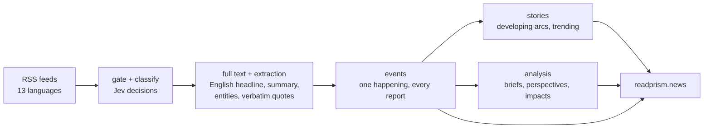

# Prism — Follow the story, not the headlines

**India's verifiable news record.** Prism reads Indian news across outlets and
languages, gathers every report of the same happening into one **event**, strings
events into developing **stories**, and shows a reader the record: who reported it,
who said what (verbatim, checked against the article it came from), what changed, and
a **lens** — a role-aware reading of the same facts for a general reader, a markets
reader or a cyber/GRC reader. The evidence is free; Plus sells depth and convenience.

- **Live:** [readprism.news](https://www.readprism.news) · API [`api.readprism.news`](https://api.readprism.news/healthz)
- **Reads:** 32 monitored outlets over 46 feeds in 13 languages (`GET /api/v1/sources`, 2026-09-25)
- **Product truth:** [`PRODUCT.md`](./PRODUCT.md) · **design system:** [`DESIGN.md`](./DESIGN.md) · **changes:** [`CHANGELOG.md`](./CHANGELOG.md)



## How it is built

| Layer | What | Where |
|---|---|---|
| Web | Next.js 15 / React 19 / Tailwind, on Vercel | [`web/`](./web) · [docs/FRONTEND.md](./docs/FRONTEND.md) |
| API | FastAPI, on Railway | [`api/`](./api) · [docs/API.md](./docs/API.md) |
| Pipeline | one worker process: collectors + Redis Streams consumers + reconcilers, on Railway | [`worker/`](./worker) · [docs/PIPELINE.md](./docs/PIPELINE.md) |
| Data | Postgres + pgvector + pg_trgm; Redis (streams, debounce, caches) | [`db/`](./db) · [docs/DB-SCHEMA.md](./docs/DB-SCHEMA.md) |
| Models | chat models and **Jev** (typed decisions) via OpenRouter; `multilingual-e5-base` embeddings in-process (fastembed/ONNX) | [docs/ML-EVALUATION.md](./docs/ML-EVALUATION.md) |
| Observability | self-hosted Langfuse (traces, prompts, evals), structlog | [docs/DEPLOYMENT.md](./docs/DEPLOYMENT.md) |

The whole system on one page: [docs/ARCHITECTURE.md](./docs/ARCHITECTURE.md).

## Documentation, by who you are

| You are | Read, in order |
|---|---|
| **New to the repo** | [TUTORIAL](./docs/TUTORIAL.md) → [ARCHITECTURE](./docs/ARCHITECTURE.md) → [PIPELINE](./docs/PIPELINE.md) → [HOWTO](./docs/HOWTO.md) |
| **Full-stack developer** | [ARCHITECTURE](./docs/ARCHITECTURE.md) → [API](./docs/API.md) → [FRONTEND](./docs/FRONTEND.md) → [DB-SCHEMA](./docs/DB-SCHEMA.md) → [`DESIGN.md`](./DESIGN.md) |
| **AI / ML engineer** | [PIPELINE](./docs/PIPELINE.md) → [ML-EVALUATION](./docs/ML-EVALUATION.md) → [CANONICALIZATION](./docs/CANONICALIZATION.md) → the `tools/score_*` and `tools/gold_*` harnesses |
| **Operator / on-call** | [DEPLOYMENT](./docs/DEPLOYMENT.md) → [HOWTO](./docs/HOWTO.md) → [PIPELINE §11 production configuration](./docs/PIPELINE.md#11-production-configuration-worker-2026-09-25) |
| **Product** | [`PRODUCT.md`](./PRODUCT.md) → [PRODUCT-BRIEF](./docs/PRODUCT-BRIEF.md) → [ROADMAP](./docs/ROADMAP.md) |

The full index is [docs/README.md](./docs/README.md).

## Quality, measured

Every model decision here is measured on labelled data before it ships, and most
thresholds carry their measurement in a dated code comment. Headline numbers
(details and sources in [docs/ML-EVALUATION.md](./docs/ML-EVALUATION.md)):

| Decision | Measure | Result |
|---|---|---|
| Same happening? — gist embedding (candidate finder) | AUC, hard same-language / cross-language / July gold | 0.913 / 0.992 / 0.940 |
| Same happening? — Jev verifier | AUC, same three sets | 0.993 / 0.985 / 0.964 |
| Same happening? — Jev at 0.85 | precision / recall, hard same-language | 1.00 / 0.75 |
| Duplicate events in production, 7 days | share of events that copy another (by founder) | 10.1% (2026-09-25) |
| Today's match cascade, replayed on 794 labelled pairs | precision / recall | 0.909 / 0.181 |

How to reproduce each figure: [docs/ML-EVALUATION.md § How to run each measurement](./docs/ML-EVALUATION.md#7-how-to-run-each-measurement).

## Code layout

```
api/              FastAPI app: feed, events/story, search, trending, entity, subject,
                  auth, billing (Razorpay), watchlist, labelling, admin
worker/           the pipeline process: collectors, stream consumers, reconcilers
ingestion/        RSS + CVE collectors, URL canonicalisation, ingest-time dedup
classification/   relevance gate + sector/subject classifier (LLM or Jev)
enrichment/       full text, schema-constrained extraction, verbatim quotes, embeddings, gist
correlation/      event matching (clustering.py, verify.py), analysis, threads,
                  story layer (partition.py, trending.py), digest
agent/            Ask: per-story grounded Q&A over the story's own reports
podcasts/ xposts/ side channels: podcast clips and X posts matched to stories
personalization/  feed ranking by lens and reader profile
common/           config, db, streams, LLM + Decisions clients, embeddings, images, auth,
                  billing, labelling ops, metrics
db/               Alembic migrations
tools/            measurement and repair: gold sets, scorers, replays, audits, backfills
evals/            Langfuse datasets and evaluators
web/              Next.js app
docs/             the documentation above
```

## Quickstart (local)

Prereqs: Docker, Python 3.12+ with [uv](https://docs.astral.sh/uv/), Node 20+.

```bash
cp .env.example .env          # add OPENROUTER_API_KEY for news, briefs and Ask
docker compose up -d          # Postgres (pgvector) + Redis
uv sync                       # Python deps
uv run alembic upgrade head   # schema
uv run python -m worker       # terminal 1: the pipeline
uv run uvicorn api.main:app --reload   # terminal 2: API on :8000
cd web && npm install && npm run dev   # terminal 3: web on :3000
```

The step-by-step version, with what to look at on each screen, is
[docs/TUTORIAL.md](./docs/TUTORIAL.md). Tests: `uv run pytest -q` (backend, refuses to
run against anything but a local or `*_test` database) and `cd web && npm test`.

## How work lands

`dev` is the default branch and the only one to commit to; feature branches PR into
`dev`. `main` is production — promote with `make promote` (fast-forward only, CI must be
green on the exact commit). A matcher tier or threshold changes only on replay evidence
(`tools/score_cascade`), ships behind an `off | shadow | live` flag, and runs in shadow
before it goes live. Regression tests are mutation-verified: put the bug back, watch the
test fail. The rules in full: [`CLAUDE.md`](./CLAUDE.md), [docs/HOWTO.md](./docs/HOWTO.md).

## Lineage

Prism generalises the pipeline from the author's EduThreat-CTI research (ingest,
classify, enrich, cluster and canonicalise, correlate, serve) from education-sector
cyber incidents to Indian news in many languages.
