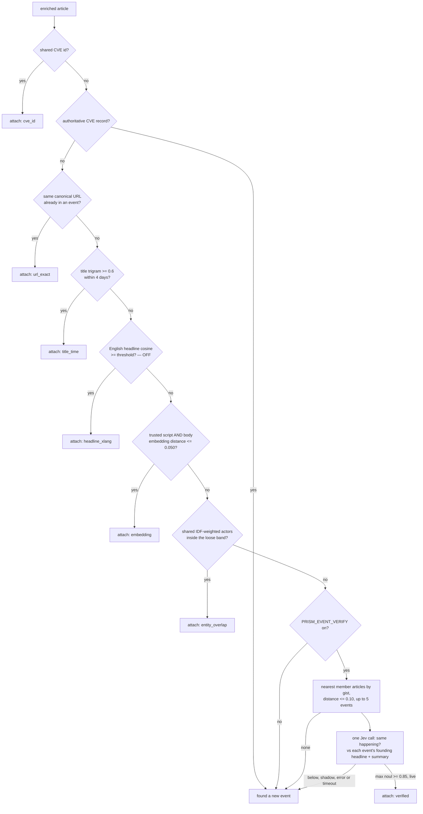
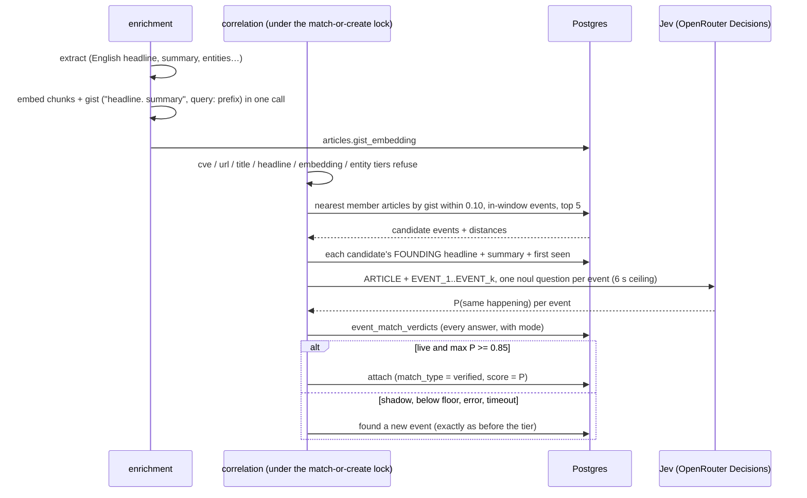

# Event canonicalization — one happening, one event

The first step of the funnel. Every article that passes the gate and extraction is
either **attached to an existing event** (the same real-world happening) or
**founds a new one**. Stories, trending, coverage counts and briefs are all built
on events, so a missed attachment shows up everywhere downstream: one death
becomes thirteen cards, a story reads "1 outlet" when twelve covered it, and the
story layer has to stitch fragments it should never have received.

This document is the reference for how that decision is made, what was measured,
and how to change it safely. Code: `correlation/clustering.py` (the cascade),
`correlation/verify.py` (the verified tier), `correlation/consumer.py` (attach).
Measurements were made on 2026-09-25 against production data; the harnesses are
in `tools/` and every number below says where it comes from.

- [What an event is](#what-an-event-is)
- [The match cascade](#the-match-cascade)
- [What went wrong (audit, 2026-09-25)](#what-went-wrong-audit-2026-09-25)
- [What each article carries, and what separates duplicates](#what-each-article-carries-and-what-separates-duplicates)
- [The verified tier](#the-verified-tier)
- [Cost and latency](#cost-and-latency)
- [Rollout](#rollout)
- [Datasets](#datasets)
- [How to measure](#how-to-measure)
- [Open work](#open-work)
- [References](#references)

## What an event is

**The same real-world happening**: the same incident, death, match or race, ruling,
announcement, deal, statement or protest — even when one report adds details,
gives different figures, arrives later or is in another language.

Not the same event (founder decision, 2026-09-25):

| Not the same happening | Where it goes |
|---|---|
| a follow-up or reaction ("stars pay tribute" after "actor dies") | its own event, grouped at the **story** layer |
| an earlier or later stage (forecast vs aftermath, semifinal vs final) | its own event, same story |
| a different person's statement on the same issue | its own event |
| another instance of a recurring kind (another co-op's results, another district's Lok Adalat, another day's prices or weather) | its own event, often no shared story |

This is the definition the labellers use (`label_batches.notes` for kind
`event_identity`) and the one Jev is asked, word for word (`correlation/verify.py:SAME_HAPPENING`).

## The match cascade

`correlation/clustering.find_event` tries tiers strongest-first and takes the
first match. The trail is kept on `event_memberships.match_type`.



Distances are cosine distances on `intfloat/multilingual-e5-base`; they move with
the model and live in one table, `correlation/clustering._SCALE`.

## What went wrong (audit, 2026-09-25)

**One death, thirteen events.** Mushtaq Khan's death on 2026-09-24 produced 13
events from 22 articles in six languages. NDTV alone founded three; two events
carried byte-identical Prism headlines ("Bollywood actor Mushtaq Khan dies at age
56"). The hockey match India beat Sri Lanka 16–1 was two events ("India lead Sri
Lanka…", 1 source; "India men's hockey team records big win…", 5 sources).

Why each article missed every tier:

| Tier | Why it could not match |
|---|---|
| title_time | compares the **outlet's** raw title with the event's **Prism** English headline — two voices; a Hindi, Odia or Urdu title can never match. Fires on ~1% of articles |
| headline_xlang | exists, **off** (threshold 0) — no labels to set it from |
| embedding | the event's vector is its founder's first 1200 raw characters, near-duplicates only (≤ 0.050), and Odia/Assamese/Urdu/Marathi are not trusted scripts |
| entity_overlap | needs ≥ 2 shared person/organisation actors; soft news extracts one ("Mushtaq Khan") |

**Across the corpus.** 7 days, 11,193 events with Prism headlines: 85% hold a
single article, and ~75% of all articles found a new event — a rate that has held
since at least late August, so it is chronic, not a regression. Judged the way the
verified tier decides (`tools/audit_event_dups`, founder-anchored):

| Jev floor | Copies | Share of events | Groups | Largest group |
|---|---|---|---|---|
| 0.85 | 1,118 | **10.1%** | 756 | 9 |
| 0.70 | 1,674 | 15.2% | 1,058 | 11 |

A random sample of 20 merges at ≥ 0.85 was 20/20 correct (week run,
2026-09-25). Linking the same pairs **transitively** (union-find) instead chained
a week of Trump–Xi coverage (itinerary, airport arrival, the meeting) into one
46-event group at 0.7 — which is why an article is only ever judged against an
event's founder.

## What each article carries, and what separates duplicates

Everything below is stored for every article at ingest (`docs/PIPELINE.md`). Each
signal was scored as a same-happening classifier on three labelled sets
([Datasets](#datasets)): **silver** (128 same-language September pairs sampled
from real candidates, including the templated-news traps), **batch 3** (268
cross-language pairs, two labellers) and **July gold** (398 pairs, mostly English).
AUC 1.0 separates perfectly, 0.5 is chance.

| Signal | Stored in | Silver | Batch 3 | July gold |
|---|---|---|---|---|
| **Gist**: mE5 over the extractor's English headline + one-line summary | `articles.gist_embedding` (new) | **0.913** | **0.992** | **0.940** |
| Same, bge-small-en (English-only model) | — | 0.907 | 0.991 | 0.953 |
| English headline, IDF word cosine | `enrichments.shared_fields.headline` | 0.802 | 0.976 | — (no English headlines in July) |
| English headline + summary, IDF word cosine | shared_fields | 0.873 | 0.979 | 0.928 |
| Raw body, first chunk (what the embedding tier uses) | `article_chunks` | **0.456** | 0.956 | 0.832 |
| Raw body, mean of chunks | `article_chunks` | 0.437 | 0.914 | 0.758 |
| Body 5-gram shingle Jaccard | `articles.clean_text` | 0.361 | 0.509 | 0.718 |
| Shared people/organisations (Jaccard) | shared_fields.entities | 0.702 | 0.874 | 0.805 |
| Places / numbers / occurred-on agree | shared_fields | 0.63–0.68 | 0.66–0.74 | 0.62–0.75 |
| Same photo (dHash), same publisher | `raw_items.image_phash` | ~0.5 | ~0.5 | ~0.5 |
| **Jev**, "same happening?" on headline + summary | — | **0.993** | **0.985** | **0.964** |
| Jev + reader brief | — | 0.990 | 0.985 | 0.964 |
| Jev + the article's opening 700 characters (original language) | — | 0.993 | 0.983 | 0.952 |

What this says:

- **The article text is used — through the extractor.** Extraction reads up to
  12,000 characters of the article and writes an English headline and summary for
  every article in every language. Embedding that distilled English beats
  embedding the raw text everywhere, and by the widest margin exactly where it
  matters: on hard same-language pairs the raw body is *worse than chance*.
- **Why the raw body fails.** Site furniture: 19% of the first 200 words of a
  Prajavani article (a quarter of the corpus), 14% of Amar Ujala's and 13% of Aaj
  Tak's are 5-grams repeated across ≥ 10 of the same outlet's articles in a week.
  And templated local news reads alike ("… Cooperative Society held its annual
  general meeting …").
- **Adding text to the judge does not help.** The brief and the article's opening
  add tokens and no accuracy.
- **Hand-built features do not transfer.** A logistic combination of gist, time,
  places, numbers and actors, trained on two sets and tested on the third, scored
  AUC 0.94–0.97 but lower recall at 95% precision than the gist alone on two of
  the three sets; gist + time + places + numbers alone fell to AUC 0.86–0.95.
- **No threshold is safe alone.** Precision of the gist alone at cosine ≥ 0.97 was
  0.94 on silver and batch 3; false merges persist at the top. At 95% precision it
  recovers only 49–67% of true duplicates. A judge breaks the trade-off.
- **No signal in photos or publishers.** Outlets shoot their own pictures; the
  same outlet files several different stories a day.

Two corrections came out of reading the disagreements: `gold_pairs` paired the
Thrissur leopard with a Palakkad one as "same" (two labels corrected, 61 → 59
positives; the gist scored them 0.89 — it would have merged two animals, Jev
said 0.05), and "BJP spends ₹287 crore in Bengal" vs "₹529 crore on five states"
— first read here as a templated false pair — is one ADR report (69% shared text).

### Within and across sources

- **Syndicated wire copy** (near-identical bodies across publishers, MinHash
  containment ≥ 0.6): 92 pairs in a week, 17 of them split across events. Small,
  and caught by the verified tier because their summaries are near-identical — no
  separate tier.
- **Same outlet, several articles on one happening** (NDTV's three Mushtaq Khan
  pieces): not a text-duplicate problem; they are different articles about the same
  death, which the verified tier judges like any other.
- **Same article in several edition feeds** (`thehindu`, `thehindu_kerala`):
  identical URL → `url_exact`; and extraction is paid once per URL
  (`enrichment/consumer._extraction_for_same_url`).

## The verified tier

`correlation/verify.py` + `correlation/clustering._match_by_gist_verified`.



Design decisions and why:

| Decision | Why |
|---|---|
| Last tier, only for articles every other tier refused | purely additive: it can only turn a would-be new event into an attachment; measured tiers are untouched |
| Candidates from **member articles**, not a per-event average | an average drifts toward whatever a wrong merge brought in and then draws more of it — the loop that once grew a Kannada event to 139 articles |
| Judged against the event's **founding** headline + summary | never moves, so no transitive chaining (the 46-event union-find group) |
| Gist floor cosine 0.90 (distance 0.10), mE5 only | every labelled September duplicate sat at ≥ 0.898 (silver) / ≥ 0.929 (batch 3); a candidate floor, not a merge threshold. Off on mpnet (unmeasured) |
| Attach at Jev ≥ 0.85 | precision 1.00, recall 0.75 on silver; 20/20 in a production sample. 0.7 gives recall 0.94 at precision 0.97 on silver — lower it only on labels |
| One call per article, all candidates in it | batched and pairwise scored the same (AUC 0.988 vs 0.987 on batch 3) |
| 6 s ceiling; any failure founds a new event | Jev runs under correlation's advisory lock; an outage must cost a missed merge, never a stalled pipeline |
| The question names the traps literally | Jev is literal: "different figures" (Mushtaq Khan's age was reported as 56, 67, 75 and 76), "another instance of a recurring kind" (co-ops, Lok Adalats) |

## Cost and latency

| | Measured |
|---|---|
| Jev per pair (event blocks) | $0.0000225 (17,590 pairs, $0.39, 2026-09-25) |
| Jev per pair (article blocks) | ~$0.000048 (1,602 calls, $0.077) |
| Latency | ~250 ms per call |
| Candidate pairs per day | ~2,500; ~830 articles a day have a candidate |
| **Monthly** | **≈ $2–4** at current volume |
| Gist embedding | one extra ~40-token embedding per article, in the same fastembed call |

For scale, extraction is the dominant spend (`docs/ML-EVALUATION.md`).

## Rollout

1. **Deploy with `PRISM_EVENT_VERIFY=off`.** Migration `e5a9c3b7d2f1` adds the
   column, `ix_events_last_updated` and `event_match_verdicts`.
2. **Backfill gists** for the window: `DATABASE_URL=<prod> uv run python -m tools.backfill_gist --days 14 --apply`
   (no LLM spend).
3. **Replay** the cascade with the tier on (`tools.score_cascade --verify 0.85 --sets gold,batch3,silver`)
   — ship only if it beats the current cascade.
4. **Shadow for ≥ 3 days** (`PRISM_EVENT_VERIFY=shadow` on the worker): every
   would-be attachment is recorded (`event_match_verdicts.mode = 'shadow'`,
   log line `event_verify_shadow`). A founder reads 50 sampled would-be merges.
5. **Live.** Watch: share of articles founding new events (baseline ~75%),
   single-article events (85%), the weekly copy rate (`tools/audit_event_dups`,
   10.1% at 0.85), `event_verify_failed` rate, correlation lock time.
6. **Then** repair the backlog (open work below) — after the live tier is verified.

## Datasets

| Set | Where | Pairs (same) | Labelled by | Status |
|---|---|---|---|---|
| gold_pairs, July | `tools/gold_pairs.py` | 398 (59) | founders, 2 batches | ratified; 2 labels corrected 2026-09-25 |
| batch 3, cross-language | `tools/gold_same_happening.BATCH_3_CROSSLINGUAL` | 268 (43) | two labellers, batch `MGDmtLPZOdjy` | 40 disputed pairs excluded; some "no"s are granularity calls |
| silver, same-language | `tools/gold_same_happening.SILVER_SAME_LANGUAGE` | 128 (64) | Claude, from headline + summary | **unratified** — to be replaced by a labeller batch |

## How to measure

```bash
# The copy rate on production, judged the way the tier decides (read-only; --judge spends ~$0.40/week, cached)
uv run python -m tools.audit_event_dups --judge --days 7 --tau 0.7 0.85

# Replay the whole cascade on the labelled sets, with and without the tier (local scratch schema; Jev cached)
uv run python -m tools.score_cascade --models intfloat/multilingual-e5-base --doc-prefix query \
    --sets gold,batch3,silver --verify 0.85

# Compile a finished label batch into pairs
uv run python -m tools.gold_crosslingual --compile <KEY>
```

Rules that have held in this code (see the comments in `correlation/clustering.py`):
a pairwise number is not a cascade number — replay before flipping a tier;
thresholds move with the embedding model; calibrate Jev floors on labels, not 0.5.

## Open work

- **Repair the backlog** (after the live tier is verified): add `events.merged_into`,
  301 old `/story/<id>` URLs, and move memberships and the 15 tables that point at
  events (including paid `lens_unlocks`). Founder-anchored only — never union-find.
- **Ratify silver**: push it as an `event_identity` label batch for two labellers.
- **The title tier compares unlike things** (outlet title vs Prism headline) — test
  outlet-title-vs-founder-title in replay, or retire it if the verified tier
  subsumes it.
- **Site furniture in `clean_text`** hurts the body embedding and Ask/RAG, not
  this tier. Per-publisher furniture stripping is its own ticket.
- **Wikidata QIDs** would give identity-level matching, but only 1.8% of entities
  carry one today.

## References

- Miranda et al., *Multilingual Clustering of Streaming News*, EMNLP 2018 — documents compared against a cluster's aggregate of all members, English as the pivot language. <https://aclanthology.org/D18-1483/>
- Nakshatri et al., *Using LLM for Improving Key Event Discovery: Temporal-Guided News Stream Clustering with Event Summaries*, EMNLP 2023 Findings — assign articles by embedding LLM-written event summaries; LLM pair check to merge clusters. <https://aclanthology.org/2023.findings-emnlp.274/>
- Chen et al., *SemEval-2022 Task 8: Multilingual News Article Similarity*. <https://aclanthology.org/2022.semeval-1.155/>
- Near-duplicate detection for wire copy (MinHash vs SimHash). <https://medium.com/@jonathankoren/near-duplicate-detection-b6694e807f7a>
