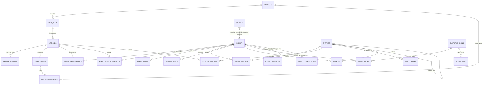
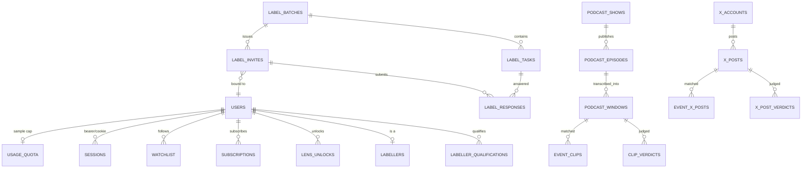

# Prism — Database Schema

Drafted 2026-09-25 against branch `feat/verified-event-match`. Source of truth is
`common/models.py` (570 lines, SQLAlchemy ORM, read in full) plus the 52 files under
`db/versions/` (Alembic migrations, read directly for every table below). `docs/DB-SCHEMA.md`
(July 2026) describes an earlier design (OpenSearch as the search store, a `field_provenance`
table shaped differently, no freemium/labelling/podcast/X tables) and is background only.

**Alembic head: `e5a9c3b7d2f1`** (`db/versions/e5a9c3b7d2f1_article_gist_and_match_verdicts.py`,
2026-09-25). Found by building the revision → `down_revision` graph across all 52 files and taking
the one revision id that no other file lists as its `down_revision`; the chain is strictly linear
(no branches).

## Conventions

- Every ORM table has `created_at`/`updated_at` (`TimestampMixin`, `common/models.py:36-42`,
  `server_default=func.now()`, `updated_at` also `onupdate=func.now()`), and most have a UUID `id`
  primary key generated client-side (`uuid_pk()`, `common/models.py:45-46`, default `uuid.uuid4`).
  Exceptions are called out per table below (composite PKs, `BigInteger Identity()` PKs, the
  `corpus_meta` singleton).
- JSONB is used where the shape is flexible or lens-specific (`shared_fields`, `lens_fields`,
  `projection`, `provenance`, etc.).
- **Not every table is an ORM model.** `common/models.py` defines exactly 27 `__tablename__`s.
  Everything else that exists in the database — labelling, billing, podcasts, X-posts, securities,
  admin audit, the new `event_match_verdicts` — was created **only** by an Alembic migration and is
  read/written via raw `sqlalchemy.text()` SQL scattered across `api/routes/`, `common/`, `worker/`,
  `podcasts/`, `xposts/`, `tools/`. The 27 ORM-backed tables are: `sources`, `raw_items`, `articles`,
  `article_chunks`, `enrichments`, `field_provenance`, `events`, `event_memberships`,
  `event_links`, `entities`, `article_entities`, `event_entities`, `stories`, `partition_runs`,
  `event_story`, `story_veto`, `perspectives`, `impacts`, `agent_sessions`, `agent_messages`,
  `users`, `usage_quota`, `auth_tokens`, `sessions`, `lens_unlocks`, `corpus_meta`, `watchlist`.
  (The file's own header docstring — "Deferred tables (users, plans, alerts, subscriptions...) bolt
  on later" — is stale: `users` etc. are already modeled, but the newer product-layer tables never
  got ORM classes at all; this is worth fixing or removing, see Open Questions.)
- Several tables the code and migration filenames name in the singular/plural you'd guess wrong:
  `labellers`/`labeller_qualifications` (not `label_qualification`), `label_responses.skipped`
  (a column, not a `label_skipped` table), `label_tasks.payload` (a column, not
  `label_task_payload`), `usage_daily`+`user_days` (not `usage_counts` — that's the migration
  filename), `podcast_shows`/`podcast_episodes`/`podcast_windows`/`event_clips` (not
  `podcast_clips` — again the migration filename), `partition_runs`/`event_story`/`story_veto`
  (not `storyline_partition`).

## Core news graph

### `sources`
ORM `common/models.py:52-66`. One row per feed/ingestion source. `publisher` groups feeds sharing a
masthead (The Hindu ships six regional RSS feeds that republish one another; corroboration must
count publishers, not feeds — `db/versions/b7c2e91a4d33_sources_publisher.py`) and defaults to the
slug. Columns: `id` UUID PK, `slug` unique, `name`, `source_type` (news_api\|cve_feed\|advisory\|rss\|scraper),
`publisher` nullable, `country`/`language` nullable, `reliability` JSONB, `watermark` JSONB
(per-source incremental cursor). Baseline `db/versions/c0bcace5aca1_baseline_schema.py:53-66`;
`publisher` added by `b7c2e91a4d33`; a data-only fix-up folds `toi_delhi`/`toi_mumbai` →
`timesofindia` in `db/versions/d4e7b1a90c62_toi_publisher.py`. Read/written: `ingestion/base.py`
(`get_source`, dedup joins), `ingestion/seed.py`.

### `raw_items`
ORM `common/models.py:69-95`. The untouched per-item ingestion envelope. Columns: `id` PK,
`source_id` FK→sources, `external_id`, `url`/`url_canonical` (canonical is a comparison key only —
`url` stays the exact publisher observation, `db/versions/c1d2e3f4a5b6_raw_item_canonical_url.py`),
`url_canonical_version`, `image_phash` (64-bit dHash hex, `db/versions/c9f1a2b3d4e5_raw_item_image_phash.py`),
`title`, `body` nullable, `language` nullable, `published_at`, `observed_at`, `raw` JSONB (untouched
payload), `image_url`, `relevance` (pending\|relevant\|rejected), `classified_at` (a dedicated stage
clock, deliberately **not backfilled** for old rows because `updated_at` may have been touched later
by enrichment — `db/versions/d2e3f4a5b6c7_raw_item_classified_at.py`), `rejection_reason`,
`classification` JSONB. Unique `(source_id, external_id)`. Written by `ingestion/base.py`; read by
`classification/consumer.py`, `correlation/consumer.py`, `enrichment/consumer.py`.

### `articles`
ORM `common/models.py:98-111`. The cleaned, extracted text for one raw item. Columns: `id` PK,
`raw_item_id` FK→raw_items **unique** (one article per raw item — enforced after deduping 6
production twins caused by a stall/reclaim race, `db/versions/b8c4f1d20e57_one_article_per_raw_item.py`),
`clean_text`, `retrieval_tier` (direct\|proxy\|archive\|body), `word_count`,
**`gist_embedding vector(768)`** nullable, `fetched_at`.

**`gist_embedding` — the 2026-09-25 addition.** Added by
`db/versions/e5a9c3b7d2f1_article_gist_and_match_verdicts.py:39`
(`op.add_column("articles", sa.Column("gist_embedding", Vector(get_settings().prism_embed_dim)))`,
768-dim per current `prism_embed_dim`). It embeds the extractor's **English headline + one-line
summary** — not the article body — because the body separates same-happening pairs at AUC 0.46 (worse
than chance, due to site furniture and templated local news) while the distilled English gist
separates them at 0.91–0.99 on all three labelled sets (`docs/CANONICALIZATION.md`). Written by
`enrichment/consumer.py` alongside the extraction; read as the candidate source for the verified
matching tier in `correlation/clustering.py` (`... min(a.gist_embedding <=> CAST(:vec AS vector))
... FROM articles a JOIN event_memberships m ...`).

### `article_chunks`
ORM `common/models.py:114-122`. Body-text chunks with per-chunk embeddings, used for the **agent's
RAG retrieval** — distinct from `gist_embedding`, which serves event-matching, not Ask. Columns:
`id` PK, `article_id` FK→articles, `chunk_index`, `text`, `embedding vector(768)` nullable. Unique
`(article_id, chunk_index)`. Dimension changed 384→768 (with a full re-embed) in
`db/versions/5493a4141cbb_multilingual_embeddings_384_768_events_.py`; an HNSW cosine index
(`ix_article_chunks_embedding_hnsw`) was added `CONCURRENTLY`, single-threaded, in
`db/versions/51de411d824c_perf_indexes_fk_hot_paths_pgvector_hnsw.py` — single-threaded specifically
because HNSW's parallel build overflows Railway's managed Postgres `/dev/shm`. Written by
`enrichment/consumer.py`; read by `agent/rag.py`.

### `enrichments` + `field_provenance`
ORM `common/models.py:128-150`. `enrichments`: one row per article's LLM extraction — `id` PK,
`article_id` FK→articles, `event_type` nullable, `summary`, `occurred_at` date, `sentiment` float,
`shared_fields` JSONB (claims/entities/regions/impacts), `lens_fields` JSONB (keyed by lens),
`raw_model_output` JSONB (reproducibility), `model` (provider+model id, for audit).
`field_provenance`: which source attributed each extracted field — `id` PK, `enrichment_id`
FK→enrichments, `field_path` (e.g. `impacts[0].effect`), `source_id` FK→sources, `confidence`
nullable. Both from baseline `c0bcace5aca1`. Written by `enrichment/consumer.py`; read via join in
`correlation/consumer.py` and `api/routes/events.py`.

### `events`
ORM `common/models.py:156-184`. The canonical, deduplicated "happening" — the unit the feed/API/agent
serve. Columns: `id` PK, `title`, `headline_by` nullable (NULL = first report's own headline,
`'prism'` = Prism-written, founder decision 2026-09-17), `summary`, `sector`/`subsector`,
`subject_path` (dotted taxonomy path, e.g. `civic.crime.violent`; `sector`/`subsector` are now
derived from it), `subject_confidence`, `regions` text[], `image_url`, `occurred_at` date,
`first_seen_at`/`last_updated_at`, `story_visible_at` nullable (first instant a published partition
made this event addressable, NULL = not yet published), `projection` JSONB (promoted serving
fields — also what `event_revisions`/`event_corrections` diff against), `embedding vector(768)`.

Indexes worth knowing: `ix_events_sector_last_updated (sector, last_updated_at DESC)` — the feed
candidate window; `ix_events_embedding_hnsw` (cosine); `ix_events_subject_path` /
`ix_events_subject_path_updated` (`text_pattern_ops`, for prefix `LIKE`); `ix_events_title_trgm` /
`ix_events_summary_trgm` (GIN pg_trgm, for `/api/v1/search`'s leading-wildcard `ILIKE`);
**`ix_events_last_updated (last_updated_at)`** — the 2026-09-25 addition.

**`ix_events_last_updated` — the 2026-09-25 addition.** Added by the same migration as
`gist_embedding` (`e5a9c3b7d2f1:40`: `op.create_index("ix_events_last_updated", "events",
["last_updated_at"])`). Per the migration's own docstring it "serves the [verified] tier's in-window
scan; the other tiers filter on the same column through the (sector, last_updated_at) index, which a
sector-free filter cannot use" — the verified tier's candidate query has no sector predicate, so it
needed a leading index on `last_updated_at` alone.

A revision-tracking **database trigger** (`events_revision`, function `record_event_revision()`,
`db/versions/e7a4c2b9f613_event_revisions.py`) fires `AFTER UPDATE OF title, summary, projection OR
DELETE ON events` and inserts the row **being replaced** into `event_revisions` — deliberately a
trigger rather than application code, because `events` has several writers (the correlation
rebuild via the ORM, `persist_briefs`, and raw SQL from the API) and a trigger is the one place none
of them can skip. This exists to satisfy IT Rules 19(3) publication-retention obligations
(`docs/COMPLIANCE-INDIA.md`). Written by `correlation/consumer.py` (create); read via raw SQL
throughout `api/routes/events.py`.

### `event_memberships`
ORM `common/models.py:187-206`. Which article(s) belong to which event, with the match method used
to attach it. Columns: `id` PK, `event_id` FK→events, `article_id` FK→articles, `match_type`
(cve_id\|url_exact\|title_time\|headline_xlang\|embedding\|entity_overlap\|verified\|new_event),
`match_score` nullable, `is_survivor` bool (canonical representative). Unique `(event_id,
article_id)` from baseline; unique on `article_id` **alone** — the one-event-per-article invariant —
added by `db/versions/a7c3e91d4b28_one_event_per_article.py` after finding the "correlation
consumer runs as exactly one process" assumption undocumented anywhere except two code comments;
paired with an advisory lock around match-or-create so a second process now serializes on the
database instead of on a deployment rule. `ix_event_memberships_article (article_id)` — the missing
leading-column index for the hottest per-article lookups — added `CONCURRENTLY` in
`db/versions/b17e4c9a2f31_index_event_memberships_article.py`. Written by `correlation/consumer.py`;
read in candidate queries in `correlation/clustering.py`.

### `event_match_verdicts` — the 2026-09-25 addition
**Not an ORM model** — raw-SQL-only. The verified matching tier's audit trail and replay cache:
Jev's (an OpenRouter Decisions-API judge) probability that an article and a candidate event report
the same real-world happening. It never merges on its own — "no threshold is safe: false merges
persist at cosine 0.97" — it only records the evidence for the cascade to act on.

Confirmed schema (`db/versions/e5a9c3b7d2f1_article_gist_and_match_verdicts.py:41-50`):
composite PK **`(article_id, event_id)`**, both `FOREIGN KEY ... ON DELETE CASCADE`; `noul` float
NOT NULL (Jev's same-happening probability); `gist_distance` float NOT NULL; `model` text NOT NULL;
`mode` text NOT NULL (`shadow`\|`live` — the mode in force when it was asked); `created_at`
timestamptz. No surrogate key, no secondary index beyond the PK; upserts use `ON CONFLICT
(article_id, event_id) DO UPDATE`. Written by `correlation/verify.py`; invoked from
`correlation/clustering.py`'s `find_event()`, itself called from `correlation/consumer.py`.

### `event_links`
ORM `common/models.py:208-223`. Cross-event thread edges (e.g. a war event → its markets-drop
coverage event). Columns: `id` PK, `from_event_id`/`to_event_id` FK→events, `relation`
(leads_to\|related\|none — `'none'` rows persist LLM rejections so a candidate pair is never
re-asked), `confidence` nullable, `rationale` nullable. Unique `(from_event_id, to_event_id)`.
Created by `db/versions/8f3d21ab5e40_personalization_threads_images.py`. All reads/writes are raw
SQL in `correlation/threads.py`.

### `entities`, `article_entities`, `event_entities`, `entity_alias`
ORM (except `entity_alias`) `common/models.py:229-287`. `entities`: a canonical actor
(person\|company\|organization\|government\|place\|product\|ticker). Columns: `id` PK, `slug`
unique, `name`, `entity_type`, `aliases` text[], `meta` JSONB (column name `metadata`), `qid`
nullable (Wikidata Q-id, ~72% coverage among entities that can form an edge at all — NULL is a
normal outcome), `resolution` nullable (records **how** a qid link was made — label\|sitelink\|alias
tie-break — because that's unrecoverable audit info once mentions are repointed), `merged_into`
self-FK `ON DELETE SET NULL` (fold pointer; the folded row is kept, not deleted, because other
tables reference it and it still holds a name real articles used). `qid`/`resolution` added by
`db/versions/a4d1e9c7b330_entity_qid_and_alias_index.py` (alongside the `entity_alias` table below);
`merged_into` added by `db/versions/b7f2c4a91e05_entities_merged_into.py`.

`article_entities` (which actors **one article** named — distinct from `event_entities`'
cumulative event-level cast, specifically to break an over-merge feedback loop where one wrongly
absorbed article's actors used to count for the event forever; one event had reached 978 actors
this way): `id` PK, `article_id` FK→articles `ON DELETE CASCADE`, `entity_id` FK→entities `ON
DELETE CASCADE`, `role` default `'affected'`. Unique `(article_id, entity_id)`. Created (not in
baseline) by `db/versions/c4d18e60a927_article_entities.py`, backfilled once from
`enrichments.shared_fields->'entities'`.

`event_entities` (which actors an **event** has ever touched): `id` PK, `event_id` FK→events,
`entity_id` FK→entities, `role` (subject\|affected\|actor\|source_cited), `provenance` JSONB. Baseline
key was unique `(event_id, entity_id, role)`, letting one actor attach under multiple roles and
double-count its IDF weight in the actor graph — collapsed to unique `(event_id, entity_id)`
(preferring `'affected'`) by `db/versions/e7c94a2b1f08_dedupe_event_entities.py`.
`ix_event_entities_entity (entity_id)` added by `db/versions/d7f4a9c02b18_storyline_partition.py`
because the partitioner's actor-graph self-join needs an entity-id-first lookup the composite
unique can't serve.

`entity_alias` — **raw-SQL-only**, the local Wikidata alias index used at entity-link time and kept
as the audit trail for why a fold happened. Composite PK `(alias_norm, qid)`; columns `alias_norm`
(normalized surface form — same `slugify` an entity slug uses), `qid`, `lang` nullable, `kind`
(label\|sitelink\|alias — label beats alias when they disagree, since Wikidata alias sets are not
always identity-preserving), `prior` int (sitelink-count tie-break), `surface` (unnormalized form,
for audit). Created alongside `entities.qid` in `a4d1e9c7b330`.

### `stories`, `partition_runs`, `event_story`, `story_veto`
ORM `common/models.py:290-374`. `stories`: a trending community promoted to a durable, shareable
identity (the `/trending/<slug>` surface) — distinct from `event_story` below, which is scoped to a
single partition run. Columns: `id` PK, `slug` unique (frozen at creation), `label` (extractive
cast, refines over time), `cast_` JSONB (column `cast`), `member_event_ids` JSONB (**not a
foreign-keyed join table** — membership is a JSON array of event ids), `hero_event_id` nullable,
`sector`, `regions` text[], `source_count`, `velocity`, `status` (active\|dormant),
`merged_into` (self-referential redirect, **no FK constraint** — same pattern `entities.merged_into`
later reused). Created by `db/versions/c4e7a2f18b60_trending_stories.py`. Reconciled via raw SQL in
`correlation/trending.py`.

`partition_runs`: one global storyline-partition pass. `base_run_id` self-FK (NULL = base Leiden
run, set = grounded-veto overlay refinement); `status` (building\|current\|superseded) with a
**partial unique index** enforcing exactly one `status='current'` row at a time (compare-and-swap
publish); `veto_state` (pending\|applied); `resolution` float; `stats` JSONB.

`event_story`: an event's story membership **within one run** — composite PK `(run_id, event_id)`,
both `ON DELETE CASCADE`; `story_label` int (an ephemeral per-run Leiden label, never a cross-run
identity, unlike `stories.slug`); `branch_parent_id`/`off_spine` (the L3 branch tree).
`ix_event_story_run_label (run_id, story_label)`.

`story_veto`: cached grounded-veto verdicts, reused across runs while a story's identity is
unchanged (skips re-calling the LLM). Unique key `(signature, candidate_event_id)`, where
`signature` is a versioned, label-independent story identity (root + recurring cast + config).
`base_run_id` FK `ON DELETE SET NULL`.

All three plus `ix_event_entities_entity` created together by
`db/versions/d7f4a9c02b18_storyline_partition.py`. Algorithm in `correlation/partition.py`.

### `perspectives`, `impacts`
ORM `common/models.py:377-400`. `perspectives`: a framing/stance grouping of an event's articles
(e.g. "vendor framing" vs. "researcher framing") — `id` PK, `event_id` FK→events, `label`,
`origin_country` nullable, `stance` nullable, `member_articles` uuid[] nullable, `summary` nullable.
`impacts`: a downstream effect on an entity (or unattached) — `id` PK, `event_id` FK→events,
`entity_id` FK→entities nullable, `effect`, `direction` (positive\|negative\|mixed) nullable,
`horizon` (immediate\|days\|weeks\|longer) nullable, `confidence` nullable, `parent_impact_id`
self-FK nullable (propagation chaining), `provenance` JSONB nullable. Both from baseline;
`ix_perspectives_event_id` and `ix_impacts_event_id` added `CONCURRENTLY` in `51de411d824c` (the
memberships/entities tables already led a unique index on the join column; these two didn't).
Written by `correlation/consumer.py`; read via `api/routes/events.py`.

### `event_revisions`, `event_corrections`
Both raw-SQL-only, both deliberately **without a foreign key** to `events` so they outlive the event
row they describe. `event_revisions` (see `events` above): `id` BigInteger `Identity()` PK,
`event_id` (no FK), `replaced_at`, `op` (update\|delete), `title`, `summary`, `lens_briefs` JSONB,
`lens_points` JSONB — populated entirely by the `events_revision` trigger, never by application
code. `event_corrections` (`db/versions/f2b8d5a1c740_event_corrections.py`): the public corrections
log — `id` BigInteger `Identity()` PK, `event_id` (no FK), `created_at`, `reason`
(source_correction\|prism_error, CHECK-constrained), `note` (CHECK length 10–600), `actor`.
`ix_event_corrections_event`, `ix_event_corrections_created`. Written by `tools/correct_record.py`;
read by `api/routes/corrections.py`.

## Agent layer

### `agent_sessions`, `agent_messages`
ORM `common/models.py:406-427`. Per-story "Ask" conversation state. `agent_sessions`: `id` PK,
`user_ref` nullable text ("placeholder until real users exist" — now largely superseded by the
`users` table but not migrated), `event_id` FK→events, `started_at`. `agent_messages`: `id` PK,
`session_id` FK→agent_sessions, `role` (user\|assistant), `content`, `cited_source_ids` uuid[]
nullable. Both from baseline. Read/written around `agent/rag.py`'s RAG loop and
`api/routes/events.py`'s `/ask` SSE endpoint.

## Users, auth, billing, usage, labelling

(Auth tables `auth_tokens` are keyed by email, not `user_id` — see below — so they are not drawn
against `USERS` above.)

### `users`
ORM `common/models.py:430-448`. Account identity, keyed by verified email (magic-link or Google —
both resolve to the same row). Columns: `id` PK, `email` unique, `name`/`profession` nullable
(profession is a slug from `common.professions`), `languages` text[] nullable (ordered by
preference), `state` nullable (ISO 3166-2), `consented_at` nullable. `name`/`profession` added by
`db/versions/9ddbcc3fd269_user_name_profession_signup_profiling.py`; `languages`/`state`/
`consented_at` added by `db/versions/b2d5e1f4a093_user_language_prefs.py` — **these are three
columns on `users`, there is no separate `user_language_prefs` table** despite the migration
filename. Written/read in `common/auth.py`.

### `auth_tokens`, `sessions`
ORM `common/models.py:471-500`. `auth_tokens`: single-use magic-link token, only the SHA-256 hash
stored. `id` PK, `email` (indexed, **not** a user FK — a token can create a brand-new user),
`token_hash` unique, `expires_at`, `name`/`profession` (signup profile carried through to
first-user-creation), `consumed_at` nullable. `sessions`: bearer/cookie session, also hash-only.
`id` PK, `user_id` FK→users (indexed), `token_hash` unique, `expires_at`. Both from
`db/versions/de000473f0e5_auth_tokens_sessions_magic_link_auth.py`. CRUD in `common/auth.py`.

### `usage_quota`, `usage_daily`, `user_days`
`usage_quota` is ORM (`common/models.py:450-468`): per-account freemium sample cap (Markets lens
only — one counter suffices). `id` PK, `user_id` FK→users **unique**, `remaining` int default 0,
`period_start`. Debited with a single atomic `UPDATE ... WHERE remaining > 0 RETURNING`
(`common/quota.py`) so two concurrent viewers of the same event+lens can never double-spend the last
sample. From `db/versions/02f6edae6a63_users_usage_quota_freemium_sample_cap.py`.

`usage_daily`/`user_days` are **raw-SQL-only** (created by
`db/versions/d8b3f6a2c914_usage_counts.py` — the filename names neither table it actually creates).
`usage_daily`: composite PK `(day, event, dim)`, `count` BigInteger, with a CHECK capping
`event`≤24/`dim`≤48 chars since a public endpoint (`/beacon`) writes to it. `user_days`: composite PK
`(user_id, day)`, indexed on `day`. No per-visitor identity ever reaches Postgres here — visitor
counting happens in Redis (`common/usage.py`). Aggregated for the admin dashboard in
`common/metrics.py`.

### `subscriptions`
**Raw-SQL-only.** "Who is on which plan, from which provider"
(`db/versions/d2a7b8c9e0f1_subscriptions.py`). `id` PK, `user_id` FK `CASCADE`, `provider`
(manual\|razorpay), `provider_sub_id`, `plan` (plus_monthly\|plus_yearly\|founding), `status`
(active\|past_due\|cancelled\|halted\|expired), `current_period_end`, `cancel_at`, `price_paise` int,
`notes`. Unique `(provider, provider_sub_id)`. Extended by
`db/versions/e3b8c9d0f1a2_subscription_refunds.py` adding `current_period_start`, `refund_id`,
`paused_until`, `starts_at` — **all four are columns on `subscriptions`; there is no separate
`subscription_refunds` table** despite the filename. A refund is represented purely by
`refund_id` being non-null. Entitlement is computed at read time from `status` +
`current_period_end` + a grace window (`common/billing.py`), never cached as a boolean. Written by
`api/routes/billing.py` and `common/razorpay.py`; aggregated in `common/metrics.py`.

### `lens_unlocks`, `watchlist`
Both ORM. `lens_unlocks` (`common/models.py:502-529`): one row per `(user, event, lens)` a reader
has paid to open — deliberately a row, not a bare decrement, so a page refresh doesn't re-charge and
so payment (once per reader) is decoupled from brief generation (once per event, cached). Unique
triple, insert uses `ON CONFLICT DO NOTHING` so a race between two tabs reads as "already
unlocked," never a 500. `watchlist` (`common/models.py:557-570`): a user's followed ticker or
sector, read-only (push/alerts are future work). `id` PK, `user_id` FK→users (indexed), `kind`
(ticker\|sector), `value`. Unique `(user_id, kind, value)`.

### `corpus_meta`
ORM (`common/models.py:532-555`), a **singleton** (`CheckConstraint("id = 1")`, `id` plain Integer
PK default 1 — not a UUID, the one exception to the UUID-PK convention besides the
`BigInteger Identity()` audit-style tables). Records which embedding model/dimension/prefix wrote
the vectors currently in the database, because cosine distances are not comparable across models
and mixing them is silent (measured: switching mE5→mpnet thresholds produced 76 false merges
against 3, a 25x increase, with nothing logged at the time). Checked before any stage that writes
more vectors.

### Labelling: `labellers`, `label_batches`, `label_tasks`, `label_responses`, `label_invites`, `labeller_qualifications`
All **raw-SQL-only**. `labellers` (`db/versions/f8a3b6c21d47_labellers.py`): one row per Prism
account that applied to label — PK is `user_id` itself (FK→users `CASCADE`, not a separate `id`),
`languages_read` text[] (gates which tasks are served), `status` (CHECK: applied\|active\|paused\|
removed), `note`, `approved_at`, `approved_by`. **"Removed" does not drop the table or delete rows**
— `db/versions/c5f1a8e3b720_labeller_removed.py` only widens the status CHECK constraint to add the
`'removed'` value, so a removed labeller's answers are kept (they're the measurement every gate is
judged on) while their qualifications are wiped.

`label_batches` (`db/versions/d9e4c1a70f38_label_batches.py`, extended by later migrations): `id`
PK, `key` unique (unguessable share link), `name`, `kind` (story_boundary\|claim_attribution),
`notes`, `open` bool, `listed` bool (shown on the labeller dashboard, off by default), `purpose`
(work\|practice\|qualify), `self_join` bool.

`label_tasks` (same migration): `id` PK, `batch_id` FK `CASCADE`, `position` (unique with
`batch_id`), `seed_event_id` FK→events (nullable, for claim-attribution tasks that have no seed
event), `candidates` JSONB, `sector`, `languages` text[] nullable (task-level language gate),
`expected`/`explanation` (practice/qualify answer key), **`payload` JSONB** — a column, not a
`label_task_payload` table.

`label_responses` (same migration): `id` PK, `task_id` FK `CASCADE`, `selected` JSONB, `unsure`
bool, `ms_spent`, **`skipped` bool** — a column, not a `label_skipped` table, distinguishing "I
can't read this" from "unsure/ambiguous." Re-keyed from a free-text `labeller` name onto `invite_id`
FK→label_invites after a name-collision bug once silently overwrote a second labeller's answers
under `ON CONFLICT DO UPDATE`. Unique `(task_id, invite_id)`.

`label_invites` (`db/versions/e2b6f014c9a7_label_invites.py`): the per-labeller write credential
(a token, not a name) that fixed that collision. `id` PK, `token` unique, `batch_id` FK `CASCADE`,
`name` (display only), `revoked` bool, `last_seen_at`; extended with `user_id` FK→users `SET NULL` +
partial-unique `(batch_id, user_id)`, then `attempt`/`task_ids`/`finished_at`/`score` for
qualification attempts (unique widened to `(batch_id, user_id, attempt)`).

`labeller_qualifications` (`db/versions/a9d4e2c7b815_label_qualification.py` — real table name is
plural): composite PK `(user_id, kind)`, FK→users `CASCADE`. `passed_at`, `best_score`, `attempts`,
`last_attempt_at`, `granted_by` (admin override).

### `admin_audit`
**Raw-SQL-only** (`db/versions/b2e7c4d91a36_admin_audit.py`). Append-only ledger, written in the
same transaction as the change it records. `id` BigInteger `Identity()` PK, `actor` (the founder's
email), `action`, `target`, `detail` JSONB default `{}`, `created_at`. Write/read helpers
`common/admin_audit.py`; called from every `common/label_ops` mutation and from
`admin_controls.py`'s pipeline trigger.

## Podcasts and X/Twitter (both feature-flagged, both raw-SQL-only)

### Podcasts
Four tables, all created by `db/versions/a7c2e9d41b06_podcast_clips.py` (again, the migration
filename names none of the four tables it actually creates), plus `clip_verdicts`:
- **`podcast_shows`**: registry, PK `slug`, `name`/`publisher`/`feed_url`/`site_url`/`art_url`,
  `language` default `en`, `enabled` bool (never deleted — an old clip still names its show),
  `last_polled_at`. Seeded by `podcasts/feeds.py`.
- **`podcast_episodes`**: PK `id`, `show_slug` FK `CASCADE`, `guid` unique with show, `title`,
  `episode_url`, `audio_url`, `published_at`, `feed_duration_s`, `audio_duration_s`/`audio_bytes`
  (measured from the fetched file, not trusted from the feed — hosts stitch different ad reads per
  request), `language`, `transcript_status` (pending\|done\|failed\|skipped), `transcribed_at`,
  `error`. Indexed on `published_at` and `transcript_status`.
- **`podcast_windows`**: PK `id`, `episode_id` FK `CASCADE`, `seq` (unique with episode),
  `start_s`/`end_s` float, `text`, `words` JSONB (word timestamps), `embedding vector(768)` — the
  same mE5 space `events.embedding` uses. Unique `(episode_id, seq)`.
- **`event_clips`**: composite PK `(event_id, window_id)`, both `CASCADE`, `start_s`/`end_s` (the
  clip's real bounds — may span several merged windows), `score`, `entity_hits`, `rank`. Audio is
  never stored: fetched, transcribed, discarded.
- **`clip_verdicts`** (`db/versions/b4e8d1c72f90_clip_verdicts.py`): composite PK `(event_id,
  window_id)`, `verdict` (event\|topic\|unrelated), `model`, `created_at` — a model's cached reading
  of "about THIS story," because the embedding+cast candidate stage alone measured precision
  0.29–0.47 on real transcripts.

### X / Twitter
Four tables, same shape as podcasts, all from `db/versions/f1c4a7d92e35_x_posts.py`:
- **`x_accounts`**: PK `handle`, `user_id` (X's numeric id), `name`, `tier`
  (official\|wire\|journalist), `profile_image_url`, `language` default `en`, `enabled` bool,
  `since_id` watermark, `last_polled_at`.
- **`x_posts`**: PK `post_id` (X's own id, text not UUID), `handle` FK `CASCADE`, `text` (verbatim,
  never altered), `lang`, `created_at`, `urls`/`metrics`/`referenced` JSONB (metrics "never shown as
  a count"), `embedding vector(768)`, `fetched_at`/`last_seen_at` (re-hydrated weekly),
  `deleted_at`. Indexed on `created_at`.
- **`event_x_posts`**: composite PK `(event_id, post_id)`, both `CASCADE`, `method`
  (url\|judge), `score`, `rank` — **never a membership**: "a post is signal, not coverage; it counts
  toward nothing."
- **`x_post_verdicts`**: composite PK `(event_id, post_id)`, `verdict`
  (event\|topic\|unrelated), `model`, `created_at`.

## Securities / markets

### `securities`
**Raw-SQL-only** (`db/versions/f3c8d2e51a09_securities.py`). Symbol master validating LLM-emitted
tickers against real exchange listings (motivated by production emitting `HUL` and `HINDUNILVR` for
the same company — 82 of 128 distinct ticker strings didn't exist as listed symbols). `id` PK,
`isin` nullable, `symbol`, `exchange`, `name`, `series`, `listed_on` date, `active` bool default
true (delisted ≠ deleted). Unique `(exchange, symbol)` — a symbol is only unique per-exchange.
Indexed on `symbol` and `isin`. Loader/auditor `tools/securities.py`; enforcement read path
`common/securities.py`.

## 2026-09-25 additions — summary

| Object | Kind | Migration |
|---|---|---|
| `articles.gist_embedding vector(768)` | column | `e5a9c3b7d2f1_article_gist_and_match_verdicts.py` |
| `event_match_verdicts` | table (raw-SQL) | `e5a9c3b7d2f1_article_gist_and_match_verdicts.py` |
| `ix_events_last_updated` | index on `events(last_updated_at)` | `e5a9c3b7d2f1_article_gist_and_match_verdicts.py` |
| `ix_entities_name_trgm` | GIN pg_trgm index on `entities(name)` | `d4b7e2a9c1f3_entities_name_trgm.py` |

`ix_entities_name_trgm` lets `/api/v1/search`'s `entities.name ILIKE '%q%'` use an index (a
leading-wildcard pattern a btree can't serve) — added because the search page now also matches
people/organizations named in a record's cast, not just its headline. 73,573 rows on production at
migration time, small enough for a plain (non-`CONCURRENTLY`) `CREATE INDEX` to finish inside the
deploy healthcheck window.

## Open questions

- **`common/models.py`'s module docstring** ("Deferred tables (users, plans, alerts, subscriptions,
  user_event_scores, feed_items, role_lenses) bolt on later") is stale — `users` and several others
  are already modeled, `role_lenses` is deliberately an in-code registry
  (`common/lenses.py`) rather than a table, and `subscriptions`/`plans` exist but were never given
  ORM classes. Worth rewriting or deleting this comment so it doesn't mislead the next reader.
- **Why did most product-layer tables (labelling, billing, podcasts, X-posts, securities, admin
  audit) never get SQLAlchemy models**, when the core news-graph tables all did? No founder
  decision or comment explaining the split was found; it may simply be that these tables are always
  queried with hand-written joins/CTEs where the ORM added no value, but that's an inference, not a
  documented decision.
- **`event_revisions` and `event_corrections`** intentionally carry no foreign key to `events` so
  they outlive a deleted event row — confirmed from migration comments — but this also means a
  standard `erDiagram`/FK-based schema tool would never discover the relationship; flagged here so
  it isn't "rediscovered" as a bug later.
- The exact current row counts/table sizes in production were not queried (this document is
  read-only, no database connection was made); the counts cited above (73,573 entities, 18,632
  event_memberships, etc.) are as reported in the migration files themselves at the time they were
  written, not current.
