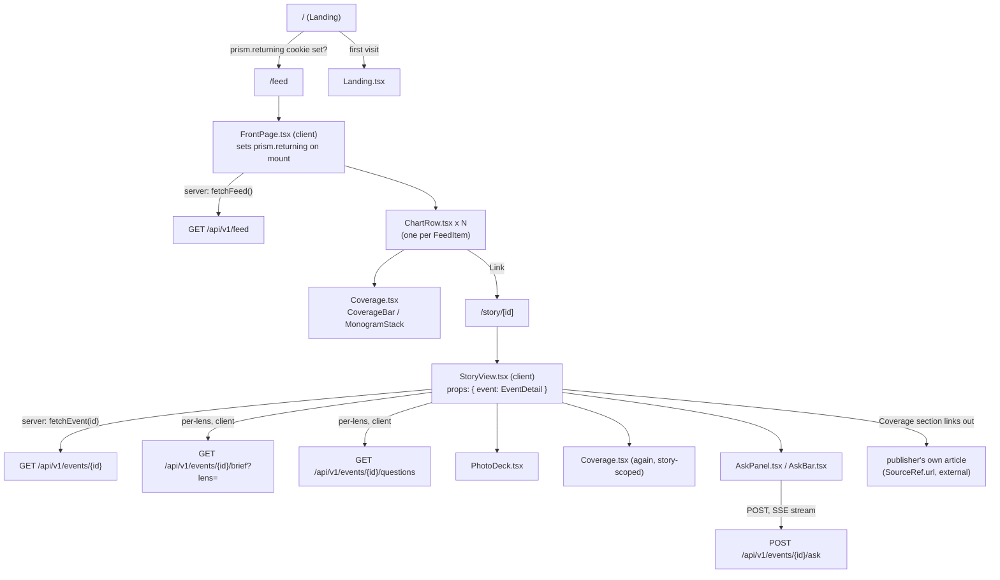

# Prism Web Frontend

Audience: a full-stack developer working on `web/`. This describes the Next.js
App Router codebase as of 2026-09-25 (Design System v2, "Wave 2", 2026-09-24).
Facts below were read directly from source; nothing here is inferred from
naming conventions alone. See `DESIGN.md` and `PRODUCT.md` at the repo root for
the product/design decisions this code implements, and `docs/API.md` for the backend it talks to.

## 1. Stack and scripts

- **Framework:** Next.js `^15.3.0` (App Router), React `^19.0.0` / React DOM `^19.0.0`, TypeScript `^5`.
- **Styling:** Tailwind CSS `^3.4.17` + `postcss`/`autoprefixer`. Design tokens are generated CSS (see §7).
- **3D/charts:** `@react-three/fiber`/`drei`/`postprocessing` + `three` (the admin coverage 3D network graph only, lazy-loaded); `recharts` (admin charts).
- **Testing:** `vitest ^3.2.7` + `jsdom ^29.1.1` + `@testing-library/react ^16.3.2` (+ `/dom`, `/jest-dom`, `/user-event`).
- **Lint:** `eslint ^9.39.5` + `eslint-config-next`.

`web/package.json` scripts:

| Script | Command | Purpose |
|---|---|---|
| `dev` | `next dev` | Local dev server |
| `build` | `next build` | Production build |
| `start` | `next start` | Run a production build |
| `lint` | `eslint .` | Lint |
| `test` | `vitest run` | Run the suite once |
| `test:watch` | `vitest` | Watch mode |
| `check:guides` | `node scripts/check-no-guides.mjs` | Repo-specific guard (labelling guides) |
| `check:charts` | `node scripts/check-admin-only.mjs` | Repo-specific guard (chart library confined to admin) |

There is no `test:coverage` script in `package.json` — coverage tooling is not currently wired into an npm script (flagged in Open Questions).

`web/next.config.ts` (no `middleware.ts` exists anywhere in the app — all auth/redirect logic lives in page bodies or client-side shells):

- `reactStrictMode: true`.
- `images.unoptimized: true`, `remotePatterns: [{ protocol: "https", hostname: "**" }]` — deliberate: publisher thumbnail CDNs block Vercel's server-side image optimizer (datacenter IP / hotlink protection), so photos are fetched directly by the browser, never proxied.
- `headers()` applied to `/:path*`: `X-Frame-Options: DENY`, `X-Content-Type-Options: nosniff`, `Referrer-Policy: strict-origin-when-cross-origin`, `Strict-Transport-Security`, a restrictive `Permissions-Policy`, and a `Content-Security-Policy-Report-Only` (report-only until nonces are wired; reports go to `${API}/api/v1/csp-report` outside `development`). CSP allows `accounts.google.com` and Razorpay domains for sign-in/checkout. A second, narrower `headers()` entry sets `Referrer-Policy: no-referrer` on `/label/:path*` so a labelling batch key never leaks via `Referer`.

`web/vitest.config.ts`: `environment: "jsdom"`, `globals: true`, `setupFiles: ["./vitest.setup.ts"]`, `include: ["src/**/*.{test,spec}.{ts,tsx}"]`, path alias `@` → `./src`. Deliberately **no** `@vitejs/plugin-react` (comment: it exists only for Fast Refresh, unused in tests, and its bundled `vite` copy collides with the app's `Plugin` type under `tsc --noEmit`); JSX is handled via `esbuild: { jsx: "automatic" }`.

## 2. Directory layout

```
web/src/
├── app/          Next.js App Router — every route, layout, sitemap and metadata file
├── components/   All React components (page-level and shared UI)
├── fonts/        Local font assets (general-sans/)
└── lib/          Non-visual logic: API client, session/profile, formatting, SEO — flat
```

`web/src/app/` (routes covered in full in §3; special files in §3.1):

```
about/  account/  admin/ (+ audit, batches, batches/[key], controls, coverage, labellers, people)
auth/verify/  corrections/  entity/[slug]/  entities-sitemap.xml/  feed/
interests/  label/ (+ [key], learn/[kind])  news-sitemap.xml/  onboarding/
plus/ (+ welcome)  privacy/  pulse/  records-sitemap.xml/  refunds/  search/
sector/[slug]/  signin/  sources/  story/[id]/ (+ quote/[n])  subject/[...path]/
terms/  trending/ (+ [slug])  watchlist/  you/
+ root files: layout.tsx, page.tsx, error.tsx, global-error.tsx, not-found.tsx,
  manifest.ts, robots.ts, sitemap.ts, apple-icon.tsx, opengraph-image.tsx, globals.css
```

`web/src/components/` (subdirectories, then ~65 flat files):

| Subdirectory | Contents |
|---|---|
| `accounts/` | `OnboardingPreview`, `ThemeChoice`, watchlist-chip helpers — account-flow pieces |
| `admin/` | `AdminShell` (auth gate + chrome), `AuditItem`, `Dashboard`, `ui`; `charts/` (recharts panels: `Bars`, `ChartPanel`, `CohortGrid`, `DotPlot`, `KpiTile`, `StackedBars`, `TrendChart`); `coverage/` (`CoverageGraph` three.js network, `NetworkFrame`, colours, layout) |
| `label/` | `BriefLineTask`, `ClaimTask`, `QuoteRenderingTask`, `StoryTask`, `GuideView`, `Workspace`, `parts`, `rounds` — labelling task UI |
| `landing/` | `IndicName`, `LensFlip`, `ProofTabs`, `parts` — marketing landing page pieces |
| `reading/` | `PulseRail`, `StoryArc`, `parts`, `QuotePage` — story-reading surfaces |
| `story/` | `ChangeTimeline`, `Impacts`, `LensBrief`, `Sheet`, `StoryActionBar`, `StoryNav` — story-page sub-components |
| `tabs/` | `Markets` — the Markets lens tab content |
| `today/` | `TodayAside`, `TopOfRecord` — feed ("Today") page furniture |
| (flat) | `FrontPage`, `StoryView`, `ChartRow`, `Landing`, `PlusPage`, `SiteHeader`, `SiteFooter`, `BottomTabBar`, the Ask family (`AskPanel`/`AskBar`/`AskShell`/`AskContext`), `GoogleSignIn`, `UsageBeacon`, `NavMemory`, `ThemeToggle`, `RouteMap`/`BranchTree`/`RelatedRoutes`, `PhotoDeck`, `PhotoImg`, `Clips`, `XPosts`, `icons.tsx`, `ui.tsx`, `Coverage.tsx`, `SectorStrip.tsx`, `Masthead.tsx`, `ProfileEditor.tsx`, etc. |

`web/src/lib/` is flat (43 modules and their tests), notably: `api.ts` (API client), `session.ts` (account session), `admin.ts`/`labeller.ts`/`watchlist.ts` (scoped clients), `profile.ts` (local no-account profile), `next.ts` (post-gate redirect memory), `returning.ts` (the `prism.returning` cookie), `nav.ts` (back-button memory), `useScrollRestore.ts`, `lenses.ts`/`sectors.ts`/`regions.ts`/`languages.ts` (vocab), `dateline.ts`, `seo.ts`, `ogCard.tsx`/`ogFonts.ts`, `legal.ts`, `analytics.ts`, `coverage.ts`, `quotes.ts`, `mark.ts`, `site.ts` (`SITE_URL`), and others. 25 of the 43 modules have a same-name test; the rest are covered through the components and pages that use them.

## 3. Routes

Root layout (`web/src/app/layout.tsx`, Server Component): loads every font (`next/font/google`) for the three type voices — Newsreader + one `Noto_Serif_*`/`Noto_Nastaliq_Urdu` per Indic script for "the record"; `Anek_*` + `Noto_Naskh_Arabic` for "read/UI" (Latin, Devanagari, Kannada, Tamil, Telugu, Bangla, Gujarati, Gurmukhi, Malayalam, Odia); `Geist_Mono` for provenance. Sets `--font-*` CSS variables on `<html>`. Injects a pre-hydration inline script that restores the saved theme from `localStorage["prism.theme"]` and marks `<html class="js">`, plus site-wide JSON-LD (`lib/seo.jsonLd(siteGraph())`). Renders `UsageBeacon`, `NavMemory`, `SiteHeader`, `<main>`, `BottomTabBar`, `SiteFooter` around `{children}`.

| Path | Shows | Data fetched | Component | Auth |
|---|---|---|---|---|
| `/` | Landing page (first-time visitors only) | none directly | Server, async | Public. Checks `(await cookies()).has("prism.returning")` and `redirect("/feed")` if present; else renders `Landing()`. |
| `/about` | "How it works" explainer, worked example | delegated to `HowItWorks()` | Server, async, `dynamic="force-dynamic"` | Public |
| `/account` | Plan/payments, profile/watchlist links, theme toggle, sign-out | `PlanCard`/`Payments` fetch their own data | Client (`"use client"`) | Requires session — client-side `useSession()`/`localStorage["prism.session.v1"]` check; `router.replace("/signin?next=/account")` if absent; renders `null` until confirmed |
| `/admin` | Founders' dashboard: KPI tiles, "Needs you" list, section charts | `fetchMetrics`, `fetchLabellers`, `fetchBatches` (`lib/admin.ts`) | Client | `require_admin_user`-equivalent client gate: `AdminShell` calls `GET /api/v1/admin/me`; states `checking`/`ok`/`signed-out`/`forbidden`/`error`. This gate is UX only — the API re-checks admin on every call. |
| `/admin/audit` | Read-only audit log, IST-day grouped | `fetchAudit(session, 100)` | Client | Same admin gate |
| `/admin/batches` | Every labelling batch, progress + switches | `fetchBatches`; mutates `setListed`/`setOpen`/`gateLanguages` | Client | Same admin gate |
| `/admin/batches/[key]` | Review + publish one practice/test round | `fetchRound(session, key)`; mutates `saveExplanations`/`setOpen` | Client | Same admin gate |
| `/admin/controls` | Feature-flag switches (read-only) + "Collect now" + audit feed | `fetchFlags`, `fetchAudit(session, 50)`; mutates `triggerCollection` | Client | Same admin gate |
| `/admin/coverage` | Outlet-coverage tables + lazy 3D network graph | `fetchCoverage(session, days)` | Client (`CoverageGraph` is `next/dynamic(ssr:false)`) | Same admin gate |
| `/admin/labellers` | Applicants, active labellers, standing board, grant/withdraw forms | `fetchLabellers`; mutates `setLabellerStatus`/`addLabeller`/`setQualification` | Client | Same admin gate |
| `/admin/people` | Every account, searchable/filterable/paginated | `fetchPeople(session)` | Client | Same admin gate |
| `/auth/verify` | Magic-link completion screen | `verifyMagicLink(token)` (`POST /api/v1/auth/verify`) | Client, wrapped in `<Suspense>` (`useSearchParams`) | Public — this *is* the sign-in completion step. On success: `saveSession`, then `router.replace(afterSignIn(needsProfile, takeNext("/feed", next)))` |
| `/corrections` | Public editorial corrections log | `fetchCorrections()` | Server, async, `revalidate=300` | Public |
| `/entity/[slug]` | An entity's page: records mentioning it | `fetchEntity(slug)` (`GET /api/v1/entity/{slug}`) | Server, async, `revalidate=300` | Public. `notFound()` on null; non-indexable stubs (`indexable=false`) set `robots: {index:false}` |
| `/feed` | "Today" — the main reading feed | Server-fetches `fetchFeed({sort:"latest", limit:FEED_WINDOW})`, passed as `initial` to client `<FrontPage>` (which re-fetches client-side for the reader's personalized slice) | Server wrapper (`revalidate=60`) + Client (`FrontPage`) | Public. `FrontPage` sets `prism.returning` on mount (see §5) |
| `/interests` | (legacy) | — | Server | Public. Pure `redirect("/you")` |
| `/label` | Labelling workspace entry: apply → wait → guides → batches | `fetchLabellerMe`, `fetchLabellerBatches` (`lib/labeller.ts`) | Client | Requires session (`useSession()`); unauthenticated → sign-in pitch; applied-not-approved → waiting screen; active → workspace |
| `/label/[key]` | One-question-at-a-time labelling UI | `fetchLabelGuide`/`fetchLabelBatch`/`fetchLabelTask`; posts `postLabelAnswer` | Client | **Per-batch token**, not account session — either a self-join name form or a token carried in the URL fragment (never sent to the server), claimed into `localStorage["prism.label.token.${batch}"]` |
| `/label/learn/[kind]` | One task kind's guide, for reading | `fetchGuide(session, kind)` | Client | Requires session; not-signed-in → sign-in gate; signed-in-not-applied (403) → "Apply to label" gate; `notFound()` for unknown `kind` |
| `/onboarding` | Three-step wizard: state → profession → subjects | none itself; children call `fetchTaxonomy`/`fetchProfessions`/`fetchRegions` | Client, wrapped in `<Suspense>` | Not gated — usable with or without a session; "Skip for now" always available. Calls `setProfile()` (API) only if signed in, always calls `saveProfile()` (localStorage) |
| `/plus` | Pricing/upsell | delegated to `PlusPage` | Server wrapper (`dynamic="force-dynamic"`) + Client, `<Suspense>` | Public |
| `/plus/welcome` | Post-checkout confirmation | delegated to `PlusWelcome` | Server wrapper + Client, `<Suspense>` | Public. `robots: {index:false}` |
| `/privacy` | Static legal copy | none (static, `lib/legal.ts`) | Server | Public |
| `/pulse` | Market Pulse: today's markets read + tickers + source stories | `fetchDigest()` (`GET /api/v1/digest/markets`) | Client | Public (session only affects ticker link targets) |
| `/refunds` | Static legal copy | none (static) | Server | Public |
| `/search` | Debounced live search + "In the news now" chips | `searchEvents(term)` (`GET /api/v1/search?q=`, `cache:"no-store"`), `fetchTrending({limit:6})` | Client (`SearchInner`), `<Suspense>` | Public. `robots: {index:false, follow:true}` (thin per-query pages) |
| `/sector/[slug]` | One of six reader-facing subject groups | Server-fetches `fetchFeed({sector, sort:"latest", limit:FEED_WINDOW})`, passed to client `<FrontPage>` | Server (`revalidate=60`, `generateStaticParams()` prerenders all 6 slugs) + Client | Public. `notFound()` for unknown slug |
| `/signin` | Email magic-link entry + Google sign-in | `requestMagicLink(email, next)` | Client, `<Suspense>` | Public — the auth entry point. Remembers `?next=` via `rememberNext()` (sessionStorage) |
| `/sources` | Monitored outlet list | `fetchSources()` | Server, async, `revalidate=300` | Public |
| `/story/[id]` | Story detail (the record) | Server-fetches `fetchEvent(id)` (anonymous, cached view); `<StoryView>` fetches per-lens brief/questions client-side | Server (`revalidate=60`) + Client (`StoryView`) | Public; paid-lens content gated client-side (401/402 handling inside `StoryView`/`fetchBrief`). `loading.tsx` renders `<RecordSkeleton>`. `notFound()` on fetch failure |
| `/story/[id]/quote/[n]` | Deep link to one quote within a story | Server-fetches `fetchEvent(id)`, locates quote via `findQuote(event.claims, n)` | Server, async | Public. `notFound()` if event or quote index is invalid |
| `/subject/[...path]` | A node in the subject taxonomy tree + its stories | `fetchSubject(path)`; best-effort `fetchSubjects()`/`fetchTrending()` for a "Developing" rail | Server, async, `revalidate=120` | Public |
| `/terms` | Static legal copy | none (static) | Server | Public |
| `/trending` | "Stories" — the developing-story list | Server-fetches `fetchTrending({limit:24})`, passed to client `<StoriesPage>` | Server (`revalidate=120`) + Client | Public |
| `/trending/[slug]` | One developing story's detail | `fetchTrendingStory(slug)` | Server (`revalidate=60`) | Public. Redirects to `canonical_slug` if the story has since merged |
| `/watchlist` | Followed tickers/sectors + their events | `getWatchlist`, `watchlistEvents` (`lib/watchlist.ts`), `fetchDigest()` | Client (`WatchlistInner`), `<Suspense>` (`?ticker=`) | Requires session — signed-out renders a `<SignedOut/>` upsell |
| `/you` | Profile editor (works with no account) + watchlist/account summary when signed in | `loadProfile`/`saveProfile` (local); `getWatchlist`/`watchlistEvents` only if session present | Client | Not gated — profile section works signed-out; "Following"/"Account" sections show sign-in prompts otherwise |

### 3.1 Route handlers and special files

| Path / file | Behavior |
|---|---|
| `entities-sitemap.xml` (`route.ts`) | `GET`, `dynamic="force-dynamic"`. Proxies `${API_URL}/api/v1/sitemap/entities` server-side (`cache:"no-store"`); `Cache-Control: public, s-maxage=3600, stale-while-revalidate=86400`; `503` + `Retry-After: 300` on API failure (avoids baking an empty sitemap mid-deploy) |
| `news-sitemap.xml` (`route.ts`) | `revalidate=900`. Calls `fetchFeed({sort:"latest", limit:100})`, filters to the last 2 days, emits a Google News sitemap (`news:` namespace) |
| `records-sitemap.xml` (`route.ts`) | `dynamic="force-dynamic"`. Same proxy pattern as entities-sitemap, against `/api/v1/sitemap/records` — the full archive beyond the freshest hundred |
| `sitemap.ts` | Default Next.js sitemap (`revalidate=3600`): static pages, the six sector groups, every subject-tree node with `story_count>0`, the freshest 100 stories (`fetchFeed`) and 100 trending arcs (`fetchTrending`). Degrades to static-pages-only if the API is down |
| `robots.ts` | Allows `*` except a `PRIVATE` list (`/account`, `/signin`, `/auth/`, `/onboarding`, `/interests`, `/watchlist`, `/you`, `/search`, `/label`, `/admin`, `/plus/welcome`). Explicitly disallows AI-training-only crawlers (`Google-Extended`, `CCBot`, `Applebot-Extended`, `Bytespider`, `meta-externalagent`) while leaving citing crawlers (GPTBot, ClaudeBot, PerplexityBot, OAI-SearchBot) free — a deliberate founder decision (2026-09-22), not an oversight. Lists all four sitemaps |
| `manifest.ts` | PWA manifest: `start_url:"/feed"`, `display:"standalone"`, warm-paper theme color `#F7F6F2` |
| `opengraph-image.tsx` | The default brand OG card (1200×630) for any route without its own — `SiteCard` component + `ogFonts()`. A story/entity page whose own card can't be built falls back to this, never an invented one |
| `apple-icon.tsx` | 180×180 PNG, the Prism mark on warm paper |
| `not-found.tsx` | `<SystemPage kind={404}/>` — the record's own 404, used both for unmatched addresses and every route's own `notFound()` call |
| `error.tsx` | `"use client"`. `<SystemPage kind="error" reference={error.digest} onRetry={reset}/>` for a segment that threw |
| `global-error.tsx` | `"use client"`. Brings its own `<html>`/`<body>` (root layout itself failed); fonts fall back to their stacks since the layout that loads them is absent |

## 4. The API client — `web/src/lib/api.ts`

**Base URL** (top of file):

```ts
export const API_URL =
  (typeof process !== "undefined" ? process.env.NEXT_PUBLIC_API_URL : undefined)
    ?.replace(/\/$/, "") ?? "http://localhost:8000";
```

Env var `NEXT_PUBLIC_API_URL`; defaults to `http://localhost:8000` locally. Production is `https://api.readprism.news`. The `typeof process` guard exists because this module is also bundled outside Next (design-system sync tooling).

**Exported types** (all field names verbatim from source — see the file for the full list; the story-facing ones): `OutletRef`, `FeedItem` (the feed-row shape: `id, title, headline_lang, available_languages, summary, sector, subsector, regions, image_url, image_outlet, is_regional, clip_shows, coverage, event_type, source_count, cvss_score, cvss_severity, kev_listed, cve_ids, tickers, catalyst, price_impact_direction, last_updated_at, latest_published_at, score, outlets`), `LensInfo`, `SourceRef`, `CoverageOut`, `EntityOut`, `PerspectiveOut`, `ClaimOut`, `SpeakerClaims`, `ImpactOut`, `CyberLens`, `FinanceLens`, `StoryDevelopment`, `StoryTimelineData`, `EventDetail` (the story-detail shape), `XPostOut`, `ClipShow`, `ClipOut`, `FeedQuery`, `RegionState`, `MonitoredFeed`, `MonitoredSet`, `RecordCorrection`, `RecordVersion`, `StoryPhoto`, `TrendingStory`, `RouteNode`/`RouteData`, `BranchNode`/`BranchTreeData`, `StoryOutlet`, `TrendingStoryDetail`, `RelatedStory`, `SubjectNode`/`SubjectPage`/`SubjectTree`, `EntityRef`/`EntityPage`, `MarketDigest`, `TaxonomySector`, `ProfessionOption`/`ProfessionGroup`, `BriefResult` (discriminated union: `{state:"ok"|"signin_required"|"no_samples"|"unavailable", ...}`), `AskCitation`, `AskLimit`, `AskStructure`, `AskCallbacks`, plus the labelling types `LabelEvent`/`LabelClaim`/`LabelRenderedQuote`/`LabelRendering`/`LabelBriefLine`/`LabelTask`/`LabelBatch`/`LabelFeedback`/`LabelResult`/`GuideExample`/`GuideBlock`/`LabelGuide`.

**Exported functions** — one per API call the frontend makes, mirroring the endpoints documented in `API.md`: `fetchVersions`, `fetchCorrections`, `fetchSources`, `fetchRegions`, `fetchFeed`, `fetchTrending`, `fetchTrendingStory`, `fetchSubject`, `fetchSubjects`, `fetchEntity`, `fetchDigest`, `searchEvents`, `fetchTaxonomy`, `fetchProfessions`, `fetchLenses`, `authHeaders`, `fetchEvent`, `fetchQuestions`, `fetchBrief`, `askQuestion` (SSE), `joinLabelBatch`, `fetchLabelGuide`, `fetchLabelBatch`, `fetchLabelTask`, `postLabelAnswer`.

**Error-handling convention** — no single global wrapper; each function picks the convention that fits its own caller:

1. **Throws** (`fetchEvent`, `fetchFeed`, `fetchVersions`, the label functions) — for data a page cannot render without; forces a `try/catch` or a Server Component `notFound()`.
2. **Returns `null`** (`fetchCorrections`, `fetchSources`, `fetchTrendingStory`, `fetchSubject`, `fetchEntity`, `fetchDigest`) — "this section just doesn't render."
3. **Returns `[]`** (`fetchRegions`, `fetchTrending`, `fetchTaxonomy`, `fetchProfessions`, `fetchLenses`, `fetchQuestions`, `searchEvents`) — list data where empty is a safe fallback.
4. **Discriminated-union result** (`BriefResult`; `askQuestion`'s `onError` callback) — where the failure mode itself changes what the UI shows (paywall vs. rate-limit vs. outage), not just "it failed."

Notably: `fetchBrief` treats `401`/`402` as *product states* (`signin_required`/`no_samples`), not failures — the file comments this explicitly.

**Auth attachment**: cookie-based via `credentials: "include"` (on `fetchEvent`, `fetchQuestions`, `fetchBrief`, `askQuestion`, and the `lib/admin.ts`/`lib/labeller.ts`/`lib/watchlist.ts` clients), plus an optional `Authorization: Bearer <token>` from `authHeaders(token)` for pages still holding a pre-cookie bearer token. `fetchEvent` caches conditionally: `cache:"no-store"` when a token is present (a paywalled unlock must never be cached-and-shared), `revalidate:60` when anonymous. The `/label/*` endpoints use a separate scheme entirely — an `X-Label-Token` header (or a body field), never a cookie or account session, since labellers can be anonymous/invited.

## 5. State and persistence

- **Account session** (`web/src/lib/session.ts`, `"use client"`): the real credential is an **HttpOnly cookie** set by the API — page JS never reads it. `localStorage["prism.session.v1"]` holds only a display-only mirror `{userId, email, token?}` (`token` is legacy, pre-cookie only). A custom DOM event `prism-session` fires on every session change so every `useSession()` consumer re-syncs in-tab; the `storage` event covers other tabs. `adoptCookie()` upgrades a stray bearer token into the cookie (`POST /api/v1/auth/cookie`), memoized per page load. `clearSession()` clears localStorage and fire-and-forgets `DELETE /api/v1/auth/session` (`keepalive:true`). `usePlan()` caches plan status in a module-level `Map` keyed by `userId`.
- **Local profile, no account required** (`web/src/lib/profile.ts`): `{lens, region, state, interests[], languages[]}` in `localStorage["prism.profile.v1"]`. Explicitly commented as a stopgap ("Replaced by real accounts + user_profiles when auth lands").
- **Post-gate redirect memory** (`web/src/lib/next.ts`): `safeNext(value)` only accepts same-site paths (must start with `/`, not `//`, ≤500 chars — blocks an open-redirect via a crafted `?next=`). `rememberNext()`/`takeNext()` round-trip through `sessionStorage["prism.next.v1"]`. `afterSignIn()` routes new readers through `/onboarding?next=...` first.
- **Returning-reader cookie** (`web/src/lib/returning.ts`): `RETURNING_COOKIE = "prism.returning"`. `markReturning()` sets `document.cookie = "prism.returning=1; path=/; max-age=31536000; samesite=lax"` — called once, from `components/FrontPage.tsx` on mount (i.e., whenever `/feed` or `/sector/[slug]` renders client-side). Read server-side only, in `app/page.tsx`, via `(await cookies()).has(RETURNING_COOKIE)`. This single cookie is the entire "first visit sees the landing page; every later visit skips straight to `/feed`" mechanism. No other file touches `document.cookie`/`cookies()`.
- **Other `sessionStorage` users**: `components/UsageBeacon.tsx` (per-tab "already counted this visit" flag), `lib/nav.ts` (back-button memory — whether real browser history exists), `lib/useScrollRestore.ts` (per-key scroll-position restore for list views).
- **No app-wide state library** — no Redux/Zustand/Context store beyond the auth-session `useSession()` hook and the `AskContext` opener function; server data flows through Next's own fetch cache (`revalidate`) plus the per-function conventions in §4.

## 6. Testing

- Tests live beside the code, `web/src/**/*.test.ts(x)` (89 files as of this writing) — page tests (`app/**/page.test.tsx`), component tests, and lib tests.
- Run: `cd web && npm test` (once) or `npm run test:watch` (watch mode).
- `web/vitest.setup.ts` sets `process.env.TZ = "Asia/Kolkata"` (the product's one clock), and ships shims jsdom lacks: `ResizeObserver` (with an exported `resizeObservers` registry tests can fire manually — assigned by plain assignment, deliberately *not* `vi.stubGlobal`, so the global `afterEach`'s `vi.unstubAllGlobals()` doesn't rip it out), `IntersectionObserver`, `window.matchMedia`, a working `window.localStorage` (jsdom ships a non-functional one), and scroll stubs. Global `afterEach`: `cleanup()`, reset scroll/observers, `vi.restoreAllMocks()`, then **`vi.unstubAllGlobals()`**, then clear `sessionStorage`/`localStorage`.

**The two jsdom traps** (from project `CLAUDE.md`), with live examples in this codebase:

1. **`vi.spyOn(Storage.prototype, ...)` does not intercept `sessionStorage`** — jsdom's `sessionStorage` doesn't route through the prototype, so the spy never fires. Fix: `vi.stubGlobal("sessionStorage", {...})`, undone in `afterEach` with `vi.unstubAllGlobals()` (`vi.restoreAllMocks()` does not undo a stub). Live examples: `web/src/components/FrontPage.test.tsx` (lines ~43-58) and `web/src/lib/useScrollRestore.test.ts` (~line 245) — both carry a comment citing `CLAUDE.md` directly. The same `vi.stubGlobal`/`vi.unstubAllGlobals` pattern (for `sessionStorage`, `localStorage`, `fetch`, `navigator`, or `matchMedia`) also appears in `web/src/app/label/page.test.tsx`, `web/src/app/label/[key]/page.test.tsx`, `web/src/components/StoryView.controls.test.tsx`, `web/src/components/ShareButton.test.tsx`, `web/src/lib/session.dead.test.ts`, `web/src/lib/scope.test.ts`, `web/src/lib/analytics.test.ts`, `web/src/lib/api.questions.test.ts`, `web/src/lib/session.test.ts`, `web/src/components/UsageBeacon.test.tsx`.
2. **`renderHook` swallows errors thrown inside effects**, so `expect(...).not.toThrow()` on a hook is vacuous. Fix: render a real component that uses the hook and assert the tree survived. Live example: `web/src/lib/useScrollRestore.test.ts`, the test `"survives storage being blocked, as in an in-app webview"` — it deliberately uses `render()` with a small wrapper component instead of `renderHook`, with a comment explaining exactly why (an unguarded throw inside the effect would otherwise blank the whole route in a WhatsApp/Instagram in-app browser, and `renderHook` would hide that).

Every regression test should be mutation-verified: reintroduce the bug, confirm the test fails, per project convention.

## 7. Design System v2 — pointer

`DESIGN.md` (repo root) is the source of truth; do not restate its values in code comments — point back to the file. Summary for orientation only:

- **Chrome**: neutral warm paper (`--paper #F7F6F2`) + carbon ink (`--ink #111317`), one interactive accent — cobalt (`--accent #0B57D0`, dark `--accent-dark #8AB4F8`). Colour otherwise appears only in the coverage bar (fixed slot order: navy national, blue-green international, orange Indian-language, hatched grey wire — always paired with its count) and in a lens's own hue+shape (Markets = green circle, Cyber = violet square; Health = magenta diamond and Policy = ochre triangle are drafted, not fully adopted as of 2026-09-25). The mark's spectrum band is the only gradient anywhere.
- **Three type voices**, generated onto `:root` from `design/tokens.json` via `uv run python design/gen_css.py` (checked with `--check` in CI): "the record" (Newsreader + per-script Noto Serif/Nastaliq, weight 600) for headlines/titles/quotes/hero figures; "read/UI" (Anek per script + Noto Naskh Arabic) for everything tapped or read, including eyebrows; "provenance" (Geist Mono, 11px floor) for counts/times/codes/`[n]`/tickers/CVE ids only — never prose, a heading, or a label. 4.5:1 contrast floor on both grounds.
- **Shape**: records cut square (2px radius), controls "pressed" (8px), sheets "held" (16px); sections sit under a 3px ink rule.
- **State is line form, not hue**: solid = verified, dashed = provisional/one source, faded (62% opacity) = stale, dashed+hatched = not counted.
- **Icons** come from `web/src/components/icons.tsx` exclusively — never a text glyph. One stroke family, `currentColor`, 22px/1.8 stroke for nav icons, 2px stroke for inline glyphs. See the file for the full list (`TodayIcon`, `StoriesIcon`, `SearchIcon`, `WatchlistIcon`, `YouIcon`, `Check`, `Lock`, arrows, `SunIcon`/`MoonIcon`, `Speech`, `Close`, `Play`/`Pause`/`SkipNext`, `XIcon` (the X/Twitter logo drawn in-house, per the display rules), `Headphones`, `InfoIcon`, etc.).
- **Motion**: the signature move is "the lens flip" — a 2px scan line in the lens hue sweeps the brief while a paper veil lifts on the same clock, paced by block height (900-1800ms), never a crossfade, layout never moves; reduced motion collapses it to an instant swap. Rows "print in" (200ms, 40ms stagger). Publisher photos fade in over 320ms. The photo deck advances in 480ms with a 5° tilt on the leaving photo; drag tracks the finger at 1° per 40px, release past 60px advances.
- **Content rules**: counted structure prints as counts ("3 of 4" below 30, never "75%"); quotes are verbatim or absent; no invented numbers or examples ship (a design mock's ILLUSTRATION banners/sample data never ship); never enumerate lens names in generic/marketing copy (the picker renders whatever `/api/v1/lenses` returns).
- `DESIGN.md`'s `## Components` section maps every design-system component name to the actual app file (e.g. `ChartRow` = "StoryRow", `Coverage` = CoverageBar/Legend/OutletStack) — consult it before assuming a name.
- `DESIGN.md`'s `## Decisions Log` is dated; check it for what's shipped vs. still diverging (e.g., as of 2026-09-25 the design's "photo pile" concept for the Stories list is unused — Stories draws no photographs yet).

## 8. Key components

- **`ChartRow.tsx`** — the story row, identical across Today/Stories/Search/Watchlist/landing (per its own doc comment, matching `DESIGN.md`'s "Story row"). Props: `{ item: FeedItem; lead?: boolean; lastOpened?: boolean; primaryLang?: string; pageCode?: string | null; draw?: boolean }`. Renders meta line, title/summary, an optional credited photo (`PhotoImg`, gated by `NEXT_PUBLIC_REPORT_IMAGES`), and a footer with `MonogramStack`, `CoverageBar`, `HeardOn`, and lens dots (`lensMarkers()` — pushes a Markets marker if `tickers.length || catalyst`, a Cyber marker if `cve_ids.length || kev_listed || cvss_score != null`).
- **`StoryView.tsx`** — the story-detail component (`app/story/[id]/page.tsx` renders `<StoryView event={event} />`). Single required prop `{ event: EventDetail }`. Manages lens state and fetches `fetchBrief`/`fetchQuestions` per lens; `isLocked(slug) = slug !== "reader" && !session` (the Reader lens is always open, Markets/Cyber require sign-in); a `readerPicked` ref distinguishes a deliberate lens tap from a profile-driven preselection so a locked pro lens snaps back to Reader without looking like a bug. Keyboard shortcuts `1`/`2`/`3` flip lenses without scrolling. DOM section IDs match `DESIGN.md`'s story-record order exactly: `lens-brief`, `changed`, `said`, `heard`, `on-x`, `route`, `so-what`, `sources`, `history`, `report`, `ask` — each section is only added to the nav when the record actually has data for it. Wraps everything in `<AskContext.Provider>`.
- **`PhotoDeck.tsx`** — props `{ sources?: SourceRef[]; frames?: DeckPhoto[] }` (caller supplies one). Implements the "stage + peek stack" carousel: pointer-drag with rotation proportional to drag distance, keyboard arrow navigation, `prefers-reduced-motion` honored via an internal `useReduced()` hook. Tracks dead/errored images locally to filter them out.
- **`PhotoImg.tsx`** — props `{ src, alt, eager?, className?, onError? }`. A plain `` (hotlinked publisher photo, not Next-optimized) that fades in via CSS once loaded; `referrerPolicy="no-referrer"`.
- **`Coverage.tsx`** — `CoverageBar({ outlets, fallbackCount?, size?, width?, draw?, className? })` (the navy/blue-green/orange/hatched-grey bar, `aria-hidden` since the adjacent count is the real a11y legend), `CoverageLegend`, `MonogramStack` (up to `limit` outlet favicons + `+N`), `Monogram`, `OutletIcon` (favicon with text-badge fallback on load error).
- **`SectorStrip.tsx`** — props `{ active, onPick?, allHref?, allLabel?, responsiveRail?, counts? }`; renders `Link`s that navigate or `button`s that call `onPick` (in-place re-sort), built from `NAV_ITEMS` (`lib/sectors.ts`).
- **`Masthead.tsx`** — props `{ dateline, right? }`; the 52px phone-only sticky header (`lg:hidden`), purely presentational.
- **Ask family** — `AskContext.tsx` (`useAsk()` hook, `AskVia` type); `AskBar.tsx` (`{ suggestions, sourceCount }`, the persistent foot-of-record input); `AskPanel.tsx` (`{ eventId, sourceCount, suggestedQuestions, open?, onOpenChange?, launcher?, request?, sources? }`, the streaming Q&A sheet, uses `askQuestion()` with an `AbortController`); `AskShell.tsx` (`{ sourceCount, turns, thinking?, input, onInput, onSubmit, onFollowUp?, onUpgrade?, suggestions, onClose?, inputRef?, scrollRef?, titleOf?, chrome?, ... }`, the shared transcript UI used by both the live per-story panel and the landing's scripted demo).
- **`ui.tsx`** — shared primitives on the system's `.p-*` classes: `EmptyState`, `Alert` (`{tone?, title?, children?, action?}`), `Toast`, `TextField`, `SelectField`, `Checkbox`, `ToggleRow`, `StepIndicator`, `BackBar`, `OnThisPage`, `InShortCard`, `InfoCard`, `SystemPage` (`{kind: "404"|"error", reference?, onRetry?}` — backs both `not-found.tsx` and `error.tsx`; no offline variant exists, "Prism has no offline mode"). Note: `Button`/`Chip`/`Segmented`/`Sheet`/`Skeleton` are listed under `DESIGN.md`'s `ui` group but live in other files (e.g. `Sheet` is imported from `@/components/story/Sheet`), not in `ui.tsx`.
- **`ProfileEditor.tsx`** — despite the name, no default component; it's the shared logic `/you` and onboarding both use: the `Picks` codec (`picksToInterests`/`interestsToPicks`/`groupOn`/`toggleGroup`/`toggleSub`), `useTaxonomy`/`useProfessionGroups`/`useRegions` hooks, `StateSelect`, `followedSubjects`, and `SubjectToggles` (renders the six sector groups as `ToggleRow`s).

## 9. Reading-flow diagram

The main reading path — Today (feed) → a story → its sources — end to end:



## Open questions

- `package.json` has no `test:coverage` script; whether coverage is measured at all (CI job, separate config) was not found in the files read for this doc.
- `DESIGN.md`'s Health (magenta diamond) and Policy (ochre triangle) lens styling is marked "drafted" — whether/when these lenses ship beyond Reader/Cyber/Markets is a product decision, not something visible in the frontend code alone.
- The `## Components` list in `DESIGN.md` names a few components (`Button`, `Chip`, `Segmented`, `Sheet`, `Skeleton`) whose exact current file locations were not individually verified beyond `Sheet` (confirmed at `components/story/Sheet`); the rest are inferred to exist from import sites seen in passing, not read in full.
