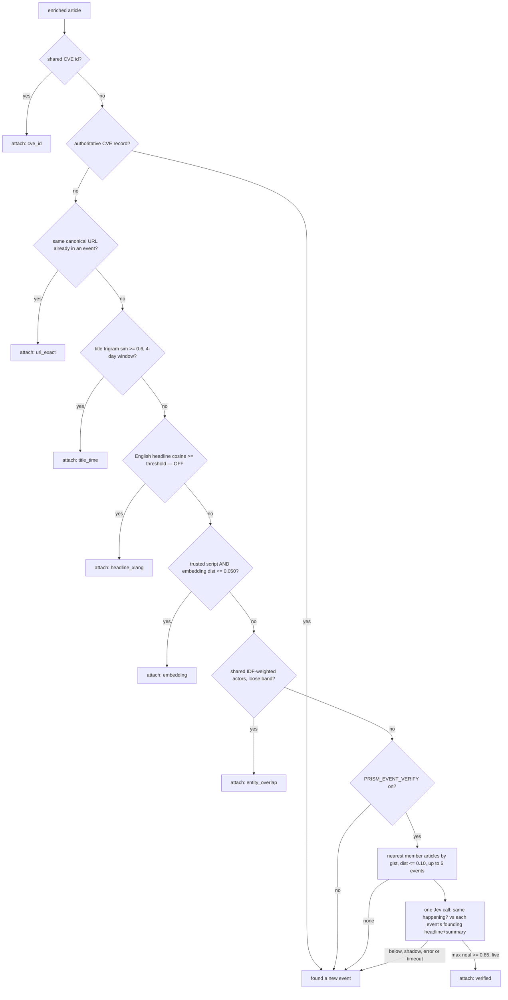
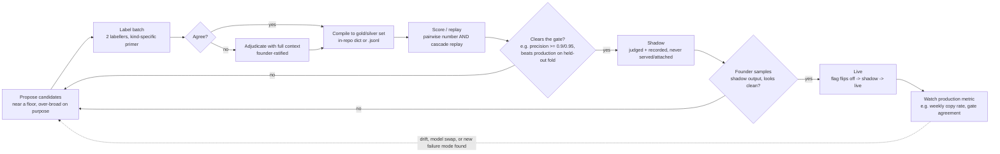

# Prism ML/AI Evaluation Reference

Audience: an ML/AI engineer who needs to reproduce, extend, or sanity-check the
measurements behind Prism's matching, clustering, and judging pipelines. Every
number below carries a file:line (or doc) citation and a date. Numbers with no
date attached were not found dated in the source and are flagged as such.

This file is a snapshot as of **2026-09-25**. The repo is Python (FastAPI API +
worker), Postgres+pgvector. The single most important fact to internalize before
trusting any number here: **this codebase has repeatedly found that a pairwise
score (does signal X separate a hand-labelled pair?) over-predicts what the same
change does through the real cascade** (greedy first-match, an article joins an
*event* that accumulates state, not another article). Every number below is
tagged pairwise or cascade-replay; prefer the latter when they disagree, and see
[Methodology](#6-methodology-rules-this-repo-learned-the-hard-way).

---

## 1. Model inventory

All model IDs are OpenRouter IDs from `common/config.py` (env-overridable via
`PRISM_MODEL_*`). Confirm current IDs/pricing on openrouter.ai/models — the repo
warns these drift.

| Stage | Setting | Model id (default) | Provider | Why chosen (measured) | Cost/latency (measured) |
|---|---|---|---|---|---|
| Gate (binary relevance, high volume) | `prism_model_gate` | `google/gemini-3.1-flash-lite` | OpenRouter chat | Cheap-reliable for high-volume structured output; free models (`tencent/hy3:free`) returned empty content. `common/config.py:39` | — |
| Classify | `prism_model_classify` | `google/gemini-3.1-flash-lite` | OpenRouter chat | Same tier as gate. `common/config.py:40` | — |
| Extract (entities/stance/cyber/finance) | `prism_model_extract`, `prism_model_extract_light` | `google/gemini-3.1-flash-lite` | OpenRouter chat | **Reversed a prior finding.** Measured 2026-09-04 on 10 production articles, same prompt, claims enabled: `qwen/qwen3.5-flash-02-23` failed 10/10 (bare-number responses, 0 claims/0 entities) vs `google/gemini-3.1-flash-lite` 0/10 failed, 16 claims/77 entities, vs `google/gemini-3.5-flash` 0/10 failed, 15 claims/73 entities. An earlier benchmark on 25 real India articles (recall vs `qwen3.7-plus`) had found gemini-3.1-flash-lite left 40% empty (recall 0.39) and picked qwen3.5-flash (0 empty, ~0.77 recall, ~4.7x cheaper than qwen3.7-plus). `common/config.py:41-66` | qwen3.5-flash $0.07/$0.26 per M vs qwen3.7-plus $0.32/$1.28 per M |
| Correlate (briefs/analysis/thread-link/digest) | `prism_model_correlate` | `z-ai/glm-5.3-flash` | OpenRouter chat | Bake-off 2026-09-17, `tools/bakeoff_brief`, 30 live multi-source events, blind judging: glm-5.3-flash grounded 0.92 vs qwen3.7-plus 0.91; complete 0.99 vs 0.98; neutral 0.98 vs 0.96; 0 failures vs 3; 19.8s vs 40.1s a brief; ¼ the price. `common/config.py:67-72` | 19.8s/brief, ~4x cheaper |
| Agent / Ask (user-facing, paid) | `prism_model_agent` | `qwen/qwen3.7-plus` | OpenRouter chat | `common/config.py:73` | — |
| Agent / Ask (free/anonymous) | `prism_model_agent_free` | `z-ai/glm-5.3-flash` | OpenRouter chat | Same prompt, ~1/6 the cost of the Plus model. `common/config.py:74` | — |
| Judge (evals, low volume) | `prism_model_judge` | `google/gemini-3.5-flash` | OpenRouter chat | Wants strong reasoning, low volume. `common/config.py:75` | — |
| Fallback (content-policy refusals) | `prism_model_fallback` | `z-ai/glm-5.3-flash` | OpenRouter chat | Gemini refused 13 of 44 gate calls in one window on 2026-09-18 (PROHIBITED_CONTENT on sexual-violence reporting); glm-5.3-flash answers the schema and doesn't refuse news. `common/config.py:76-81` | — |
| Guard (Ask moderation) | `prism_model_guard` | `google/gemini-3.1-flash-lite` | OpenRouter chat | Cheap + fast. `common/config.py:82` | — |
| **Event verification (verified matching tier)** | `prism_model_decide` (via Jev) | `typesafe/jev-1.13` | **OpenRouter alpha Decisions API** ("Jev" = TypeSafe's Decisions model) | See §3. Batched call = ~$0.00005 and ~250ms per article. `correlation/verify.py:19-20` | ~$0.00005, ~250ms/article |
| **Gate + classifier (Jev unification, staged)** | `prism_model_decide` + `prism_decisions_mode` | `typesafe/jev-1.13` | OpenRouter alpha Decisions API | Smoke-tested 2026-09-22 on en/kn/hi: 320-600ms, ~$0.00005 an item for gate+classifier in ONE call, vs ~$0.0008 for the two separate LLM calls. Pinned to a version deliberately — `jev-latest` retunes without notice. `common/config.py:186-196` | ~$0.00005/item vs ~$0.0008 (2-call baseline) |
| Clip / X-post judge | `prism_judge_backend` | `llm` (one-word judge) or `decide` (Jev) | OpenRouter chat or Decisions API | Verdicts cached with the model that gave them; a backend flip re-judges nothing already settled. `common/config.py:197-201` | — |

Embedding model is **not** an OpenRouter call — see §2.

### 1.1 The Decisions API (Jev) wire contract

`common/decisions.py` — measured 2026-09-22 (`common/decisions.py:11-16`):
`POST {openrouter}/api/alpha/decisions` with `{model, state, questions}` → back
comes `{answers, usage: {input_tokens, output_tokens, cost}, model, id, provider}`.
**$0.042 per million input tokens, output is free**; 64k tokens of state+questions
per call; **1,200 requests/minute**. Same API key, attribution headers and quota
pool as the chat client — credits are shared with the rest of OpenRouter spend.
Jev answers three question shapes: `noul` (yes/no with a probability), `choice`
(pick 1 of up to 255 named options + confidence + full distribution), `score`
(place on an ordered rubric) (`common/decisions.py:3-6`). Failure semantics reuse
`common/llm.py`'s: quota errors (402/429/401/403) pause every model call; a 5xx or
timeout retries twice (`DECISIONS_TIMEOUT_S = 15.0`, `_RETRIES = 2`,
`_RETRY_BACKOFF_S = 0.5`) then raises `ConnectionError` (message stays pending,
redelivered); any other 4xx is a `ValueError` (dead-lettered once, not redelivered)
(`common/decisions.py:18-43`).

`common/pair_judge.py` is the **shared judge machine behind both the podcast-clip
and X-post attachment questions** ("is this TEXT about THIS story? event / topic /
unrelated") — the two were literally duplicate code until unified 2026-09-22
(`common/pair_judge.py:1-9`). `prism_judge_backend` picks the model+API per call:
`llm` → `prism_model_judge` via chat, temperature 0, `max_tokens=40`; `decide` →
`prism_model_decide` (Jev) via the Decisions API with a `Choice` question
(`common/pair_judge.py:88-114`). `JUDGE_CONCURRENCY = 4`, `STORY_RECORD_CHARS =
600`, `RIGHT_TEXT_CHARS = 1600` (`common/pair_judge.py:31-33`). **This is a
different judge instance from the relevance gate/classifier in
`classification/decide.py`** and from the verified-matching-tier judge in
`correlation/verify.py` — all three share the same underlying Jev/Decisions API
and the same `prism_judge_backend`/`prism_model_decide` config, but ask different
questions over different text shapes.

---

## 2. Embeddings

**Model:** `intfloat/multilingual-e5-base` (768-dim, mean-pooled, normalized), run
in-process via `fastembed` (ONNX/CPU) — free, portable, no torch/sentence-transformers
in the image (`common/embeddings.py:1-24`). Registered as a custom fastembed model
since it isn't in fastembed's built-in registry (`common/embeddings.py:22-24,83-94`).

**Chosen over `paraphrase-multilingual-mpnet-base-v2` on a full cascade replay
against `gold_pairs`**, not on the isolated embedding score (measured 2026-09-05,
both folds — `common/config.py:84-100`):

| Model | all 398 pairs (Cdet) | batch1 fitted (Cdet) | batch2 HELD OUT (Cdet) |
|---|---|---|---|
| mpnet | 0.5930 | 0.5268 | 0.6555 |
| mE5 + `passage:` prefix | 0.5466 | 0.5179 | 0.5837 |
| mE5 + `query:` prefix | 0.5319 | 0.4598 | 0.5949 |

mE5 beats mpnet on F1 and Cdet in **both** folds (mpnet's predecessor step had
failed that test). Both models are 768-dim, so no vector-column migration was
needed. Earlier signal that motivated multilingual embeddings at all: on real CJP
coverage, same-story cosine similarity was Hindi 0.87 / Telugu 0.77 / Tamil 0.56
vs unrelated −0.01, while `bge-small-en` couldn't separate Hindi at all
(`common/config.py:84-89`).

**What gets embedded:**
- Article chunks (`article_chunks`, for RAG) and the event embedding (first
  chunk) — both stored with the same vector, since one stored vector must serve
  both jobs (`common/embeddings.py:41-43`).
- **Article gist** (new, 2026-09-25): the extractor's English headline + one-line
  summary, `correlation/verify.gist_text` (`correlation/verify.py:69-77`) — the
  retrieval vector for the verified matching tier, stored in
  `articles.gist_embedding` (migration `e5a9c3b7d2f1`, `db/versions/e5a9c3b7d2f1_article_gist_and_match_verdicts.py:39`).

**E5 instruction prefixes** (E5 requires one; omitting it degrades silently —
embeddings still come out, just weaker):
- `DOC_PREFIX = "query"` for **stored document vectors** (`common/embeddings.py:69`).
  Comparing two articles is a **symmetric** task, and E5 wants `query:` on both
  sides for that; `passage:` is right for asymmetric search. Chosen on evidence
  the cascade itself can't see (gold_pairs is mostly monolingual English, but the
  reason to adopt mE5 at all is cross-lingual alignment) — measured over 163
  cross-lingual news pairs (`tools/score_crosslingual_news`), 2026-09-03:

  | script | `passage:`/`passage:` P@1 | `query:`/`query:` P@1 |
  |---|---|---|
  | Devanagari | 0.399 | 0.531 |
  | Kannada | 0.611 | 0.778 |

  `common/embeddings.py:26-68`. The cascade itself can't distinguish the two on
  gold_pairs — held out, `passage:` scores Cdet 0.5837 vs `query:` 0.5949, a
  difference of ONE event out of 242 pairs (tp 15/fp 2 vs tp 14/fp 1) — so
  choosing on that alone would be reading noise; `query:` also had the better
  precision on the deciding fold, 0.9333 vs 0.8824, and a false merge is worse
  than Cdet's 4x weighting implies. Enforced at runtime by `assert_corpus_model`
  (`common/embeddings.py:167-190`), which halts (rather than silently producing
  wrong vectors) if the configured model/prefix doesn't match what wrote the
  corpus.
- Search queries use `embed_query` → always `query:` prefix (`common/embeddings.py:120-130`).
- mpnet takes no prefix at all — the prefix logic is inert until an E5 model is
  configured (`common/embeddings.py:44-48`).

**Distance scale calibration** (`correlation/clustering.py:33-91`) — cosine
distances are **not comparable across embedding models**, and the failure mode is
silent. Swapping the model while keeping mpnet's numbers, measured through the
full cascade against gold_pairs:

| Config | tp | fp | P | R | Cdet |
|---|---|---|---|---|---|
| mpnet, its own thresholds | 28 | 3 | 0.9032 | 0.4590 | 0.5766 |
| mE5, MPNET's thresholds | 47 | 76 | 0.3821 | 0.7705 | 1.1316 |
| mE5, its own thresholds | 31 | 8 | 0.7949 | 0.5082 | 0.5868 |

mE5's same-event median distance is 0.063 vs different-event median 0.145; mpnet's
0.12 threshold sits **between** them, sweeping in ~a third of unrelated pairs with
no error and no log line (`correlation/clustering.py:38-59`). Per-model thresholds
are keyed by model name in `_SCALE` (`correlation/clustering.py:74-91`) so the two
can never drift apart:

| Threshold | mpnet | mE5 |
|---|---|---|
| `embedding` (near-dup) | 0.12 | 0.050 |
| `entity_near` | 0.25 | 0.079 |
| `entity_loose` | 0.45 | 0.106 |
| `embed_far` | 0.45 | 0.106 |
| `story_max` | 0.55 | 0.127 |
| `story_edge_max` (sanity floor, = different-event median) | 0.656 | 0.145 |
| `gist_candidate` (verified-tier floor) | off (`None`) | 0.10 |

Derived by matching **percentiles** of the pairwise distance distribution
(`tools/tune_embed_threshold`), not a constant ratio — the distributions differ in
shape as well as width (`correlation/clustering.py:47-49,61-63`). `story_edge_max`
is the one exception: it's not a percentile match but each model's
**different-event median** distance, used as a sanity floor under mutual-kNN
rather than a tuned cutoff — the percentile map's number (0.115) cut 72% of the
live window's edges and cost real recall (F1 0.7104 → 0.6816) for no measurable
gain (`correlation/clustering.py:65-73`). An unconfigured/unmeasured model falls
back to mpnet's numbers with a loud warning rather than guessing
(`correlation/clustering.py:94-108`).

**Script collapse findings** — cosine distance only carries same-story signal for
some scripts. Measured against production, 2026-07-28, on mpnet:

| Script | unrelated-pair floor | median NN distance | unrelated neighbours ≤0.12 |
|---|---|---|---|
| Latin | 0.2606 | 0.2911 | 1.50 |
| Devanagari | 0.1510 | 0.1985 | 0.54 |
| Kannada | 0.0065 | 0.0338 | 228.4 |
| Tamil | 0.0148 | 0.0284 | 21.2 (of 36 peers) |

For Kannada the ROC against distance is the diagonal (AUC ≈ 0.5): excluding 90% of
unrelated pairs costs ~91% of true duplicates — no threshold works; one event
absorbed 139 unrelated Kannada articles this way. Devanagari, by contrast, is
healthy (69% recall at zero false positives) — **this is not "non-Latin is bad,"**
it's an allow-list (`EMBEDDING_TRUSTED_SCRIPTS = {"latin", "devanagari"}`) built
from what's actually been measured, not a deny-list on "not English"
(`correlation/clustering.py:113-137`). Untrusted-script articles skip straight to
the shared-actor path.

### 2.1 The 4-model bake-off that picked mE5 (`tools/score_embeddings.py`, 2026-08-27)

Before the cascade-replay decision in the main table above, four candidate
embedding models were compared directly on two axes: same-story separation on
real news (monolingual, per script) and FLORES-200 cross-lingual retrieval P@1
(`tools/score_embeddings.py:9-47`):

**Monolingual same-story AUC:**

| Model | Latin | Devanagari | Kannada |
|---|---|---|---|
| mpnet (incumbent) | 0.9811 | 0.8518 | 0.7006 |
| **mE5-base** | 0.9827 | 0.8311 | 0.7475 |
| LaBSE | 0.9906 | 0.7949 | 0.7564 |
| Vyakyarth | 0.9896 | 0.8355 | 0.7181 |

**FLORES-200 cross-lingual P@1:**

| Model | Kannada | Tamil | Malayalam | Assamese |
|---|---|---|---|---|
| mpnet | 0.875 | 0.935 | 0.925 | 0.715 |
| **mE5-base** | 1.000 | 0.995 | 1.000 | 0.985 |
| mE5-large | 1.000 | 1.000 | 1.000 | 0.995 |
| LaBSE | 1.000 | 1.000 | 1.000 | 1.000 |
| Vyakyarth | 0.990 | 0.995 | 0.995 | 0.800 |

`intfloat/multilingual-e5-base` was chosen over LaBSE (which wins on raw
FLORES P@1) despite that — the decision was made on the news-domain AUC table
and later confirmed on the cascade-replay Cdet table in §2's main text, not on
FLORES alone (`tools/score_embeddings.py:49`). **Caveats the file states about
itself:** the Kannada monolingual AUC has label leakage, so "the true
embedding-only signal is likely nearer AUC ~0.5" (consistent with the separate
script-collapse finding above); Tamil had only 65 articles and 6 positive pairs
in this sample — too few to trust (`tools/score_embeddings.py:80-88`).

`tools/score_crosslingual_news.py` (2026-09-03, 163 real production pairs, not
FLORES) is the news-domain cross-check of the FLORES numbers and the source of
the E5-prefix table in §2's main text — devanagari P@1 mpnet 0.483/mE5 0.531
(n=143), kannada mpnet 0.444/mE5 0.778 (n=18), tamil too few (n=2)
(`tools/score_crosslingual_news.py:23`).

---

## 3. Event canonicalization: match cascade + the verified tier

**This section is anchored on `docs/CANONICALIZATION.md`** (dated 2026-09-25 —
note this doc did not exist in the repo when this file's research began and
appeared partway through this session; treat it as the primary source for §3,
superseding the raw code-comment figures where the two differ, which is flagged
explicitly below). Code: `correlation/clustering.py` (the cascade),
`correlation/verify.py` (the verified tier), `correlation/consumer.py` (attach).

### 3.1 What an event is, and the cascade

**The same real-world happening**: the same incident, death, match or race,
ruling, announcement, deal, statement or protest — even when one report adds
details, gives different figures, arrives later, or is in another language. NOT
the same event (founder decision, 2026-09-25, `docs/CANONICALIZATION.md:34-41`):
a follow-up/reaction (grouped at the **story** layer instead), an earlier/later
stage (forecast vs aftermath), a different person's statement on the same issue,
or another instance of a recurring kind (another co-op's results, another
district's Lok Adalat). This is word-for-word the question Jev is asked
(`correlation/verify.py:SAME_HAPPENING`).

`correlation/clustering.find_event` — strongest signal first, greedy first-match,
every step persisted on `event_memberships.match_type` (reproduced from
`docs/CANONICALIZATION.md:51-74`, matches `correlation/clustering.py:202-283`):



Distances are cosine distances on `intfloat/multilingual-e5-base`; they move
with the model and live in one table, `correlation/clustering._SCALE` (§2).

**What went wrong, audit 2026-09-25 (`docs/CANONICALIZATION.md:79-110`):** one
death, thirteen events — Mushtaq Khan's death on 2026-09-24 produced 13 events
from 22 articles in six languages (NDTV alone founded three; two events carried
byte-identical Prism headlines). A hockey match (India beat Sri Lanka 16–1)
became two events. Why each tier missed non-English soft news:

| Tier | Why it could not match |
|---|---|
| `title_time` | compares the **outlet's** raw title with the event's **Prism** English headline — two voices; fires on ~1% of articles |
| `headline_xlang` | exists, **off** (threshold 0) — no labels to set it from yet |
| `embedding` | founder's vector is its first 1200 raw characters, near-dup only (≤0.050 distance), and Odia/Assamese/Urdu/Marathi aren't trusted scripts |
| `entity_overlap` | needs ≥2 shared person/org actors; soft news often extracts only one |

**Corpus-wide (7 days, 11,193 events with Prism headlines):** 85% hold a single
article; **~75% of all articles found a new event** — a rate chronic since at
least late August, not a regression.

### 3.2 Cascade tier history (pairwise vs cascade-replay)

| Tier | Pairwise number | Cascade-replay number | Verdict / date |
|---|---|---|---|
| Title: trigram (production) vs IDF cosine ≥0.39, standalone | cosine: P 0.944 R 0.515 F1 0.667 Cdet 0.083 (looks great) | Full cascade, gold_pairs batch1(fitted)/batch2(HELD OUT): trigram Cdet 0.5268/0.6555; cosine Cdet 0.7143/0.4737 — folds disagree **in the wrong direction** for cosine (overfitting looks the opposite way) | **DO NOT SHIP** (2026-09-04) — "gold_pairs is too small to decide this," not a threshold problem. Re-run `tools/score_cascade --title-tier cosine` as gold_pairs grows. `correlation/clustering.py:325-368` |
| Entity path: headline-agreement gate (title-cosine confirming gate) | threshold 0.45: P 0.9706, fp 1 (looks excellent) | no gate: tp 28 fp 3 P 0.9032 R 0.4590 Cdet 0.5766; gate@0.45: tp 24 fp 0 P 1.0000 R 0.3934 Cdet 0.6066 | **LOSES** (2026-08-28, 3rd time this shape has lost) — perfect precision isn't worth it when a rejected merge *creates* a new, smaller, wronger candidate event (compounding, invisible to pairwise scoring). `correlation/clustering.py:437-469` |
| Entity path headline gate, B-cubed | — | without gate: 40 clusters (of 41 gold), B3 recall 0.8227; with gate: 80 clusters, B3 recall 0.5178 | Predicted recall cost 9%, actual 37%. `correlation/clustering.py:443-449` |
| Cross-language headline tier | — | 19% of non-English article founders had an English twin at cosine ≥0.39 (2026-09-17); above 0.55 every pair read same-happening, 0.39–0.50 about half were not | Threshold comes from labels (`gold_crosslingual`), currently **off** (`prism_headline_tier_threshold = 0.0`). `correlation/clustering.py:490-494`, `common/config.py:127-131` |
| Embedding model swap (mE5 vs mpnet) | — | see §2 table | mE5 shipped 2026-09-05 |

### 3.3 The verified tier — full metrics table

**Why a judge and not a threshold:** similarity finds duplicates but can't be
trusted to merge them — templated local news (two cooperative societies' annual
results, two districts' Lok Adalats, "rain in Karnataka" vs "rain in Kerala") sits
at cosine 0.93–0.97 on every signal, and no cut clears those without discarding
most true duplicates (`correlation/verify.py:1-20`).

**Same-happening AUC, every signal measured, three labelled sets**
(`docs/CANONICALIZATION.md:112-136`, corroborated by `correlation/verify.py:5-20`
and `db/versions/e5a9c3b7d2f1_..._verdicts.py:7-13`). AUC 1.0 separates
perfectly, 0.5 is chance:

| Signal | Stored in | Silver (128 pairs, 64 same) | Batch 3 (268 pairs, 43 same) | July gold (398 pairs, 59 same) |
|---|---|---|---|---|
| **Gist**: mE5 over extractor's English headline + one-line summary | `articles.gist_embedding` | **0.913** | **0.992** | **0.940** |
| Same, `bge-small-en` (English-only model) | — | 0.907 | 0.991 | 0.953 |
| English headline, IDF word cosine | `enrichments.shared_fields.headline` | 0.802 | 0.976 | — (no English headlines in July) |
| English headline + summary, IDF word cosine | shared_fields | 0.873 | 0.979 | 0.928 |
| Raw body, first chunk (what the `embedding` tier uses) | `article_chunks` | **0.456** | 0.956 | 0.832 |
| Raw body, mean of chunks | `article_chunks` | 0.437 | 0.914 | 0.758 |
| Body 5-gram shingle Jaccard | `articles.clean_text` | 0.361 | 0.509 | 0.718 |
| Shared people/organisations (Jaccard) | shared_fields.entities | 0.702 | 0.874 | 0.805 |
| Places / numbers / occurred-on agree | shared_fields | 0.63–0.68 | 0.66–0.74 | 0.62–0.75 |
| Same photo (dHash), same publisher | `raw_items.image_phash` | ~0.5 | ~0.5 | ~0.5 |
| **Jev**, "same happening?" on headline + summary | — | **0.993** | **0.985** | **0.964** |
| Jev + reader brief | — | 0.990 | 0.985 | 0.964 |
| Jev + article's opening 700 chars (original language) | — | 0.993 | 0.983 | 0.952 |

What this says (`docs/CANONICALIZATION.md:137-159`):
- **The article text is used — through the extractor, not raw.** Extraction
  already reads up to 12,000 characters and writes an English headline+summary
  for every article in every language; embedding that distilled English beats
  embedding raw text everywhere, and on hard same-language pairs the raw body is
  *worse than chance* (AUC 0.456).
- **Why the raw body fails:** site furniture — 19% of the first 200 words of a
  Prajavani article (a quarter of the corpus), 14% of Amar Ujala's, 13% of Aaj
  Tak's are 5-grams repeated across ≥10 of the same outlet's articles in a week —
  plus templated local news reading alike verbatim.
- **Adding text to the judge does not help** — the reader brief and the
  article's own opening add tokens and no accuracy.
- **Hand-built features do not transfer.** A logistic combination of gist, time,
  places, numbers and actors, trained on two sets and tested on the third, scored
  AUC 0.94–0.97 but *lower* recall at 95% precision than the gist alone on two of
  three sets; dropping Jev/text for gist+time+places+numbers alone fell to AUC
  0.86–0.95.
- **No threshold is safe alone.** Precision of the gist alone at cosine ≥0.97
  was only 0.94 on silver/batch 3 — false merges persist at the top; at 95%
  precision it recovers only 49–67% of true duplicates. A judge is what breaks
  the trade-off.
- **No signal in photos or publishers** — outlets shoot their own pictures, and
  file several different stories a day.

**Two label corrections came out of reading the disagreements**
(`docs/CANONICALIZATION.md:161-165`): `gold_pairs` had paired the **Thrissur
leopard with a Palakkad one** as "same" (corrected, 61→**59** positives — the
gist scored them 0.89, would have merged two animals; Jev correctly said 0.05),
and "BJP spends ₹287 crore in Bengal" vs "₹529 crore on five states" — first
read as a templated false pair — is actually one ADR report (69% shared text,
i.e. it *should* merge). **This supersedes the 61-positive count used elsewhere
in earlier code comments** (`correlation/clustering.py:456`, dated 2026-08-28,
predates the correction) — treat 59 as current.

**Verified-tier design decisions** (`docs/CANONICALIZATION.md:207-218`):

| Decision | Why |
|---|---|
| Last tier, only for articles every other tier refused | purely additive — can only turn a would-be new event into an attachment; measured tiers untouched |
| Candidates from **member articles**, not a per-event average | an average drifts toward whatever a wrong merge brought in and draws more of it — the loop that grew one Kannada event to 139 articles |
| Judged against the event's **founding** headline+summary | never moves, so no transitive chaining (the 46-event Trump–Xi union-find group) |
| Gist candidate floor: cosine ≥0.90 (distance ≤0.10), mE5 only | every labelled September duplicate sat at ≥0.898 (silver) / ≥0.929 (batch 3) — a *candidate* floor, not a merge threshold; off on mpnet (unmeasured) |
| Attach at Jev ≥0.85 | precision 1.00, recall 0.75 on silver; 20/20 in a production sample; 0.7 gives recall 0.94 at precision 0.97 on silver — lower only on labels |
| One call per article, all candidates in it | batched scores the same as pairwise (AUC 0.988 vs 0.987 on batch 3) |
| 6s ceiling; any failure founds a new event | runs under correlation's advisory lock; an outage must cost a missed merge, never a stalled pipeline |
| The question names the traps literally | Jev is literal: "different figures" (one person's age reported as 56/67/75/76), "another instance of a recurring kind" (co-ops, Lok Adalats) |

**Week-long production audit** (`tools/audit_event_dups.py:1-19` and
`docs/CANONICALIZATION.md:96-110`, run 2026-09-25): 7 days, **11,193 events**
(85% single-article) → **17,590 candidate pairs** (gist cosine ≥0.90 within a
4-day window, nearest 5). Copy rate at two floors, founder-anchored:

| Jev floor (τ) | Copies | Share of events | Groups | Largest group |
|---|---|---|---|---|
| 0.85 | 1,118 | **10.1%** | 756 | 9 |
| 0.70 | 1,674 | 15.2% | 1,058 | 11 |

A random sample of 20 merges at τ=0.85 was **20/20 correct**. Linking the same
pairs **transitively** (union-find) instead of founder-anchored chained a week of
Trump–Xi coverage (itinerary, airport arrival, the meeting) into **one 46-event
group** at τ=0.7 — the reason an article is judged only against an event's
founder, never transitively.

(Counted by founder, as the tier decides. The same pairs linked transitively would
claim 11.5% of events — the figure in early notes.)

**Cost and latency** (`docs/CANONICALIZATION.md:220-231`):

| | Measured |
|---|---|
| Jev per pair, event-block granularity | $0.0000225 (17,590 pairs, $0.39 total, 2026-09-25) |
| Jev per pair, article-block granularity | ~$0.000048 (1,602 calls, $0.077 total) |
| Latency | ~250ms/call |
| Candidate pairs/day | ~2,500; ~830 articles/day have a candidate |
| **Monthly, at current volume** | **≈$2–4** |
| Gist embedding | one extra ~40-token embedding per article, in the same fastembed call as chunk embedding — no extra LLM spend |

For scale: **extraction is the dominant LLM cost**, not matching or verification
(`docs/CANONICALIZATION.md:231`, cross-referencing this very file).

**Rollout sequence** (`docs/CANONICALIZATION.md:233-247`):
1. Deploy with `PRISM_EVENT_VERIFY=off` (migration `e5a9c3b7d2f1` adds the column,
   index, and `event_match_verdicts` table).
2. Backfill gists for the lookback window: `tools.backfill_gist --days 14 --apply`
   (no LLM spend).
3. Replay the cascade with the tier on
   (`tools.score_cascade --verify 0.85 --sets gold,batch3,silver`) — ship only if
   it beats the current cascade.
4. Shadow ≥3 days (`PRISM_EVENT_VERIFY=shadow` on the worker): every would-be
   attachment recorded (`event_match_verdicts.mode='shadow'`,
   log line `event_verify_shadow`); a founder reads 50 sampled would-be merges.
5. Live. Watch: share of articles founding new events (baseline ~75%),
   single-article events (85%), the weekly copy rate (`tools/audit_event_dups`,
   10.1% at 0.85), `event_verify_failed` rate, correlation-lock time.
6. Then repair the backlog (below) — only after the live tier is verified.

**Current deployment status:** `prism_event_verify` defaults to `"off"`
(`common/config.py:132-137`); modes are `off | shadow | live`,
`prism_event_verify_min = 0.85`. **This shipped to `CHANGELOG.md` as `[0.0.97.0]
- 2026-09-25`** ("one happening, one event (the verified matching tier, off by
default)") during the course of this session's research — an earlier pass over
this repo found no such entry and the working tree's own commit
(`088c3c6 "wip: verified matching tier"`) predates it; the CHANGELOG entry is the
more current signal. It is still **off by default in code**, i.e. built and
documented but not live in production.

**Open work** (`docs/CANONICALIZATION.md:275-287`): repair the backlog of
already-duplicated events (needs `events.merged_into`, fixes 301 old
`/story/<id>` URLs and 15 tables that point at events, incl. paid
`lens_unlocks`) — founder-anchored only, never union-find; ratify `silver` as a
proper two-labeller `event_identity` batch; the title tier compares unlike
things (outlet title vs Prism headline) and should be tested in replay or
retired if the verified tier subsumes it; site-furniture stripping in
`clean_text` (its own ticket, helps body embeddings and Ask/RAG generally, not
this tier); Wikidata QIDs would give identity-level matching but only 1.8% of
entities carry one today.

**Retrieval vector backfill:** `tools/backfill_gist.py` embeds
`gist_text(shared_fields, title)` for existing articles with no LLM spend (the
gist text is already-extracted headline+summary); measured throughput **~30
articles/sec on a laptop (11,193 articles in 5.8 minutes, 10 threads)**
(`tools/backfill_gist.py:1-17`).

**Literature** (`docs/CANONICALIZATION.md:289-294` — the closest published work,
and where this design agrees/disagrees with it):
- Miranda et al., *Multilingual Clustering of Streaming News*, EMNLP 2018 —
  compares documents against a cluster's aggregate of all members, English as
  pivot language. Prism deliberately does **not** do this (judges against the
  founder only, to avoid drift/chaining).
- Nakshatri et al., *Using LLM for Improving Key Event Discovery:
  Temporal-Guided News Stream Clustering with Event Summaries*, EMNLP 2023
  Findings — assigns articles by embedding LLM-written event summaries, then an
  LLM pair-check to merge clusters; closest published analogue to the
  gist-embed-then-Jev-judge design here.
- Chen et al., *SemEval-2022 Task 8: Multilingual News Article Similarity*.
- Near-duplicate detection for wire copy (MinHash vs SimHash) — background for
  the syndicated-wire-copy note in §3.4 below.

### 3.4 Within- and cross-source duplication (`docs/CANONICALIZATION.md:167-178`)

- **Syndicated wire copy** (near-identical bodies across publishers, MinHash
  containment ≥0.6): 92 pairs in a week, 17 split across events. Small, and
  caught by the verified tier because their summaries are near-identical — no
  separate tier needed.
- **Same outlet, several articles on one happening** (NDTV's three Mushtaq Khan
  pieces): not a text-duplicate problem — different articles about the same
  death, judged by the verified tier like any other pair.
- **Same article in several edition feeds** (`thehindu`, `thehindu_kerala`):
  identical canonical URL → `url_exact` tier; extraction is paid once per URL
  (`enrichment/consumer._extraction_for_same_url`).

### 3.5 Distance-based tiers (recap of thresholds)

See §2 for the full `_SCALE` table (mpnet vs mE5). `TITLE_SIMILARITY_THRESHOLD =
0.6` (trigram), `TIME_WINDOW_DAYS = 4`, `TITLE_COSINE_THRESHOLD = 0.39`
(unshipped alternate title tier), `ENTITY_MATCH_MIN_SHARED = 2`,
`ENTITY_MATCH_MIN_IDF = 0.15`, `ENTITY_MATCH_MIN_TOP_IDF = 0.1`,
`ENTITY_MATCH_BROAD_SHARED = 4`, `ENTITY_MATCH_MIN_ARTICLES = 2`
(`correlation/clustering.py:30-192`) — each with a dated rationale in the source
(the 139-article Kannada over-merge, the 978-actor feedback loop, the
eight-shared-actor false rejection, etc.); read the file directly for the full
narrative behind each constant, it is unusually well-commented.

---

## 4. Story layer, claims, classification/Jev, podcasts, X-posts, briefs

### 4.1 Story layer (`correlation/partition.py`, `correlation/trending.py`, `correlation/threads.py`)

Three layers: L2 Leiden story boundary over a mutual-kNN graph, an L2.5 content
gate, an L3 branch tree. Leiden **guarantees** well-connected communities where
greedy modularity had left 53/105-event blobs (`correlation/partition.py:6-8`).

**CPM, not modularity, and why:** `leiden_partition` uses
`leidenalg.CPMVertexPartition` because modularity has a resolution limit and CPM
does not (Fortunato & Barthelemy, PNAS 2007; Traag et al. 2011) —
`correlation/partition.py:52-54`:

| Partition type | resolution | floor | max group | groups >25 |
|---|---|---|---|---|
| RB (modularity-like) | 1.000 | 0.15 | 80 | 12 (blob-and-dust) |
| CPM | 0.020 | 0.15 | 34 | 1 |

`LEIDEN_RESOLUTION = 0.020` is the v1 (entity-only-edge) resolution
(`correlation/partition.py:62`); `LEIDEN_RESOLUTION_V2 = 0.05` is the actual
default used by `compute_partition`/`persist_base_run` in the v2 (embedding+entity
union) edge scheme (`correlation/partition.py:91`). **Contradiction to note:**
`persist_veto_overlay` records the overlay run's `resolution` column as
`LEIDEN_RESOLUTION` (0.020) even though the base it refines was built with
`LEIDEN_RESOLUTION_V2` (0.05) — likely a mislabelled stats field, not a behavioral
bug, since no Leiden recompute happens in the overlay path
(`correlation/partition.py:1188`).

**v1 (entity-only edges) vs v2 (embedding + entity union), measured 2026-09-03**
against the corpus gold set (full table in `tools/l2.py`) — `correlation/partition.py:64-91`:

| Version | corpus F1 | corpus Cdet | CJP-slice F1 | max group |
|---|---|---|---|---|
| v1 (entity only) | 0.0508 | 0.9739 | 0.4541 | 23 |
| v2 (embedding+entity union) | 0.5930 | 0.5628 | 0.3793 | 17 |

96.5% of human-judged same-story pairs have **no edge to merge along** under the
entity-only rule — the reason v1 plateaus regardless of tuning. Agglomerative
clustering (average/complete linkage, union and mutual kNN, k=3..10) was tried and
blobbed every time (max group 316 to 5,214 of 5,413 events) — ruled out, not just
untried (`correlation/partition.py:78-81`).

**Mutual-kNN embedding edges, measured on a 5,413-event snapshot against
`gold_stories`** (`correlation/partition.py:299-321`):

| Config | P | R | F1 | Cdet | max group |
|---|---|---|---|---|---|
| mpnet, fixed threshold (v1) | 0.4519 | 0.4563 | 0.4541 | 0.6144 | 23 |
| mE5 + `passage:`, mutual-kNN | 0.9153 | 0.4696 | 0.6207 | 0.5357 | 15 |
| mE5 + `query:`, mutual-kNN | 0.9545 | 0.5478 | 0.6961 | 0.4553 | 12 |
| mE5 + `query:`, unioned with entity edges (**live**) | 0.9559 | 0.5652 | **0.7104** | 0.4379 | 23 |

mE5 separates same/different-story pairs at pairwise AUC 0.990 vs mpnet's 0.955,
yet a naive swap "scored no better under a thresholded graph, because the grid was
built around mpnet's distances" — another instance of the model-swap silent-failure
pattern from §2/§6. `STORY_EMBED_KNN = 4` (k=3 loses recall; k=5 collapses to one
blob via connected components) (`correlation/partition.py:88,323-325`). A
**live-window failure was measured directly**: 261 edges, distance median 0.1262,
p75 0.1389, max 0.1915 — 72% beyond the calibrated story cutoff (0.115) and 19%
beyond mE5's different-event median (0.145) (`correlation/partition.py:335-337`).

**`PARTITION_MIN_EDGE_WEIGHT` sweep**, chosen "from the centre of a broad plateau,
not the argmin" — a first attempt at picking the single best of ~150 cells on a
45-story gold set found a sharp optimum that then lost to production on held-out
folds in both directions (`correlation/partition.py:102-105`):

| Config | P | R | F1 | Cdet | false-pos | max group | groups >25 |
|---|---|---|---|---|---|---|---|
| RB 1.0, floor 0.50, gate | 0.2709 | 0.5340 | 0.3595 | 0.6496 | 148 | 32 | 1 |
| CPM 0.020, floor 0.30, content-sim 0.20 (**live**) | 0.4344 | 0.5146 | 0.4711 | 0.5710 | 69 | 23 | 0 |

Wrong merges more than halved (148→69) for two extra wrong splits; size
distribution lands at mean 3.32/max 23/zero groups >25, matching the published
reference — Story Forest (Liu et al., CIKM 2017): mean 4.07 events/story, median
3, max 25 (`correlation/partition.py:114-116`). `PARTITION_MIN_EDGE_WEIGHT = 0.30`,
`SPINE_MIN_WEIGHT = 0.05` (`correlation/partition.py:117,122`).

**L2.5 content gate — full sweep on an 18,621-event partition**
(`correlation/partition.py:456-463`), motivated by Nallapati et al. (Event
Threading within News Topics, CIKM 2004: adding person-name overlap made news
clustering *worse*, 0.50→0.45 cluster F1 — entities are a topic signal, not a
story signal — `correlation/partition.py:432-434`):

| content floor | gate | edges | max group | groups >25 | P | R | F1 | Cdet | fp | fn |
|---|---|---|---|---|---|---|---|---|---|---|
| 0.15 | off | 1347 | 72 | 12 | 0.2324 | 0.9041 | 0.3697 | 1.1206 | 218 | 7 |
| 0.15 | ON | 1347 | 72 | 10 | 0.2324 | 0.9041 | 0.3697 | 1.1206 | 218 | 7 |
| 0.20 | ON | 1065 | 62 | 8 | 0.2557 | 0.7671 | 0.3836 | 0.9990 | 163 | 17 |
| 0.30 | ON | 699 | 44 | 4 | 0.2460 | 0.4247 | 0.3116 | 1.0219 | 95 | 42 |
| 0.50 | off | 402 | 29 | 1 | 0.4833 | 0.3973 | 0.4361 | 0.7485 | 31 | 44 |
| 0.50 | ON (**live**) | 402 | 29 | 1 | 0.5179 | 0.3973 | 0.4496 | 0.7296 | 27 | 44 |
| 0.80 | ON | 159 | 10 | 0 | 0.6667 | 0.0822 | 0.1463 | 0.9319 | 3 | 67 |

`CONTENT_MIN_SIM = 0.20`, `CONTENT_MIN_SHARED_WORDS = 1`
(`correlation/partition.py:476-477`). "The real open problem is recall: 0.3973,
with 44 wrong splits and 6 of 25 gold stories broken across groups"
(`correlation/partition.py:472-474`).

**Self-corrected stale number** (a direct example of the methodology rule in §6):
"A first measurement claimed this cut wrong merges 43%. That was wrong... the gate
was applied to a `labels` dict pre-filtered to the 49 gold events, so union-find
ran over tiny sub-slices" — flagged and corrected in the same file
(`correlation/partition.py:448-452`).

**Roundup exclusion:** items with a roundup title marker AND ≥8 entities are
excluded from the story graph (`ROUNDUP_MIN_ENTITIES = 8`,
`correlation/threads.py:320-323`) — keeps single-topic items ("IndusInd Q1 Results
Today:") in the graph while dropping digests ("Tamil Nadu Today: …", 10-44
entities).

**Branch tree (L3):** pull-normalization measured on a 22-development storyline —
before: root won 19/21 attachments, none by tie-break, median margin 0.73; after:
fan-out 19→4, depth 2→5 (`correlation/partition.py:656-664`). A same-timestamp
tie-break bug measured 2026-09-04: 314 mutual pairs, every one between events with
identical `occurred_at`, leaving 1,059/5,559 members (19%) unable to walk to a
root at all — root cause is 73.5% of events carrying date-granularity (exact
midnight) timestamps (`correlation/partition.py:684-688`).

**LLM veto:** `VETO_MIN_STORY_SIZE = 4`, `VETO_MAX_MEMBERS = 25`,
`VETO_CONCURRENCY = 3` (`correlation/partition.py:718-720`). Validated: "grounded
qwen2.5:3b separates every contaminant (NEET/SIR/Pawar/Banerjee) while keeping the
genuine developments" (`correlation/partition.py:713-715`) — **note:**
`qwen2.5:3b` is a local/Ollama validation model and does not match any production
default in `config.py`; the shipped `veto_model()` resolves to `prism_model_decide`
or `prism_model_gate` depending on `prism_judge_backend`, so this "validated"
claim describes a different model than what actually ships. **Production
status** (see also [Open questions](#open-questions)): `prism_veto_enabled = True` in code, but a comment in the same file
says the hourly pass was turned **off in production 2026-07-30** — of 10 retained
runs exactly one carried an applied veto, and it survived 4m33s before the next
15-minute base-run tick republished with `veto_state='pending'` and discarded it
(`common/config.py:169-184`). Treat the code default and the documented
production state as in tension until confirmed against a live env var.

**Silent-degradation incident, 2026-09-03:** `event_story` held 0 rows across 9
runs (and had never held any) because the corpus was frozen at 2026-08-04 while
`STORY_WINDOW_DAYS = 30` aged every candidate out — "the product degraded
silently and the logs said success, which is this repo's signature failure mode"
(`correlation/partition.py:1101-1116`).

**`correlation/trending.py`** — `TRENDING_CANDIDATES = 30`, `OVERLAP_THRESHOLD =
0.6`, `MIN_SUPPORT_SOURCES = 2`, `MIN_SUPPORT_MEMBERS = 2`,
`VELOCITY_WINDOW_HOURS = 6`, `DORMANT_AFTER_HOURS = 24`
(`correlation/trending.py:41-46`). Same-story de-dup for trending cards:
`CAST_SAME_STORY = 0.5` (cast Jaccard) or `SPECIFIC_CAST_MIN = 0.12` (IDF-weighted
shared cast) (`correlation/trending.py:66,75`). A hero-anchor bug was observed
live: two active trending cards both anchored on the same event ("Karnataka
cabinet expansion...") despite member overlap 0.33 (<0.60) and cast Jaccard 0.20
(<0.50) — the only shared actor (Dharmendra Pradhan, df 339) gave an IDF-weighted
overlap of 0.003 against the 0.12 floor (`correlation/trending.py:99-105`).
Ranking: `(recent_sources*2.0 + total_sources) * exp(-0.03 * age_seconds/86400)`
(`correlation/trending.py:215-216`) — note the `0.03` decay constant here
duplicates `threads.STORY_DECAY_LAMBDA` as a separate literal rather than a shared
reference (a DRY gap, not a value inconsistency). A merge/re-create treadmill was
observed live: one protest occupying 7 of 17 trending slots, 6 pairs `_same_story`
already judged identical, two differing only by a trailing slug hash
(`correlation/trending.py:462-464`).

**`correlation/threads.py`** — entity-thread linking, edge weight = `sum(1/df)`
over shared person/org actors `× exp(-λ·days_apart)` (`correlation/threads.py:251`),
same IDF-down-weighting rationale as §3.5 (a shared magnet like the Cockroach
Janta Party at df=82 contributes 0.012; a specific actor like Delhi Metro at df=6
contributes 0.167 — `correlation/threads.py:252-254`). Constants:
`MAX_CANDIDATES = 3`, `WINDOW_DAYS = 14`, `CHAIN_MIN_CONFIDENCE = 0.55`,
`CHAIN_MAX_DEPTH = 3`, `CHAIN_MAX_NODES = 8`, `STORY_WINDOW_DAYS = 30`,
`STORY_MIN_SHARED = 2`, `STORY_SIZE_CAP = 30`, `STORY_DEPTH_CAP = 4`,
`STORY_CACHE_TTL = 300`, `STORY_DECAY_LAMBDA = 0.03` (7d → 0.81×, 30d → 0.41×),
`STORY_MIN_EDGE_WEIGHT = 0.15` (`correlation/threads.py:27-276`).
`STORY_MIN_EDGE_WEIGHT = 0.15` was validated on three live stories: keeps a
specific+magnet pair (0.167+0.012=0.18, CJP regroups) but drops a magnets-only
pair (~0.05, Iran/Lebanon splits, KSU stays separate)
(`correlation/threads.py:276`). `STORY_MAX_EMBED_DIST` (seed-relative embedding
ceiling, = `_scale()["story_max"]`, §2) was set at 0.55 because live members sit
≤0.47 from their seed while contamination sits ≥0.62, and CJP's own cross-state
developments span 0.0–0.64 (0.55 keeps ~28/31 CJP developments, trimming only a
duplicate and one hospital tail at 0.64) (`correlation/threads.py:285-289`). A
known unresolved gap: a small corpus gives even a magnet entity a high 1/df (NDRF
on 4 events → 0.25), so IDF alone doesn't always suppress it — "a flood links a
tunnel collapse" (`correlation/threads.py:295-296`).

**Contradictions vs the design docs**, worth confirming before citing either:
- `docs/STORYLINE-DESIGN.md` (2026-07-24, status "proposal") specifies
  `leidenalg.RBConfigurationVertexPartition`; the shipped `partition.py` uses
  `CPMVertexPartition` specifically to avoid the resolution limit the design doc
  doesn't address — an expected, self-declared supersession, but the doc's code
  sample is now wrong.
- `docs/STORY-GRAPH.md:151-152` documents the trending same-story rule as "share
  ≥3 cast members outright"; the shipped `trending.py` uses an IDF-weighted sum
  (`SPECIFIC_CAST_MIN = 0.12`) plus a separate hero-anchor short-circuit not
  mentioned in the doc at all — the doc is stale relative to the code.

### 4.2 Classification / Jev decisions layer

`classification/decide.py` — thresholds calibrated on 450 production items the
LLM pair had already labelled (`tools/bakeoff_decide`, 2026-09-22):

- `EVENT_MIN = 0.3`, `NOT_NEWS_MAX = 0.4`, `FAST_LANE_MIN = 0.7`,
  `LENS_MIN = {"cyber": 0.7, "markets": 0.5}` (`classification/decide.py:50-53`).
- "the `event` noul for items the LLM kept sat at 0.52-0.86 and for items it
  rejected at 0.09-0.77, so the gate leans on `not_news` (0.07 vs 0.42 medians)"
  (`classification/decide.py:41-44`).
- `fast_lane`: "0.79+ on every LLM fast-lane item and under 0.63 on 90% of the
  rest, so 0.7 keeps all of them at a 4% false-positive rate where 0.5 gave 23%"
  (`classification/decide.py:44-47`).
- `markets` lens stays at 0.5 deliberately: "where the two disagreed Jev was
  right — the LLM had tagged a school shooting and a co-op's ₹51-lakh profit as
  market-moving; Jev's 0.88+ were a stock down 11%, a ₹4,433-crore fine and a BoJ
  rate hike" (`classification/decide.py:47-49`).
- `decided_confidence`: 0.98 median where Jev and the LLM agreed on sector, 0.71
  where they didn't (`classification/decide.py:226-228`).
- Returns `(GateResult, ClassificationResult | None)`;
  `GateResult.is_relevant = event >= EVENT_MIN and not_news < NOT_NEWS_MAX`
  (`classification/decide.py:186`).

**Modes** (`common/config.py:186-201`): `prism_decisions_mode`: `off` (LLM
gate+classifier as before) | `shadow` (Jev answers beside them, logged to
`decision_shadow`, behaviour unchanged) | `live` (Jev replaces both; an item under
`prism_decisions_min_confidence` — currently `0.0`, i.e. not yet set from data —
falls back to the LLM pair). **Smoke test, 2026-09-22**, en/kn/hi: 320–600ms,
~$0.00005/item (Jev, gate+classifier in one call) vs ~$0.0008/item (two LLM
calls). Currently `off` in the default config.

> **Cost figure discrepancy, same day:** `common/config.py:192-193`'s smoke test
> says ~$0.00005/item; the full `tools/bakeoff_decide` production bake-off (below,
> `CHANGELOG.md [0.0.85.0]` and `docs/OPTIMIZATION-LEDGER.md`, both 2026-09-22)
> says ≈$0.00013/item. Both are dated identically; the smoke test likely probed a
> handful of items across three languages while the bake-off ran 450 real
> production items — treat **$0.00013/item as the more representative number**
> for planning, and the $0.00005 figure as a lower-bound smoke-test result.

**Full production bake-off, `tools/bakeoff_decide`, 450 prod items (150 each
en/kn/hi), measured 2026-09-22** (`CHANGELOG.md [0.0.85.0]`,
`docs/OPTIMIZATION-LEDGER.md` rows 1-5):

| Metric | en | kn | hi | Gold-set accuracy |
|---|---|---|---|---|
| Gate agreement (Jev vs LLM) | 77% | 89% | 85% | relevance 27/27 |
| Sector agreement | 90% | 90% | 83% | sector 31/32 |
| Route agreement | 98% | 93% | 95% | sub-domain 12/13 |
| Language agreement | 100% | 99% | 99% | — |

Fast-lane/route noul crossing points, before vs after moving off 0.5
(`docs/OPTIMIZATION-LEDGER.md` row 3): route agreement 65–80% at 0.5 →
**93–98%** at calibrated crossing points; fast-lane false-positive rate 23% at
0.5 → **4%** at 0.7 (fast-lane recall 4/4 prod, 6/6 gold at that rate).

**Pair-judge (clip attachment and story veto) head-to-head, Jev vs LLM,
measured 2026-09-22** (`docs/OPTIMIZATION-LEDGER.md` rows 4-5,
`CHANGELOG.md [0.0.85.0]`):

| Judge | Metric | LLM (`gemini-3.5-flash`, cached) | Jev |
|---|---|---|---|
| Clip judge, 42 gold pairs | precision / recall / 3-way accuracy | 1.00 / 0.56 / 0.71 (24 cached pairs) | **1.00 / 0.75 / 0.88** (all 42) |
| Story veto, 1,147 ratified pairs | keep-recall / separation | 0.98 / 0.79 (162-pair subsample) | 0.86 / 0.87 (same 162) — **0.88 / 0.89** (all 1,147) |

On the 162-pair head-to-head subsample the LLM keeps more genuine stories intact
(0.98 vs 0.86) while Jev separates contaminated stories better (0.87 vs 0.79) —
**a real trade-off, not a strict win**, which is why `prism_judge_backend`
**stays `llm`** by default for the story veto despite Jev's better numbers on
the full 1,147-pair set (a founder call, not a pure accuracy argument).
Jev's clip-judge cost: ≈$0.00002/pair.

### 4.2.1 Model-call optimization ledger (`docs/OPTIMIZATION-LEDGER.md`, all rows dated 2026-09-22)

"Every change made in the 2026-09 hardening programme, with the number before
and the number after, and how each was measured. A row without a measurement is
not an optimization, it is a hope" (`docs/OPTIMIZATION-LEDGER.md:1`).

| # | Change | Before | After | Measured how |
|---|---|---|---|---|
| 1 | Gate+classifier → one Jev call | 2 chat calls, ≈$0.0008/item, 2–6s | 1 Jev call, ≈$0.00013/item, 0.32–0.6s | `tools/bakeoff_decide`, 450 prod items |
| 2 | Same, accuracy | LLM as silver standard | see agreement table above | same bake-off |
| 3 | Noul crossing points from data, not 0.5 | route 65–80% agree; fast-lane FP 23% | route 93–98%; fast-lane FP 4% | same bake-off + gold sets |
| 4 | Clip judge → Jev | P 1.00 R 0.56 acc 0.71 (24 cached) | P 1.00 R 0.75 acc 0.88 (42 gold) | `tools/gold_clips`-style scoring |
| 5 | Story veto → Jev | keep 0.98 sep 0.79 (162-subsample) | keep 0.86 sep 0.87 (162); 0.88/0.89 (1,147) | `gold_story_pairs` |
| 6 | `pair_judge.py` unification | one-at-a-time, `TypeError` crash on failure | 4-in-flight, `executemany`, mutation-verified (`tests/test_pair_judge.py`) | code review |
| 7 | Classification write → 1 UPDATE | 2 round trips, race risk | 1 round trip | `test_an_item_settled_by_another_worker_mid_call_is_not_overwritten` |
| 8 | `structured_chat` deadline | worst case ≈13.5 min hung | ≤180s then redelivery | `test_a_hung_provider_costs_one_deadline_not_nine_attempts` |
| 9 | Per-model 429 cooldown | any 429 paused all stages incl. Ask, 120–900s | only that model pauses | — |
| 10 | Thread-link writes → `executemany` | ~9k round trips/day | 1/event | — |
| 11 | Embedding shadow gate removed | 1 fastembed call/item (~2,500/day), unused since 2026-07-20 calibration failed its own bar | 0 | see calibration verdict below |

**Removed feature, measured then killed (2026-07-20, `CHANGELOG.md [0.0.22.0]`,
referenced again at `[0.0.86.0]`):** a relevance-gate embedding pre-filter was
calibrated on n=500 balanced DB-labelled `raw_items` — max-cosine AUC **0.67**,
contrastive (positive−negative anchors) AUC **0.72** — but at ≤3% relevant-news
loss it gated only ~5% of junk, and pushing to ~13% junk-gated cost ~5% of real
coverage: it failed the "don't degrade content" bar and was removed rather than
shipped half-working. A clean example of measuring honestly and not shipping a
feature that clears no useful bar.

### 4.2.2 Langfuse evals (`evals/`) — not wired to CI

Three tracked datasets, run manually via `uv run python evals/run_all.py
[target]` (targets: `relevance`, `classification`, `threads`, `groundedness`,
`veto`; `--backend llm|decide` compares the LLM pair vs Jev side by side).
**Baseline run, 2026-07-15** (`evals/README.md`):

| Eval | Metric | Score | n |
|---|---|---|---|
| Relevance | accuracy | 1.000 | 27 |
| Classification (sector) | accuracy | 0.889 | 18 |
| Classification (role/lens interest) | accuracy | 0.833 | — |
| Agent groundedness | LLM-judge score | 0.930 (judge: `qwen3.5:397b`) | 10 |
| Agent citation quality | LLM-judge score | 0.920 | — |
| Agent correct-refusal | accuracy | 0.667 → **1.000** (after an "agent-qa v2" prompt fix, which also lifted groundedness to 1.000 and citation_quality to 0.947) | — |

`evals/brief_groundedness.py` — standalone (not part of `run_all.py`), samples
real DB briefs (>400 chars) and judges each against its own structured record;
`FLAG_BELOW = 0.7`; judge model = `prism_model_judge`. **Baseline, 2026-07-20
(`CHANGELOG.md [0.0.23.0]`), n=8: mean 0.66** — "briefs over-reach on
thin/single-source records." Run: `python evals/brief_groundedness.py [N]`
(default N=20). `evals/sync_prompts.py` publishes 11 fallback prompts to
Langfuse labelled `production` — also manual, not CI.

Requires `LANGFUSE_*` + `OLLAMA_API_KEY` env vars; **no CI wiring found
anywhere in `evals/`** — every eval here is a manual, on-demand check, not a
merge gate.

### 4.3 Podcasts, X-posts, claims/renderings — flags and floors (from `common/config.py`)

| Feature | Flag | Default | Threshold | Gate to enable | Cost (measured) |
|---|---|---|---|---|---|
| Podcast clips | `prism_podcasts_enabled` | `False` | `prism_clip_min_cos = 0.84` (candidate stage; judge in `podcasts/judge.py` via `common/pair_judge.py` decides) | `gold_clips` ≥ 0.9 | ~$0.06/day (OpenRouter→Groq transcription, 5 shows) |
| X-posts | `prism_x_enabled` | `False` | `prism_x_min_cos = 0.84` (candidate stage; tuned on 100–150-word podcast windows, a post is 30–60 words — re-measure with `gold_xposts`) | `gold_xposts` ≥ 0.9 | $0.005/post read (X pay-per-use, 2026-09); ~25 official accounts ≈ $2/day |
| Quote-language renderings judge | `prism_quote_verdicts` | `False` (API) | — | `gold_renderings` ≥ 0.95 | ~$0.0001/card on Jev |

Worker/API split pattern for all three: worker running + API off = **shadow**
(judged and recorded, never served); both on = live (`common/config.py:145-167`).
The clip and X-post judges are literally the same code path
(`common/pair_judge.py`, §1.1) — verdicts, event/topic/unrelated, cached with the
model that produced them so a backend flip (`llm` ↔ `decide`) doesn't re-judge
anything already settled. **`prism_clip_min_cos` and `prism_x_min_cos` default
to the identical literal `0.84`, but only the podcast value is actually
measured** — the config comment for X-posts explicitly says "re-measure with
`tools/gold_xposts` before trusting it," since the podcast floor was tuned on
100–150-word windows and a post is 30–60 words (`common/config.py:164-166`).

### 4.3.1 Claims verbatim rule (`enrichment/claims.py`)

"A claim is stored only if its quote is verbatim in the article" — enforced
against the article text, not by asking the model whether it was careful
(`enrichment/claims.py:1-7`). Offsets are **repaired, not trusted**: models copy
sentences reliably but count characters unreliably, so the quote is the claim and
the span is a lookup — recomputed if the text is present, the claim dropped if
it's absent (`enrichment/claims.py:9-13`). Only whitespace is normalized before
comparing (collapsed newlines are a markup artefact, not a change to what was
said); case and punctuation are never touched, since either would let a
near-quote pass as a quote (`enrichment/claims.py:15-18`). `MIN_QUOTE_CHARS = 25`
— a quote shorter than this ("Yes", "We will", a bare name) matches almost any
article by accident and proves nothing about attribution
(`enrichment/claims.py:38`); `MAX_ROLE_CHARS = 60` — longer than this is a
description, not a title (`enrichment/claims.py:44`).

`faithful_role()` (`enrichment/claims.py:74-119`) gates a quoted speaker's role
against the article's own words: kept in full only when every content word
appears in the article, otherwise cut back to the longest leading run the
article does support — "a null prints no role, which is better than a plausible
one." `verify_claims()` counts its own rejection reasons
(`no_speaker`/`short_quote`/`not_verbatim`) rather than silently dropping —
"dropped silently for the reader, counted here so nobody has to guess how often
it happens" (`enrichment/claims.py:122-160`). `speaker_key()` was measured on the
live window: 3% of events carry one person under two speaker strings, all of
them punctuation/case variants, no date given (`enrichment/claims.py:163-172`).

**Extraction's claim quality is measured by `tools/bakeoff_extract.py`**, which
runs `enrichment.claims.verify_claims` against each candidate model's output and
reports `claims_per_article`, `claims_kept_per_article`, `not_verbatim_per_article`
(on non-English articles this is effectively the translation-vs-verbatim rate),
and `kept_native_share` — a live bakeoff tool, not a frozen number; see §7 for
the run command.

### 4.3.2 Quote-language renderings judge (`enrichment/renderings.py`, `tools/gold_renderings.py`)

Distinguishes "one statement printed twice" (a genuine bilingual quote) from "a
lone translation" (the outlet's own rendering) across language editions of a
quote card. Founder decision D-quote-4 (2026-09-23): a model may only
**downgrade** a claim Prism is making, never assert one (`enrichment/renderings.py:19`).
Crossing points are **provisional, not yet measured against labels**: `SAME_MIN
= 0.8` ("spoken in the language printed?" below this reads as a confident NO),
`SPOKEN_MAX = 0.2` (`enrichment/renderings.py:53-60`) — deliberately recorded as
raw probabilities so they can be set from `tools/gold_renderings` without
re-asking the model. Caps: `MAX_PAIRS = 40`, `MAX_CLAIMS = 24`, `MAX_CARDS = 30`,
`JUDGE_CONCURRENCY = 8`, `QUESTIONS_VERSION = "renderings-v1"`
(`enrichment/renderings.py:64-71`). One Jev call judges every question for a
speaker card in one parallel pass. Two dated incidents: the alpha Decisions API
raising on an unexpected answer key once wedged a card so every sweep
re-selected and re-crashed on it (security review, 2026-09-23,
`enrichment/renderings.py:154-160`); a whole-sweep single transaction meant a
dropped connection on event 150 rolled back verdicts already paid for on events
1–149 — fixed so a failure now costs one event (code review, 2026-09-23,
`enrichment/renderings.py:347-352`).

**`tools/gold_renderings.py` — the gate.** `GATE = 0.95`, `SAMPLE_PER_SIDE = 60`,
`EVENT_CONCURRENCY = 8` (`tools/gold_renderings.py:64-66`). Sampling is
**stratified**, not random: an equal number of pairs the model called same/not,
and an equal number of quotes it called a translation/not — "a random sample
would be almost all 'spoken in English, yes' and measure nothing"
(`tools/gold_renderings.py:25-28`). **Precision must reach 0.95 per kind to
gate; recall is printed, not gated** — a missed translation just leaves today's
default card (`tools/gold_renderings.py:30-35`). Explicit attack-surface caveat:
quote text reaches Jev as part of the state, so a hostile outlet could try to
steer a card's verdict, and "a targeted attack on one story is not something a
random-sample precision number measures" (`tools/gold_renderings.py:37-42`).
`gate()` prints "GATE PASSED" or "gate not passed" against a specific labelled
batch (`tools/gold_renderings.py:211-232`) — no frozen score ships in the file
itself; run it to get a current number (§7).

### 4.3.3 Podcast clips (`podcasts/*.py`, `tools/gold_clips.py`)

**Judge precision, measured 2026-09-20 on 23 clips: 0.83 pairwise** (one call
per event/window pair, `about: event|topic|unrelated`) **vs 0.56 for a
comparative form** (one call per window over all candidate stories, which
"picked 'the best on the menu' even for a headline list") —
`podcasts/judge.py:8-13`. Pairwise stays; `podcasts/match.py` adds the
structural rule the comparative misses pointed at (`one_event_per_story`, one
event per story per window), which fixed **3 of the 4 misses** in the
2026-09-20 sample (`podcasts/match.py:68-78`). Decision chain: embedding+cast
candidates → pairwise Jev/LLM judge → tie-break (comparative form, losers get
rewritten to `"topic"` in the cache) → `one_event_per_story` structural guard.
Verdicts cached in `clip_verdicts`, keyed per `(event, window)`.

Candidate-stage constants, all measured/dated 2026-09-20
(`podcasts/match.py:31-52`): `CLIP_MAX_S = 90.0`, `CLIPS_PER_EVENT = 4`,
`CANDIDATES = 8`, `TITLE_WORDS = 2`, `BEFORE = AFTER = 72h`, `TOP_BAND = 0.03`
("at a 0.84 floor every window's eight nearest events cleared it, so a cap on
EVENTS fired on the true matches too"), `COMMON_ENTITY_DF = 0.01` ("an entity
named in more than this share of the month's events — India, US, Modi, BJP,
Apple — says nothing about which story"), `MAGNET_STORIES = 6`.

**Transcription:** `openai/whisper-large-v3` via OpenRouter→Groq, ~$0.11/hour
(`podcasts/transcribe.py:5-6,40`). The full model, not `turbo`: turbo dropped a
whole phrase mid-sentence on a Moneycontrol clip and every word after it read
ahead of the voice (founder, 2026-09-21) — "about 2.5× the price; the
read-along is only as good as the alignment" (`podcasts/transcribe.py:35-39`).

**Why IE (Indian Express) is disabled** — the "IE something is disabled" note
from the task brief: Indian Express's `3 Things` show stitches ads in
per-request (`dai=True`, "dai" = dynamic ad insertion). Measured on one episode,
2026-09-20: two clients got files 57s apart in length, but the actual content
was shifted by only 28.6s (ads pre-roll **and** mid-roll) — no duration
arithmetic recovers the offset, so a clip would start in the wrong place for
most readers. Registered but disabled until the host serves one byte-identical
file to every client, unlike the other four shows (`podcasts/shows.py:1-13,28-35`).
Five live English dailies only — "every Hindi daily we knew of had stopped
publishing to RSS" (`podcasts/shows.py:1-6`).

**`tools/gold_clips.py` — the gate.** Ships at ≥0.9 precision on `y` among what
the threshold keeps; below that "the section does not exist" — absence of a clip
is never itself a signal (`tools/gold_clips.py:8-10`). `--report` sweeps
thresholds `[0.80, 0.82, 0.84, 0.86, 0.88, 0.90, 0.92]`, flagging the first that
clears 0.9 (`tools/gold_clips.py:86-90`). Labels: `y` (about this event) /
`t` (about the topic, not this event) / `n` (unrelated) / `s` (skip). Stored at
`tools/gold_clips.jsonl` — no frozen precision number is hardcoded in the
scoring file itself; run `--report` for a current number (§7).

### 4.3.4 X-posts (`xposts/*.py`, `tools/gold_xposts.py`)

**Pilot scope decided 2026-09-21:** official bodies only — "the institution
speaking in its own name, first-party by construction." Wires (@ANI, @PTI_News,
~700 posts/day between them) and named journalists are schema-ready tiers added
"when the pilot's attach rate earns their read bill" (`xposts/accounts.py:1-12`).
Kannada and Tamil handles wait on an embedding that carries same-story signal in
those scripts at all (`EMBEDDING_TRUSTED_SCRIPTS`, §2/§3) —
`xposts/accounts.py:12`. A dated correction: the first poll (2026-09-21) could
not resolve `SEBI_India` because it's an awareness handle X's lookup doesn't
return — the allowlist was wrong, not X (`xposts/accounts.py:51-55`).

**Pricing, verified 2026-09-21** against X's own docs: $0.005/post read,
pay-per-use (`xposts/client.py:1-6`); `READ_USD = 0.005` (`xposts/poll.py:21`).
`FIRST_LOOK = 6h`, `PAGE = 100` (`xposts/client.py:22-23`). Only trusted-script
posts get an embedding at all — `embed_text()` gates on
`detect_script(t) in EMBEDDING_TRUSTED_SCRIPTS`, storing `None` otherwise
(`xposts/poll.py:25-28,80,90`). `xposts/judge.py` reuses `podcasts/judge.py`'s
exact mechanics (cached per pair, one word back, reasoning off) with a different
prompt, and — unlike podcasts — has **no tie-break**: a post approved for two
stories simply keeps the best score (`xposts/judge.py:3,8-9`).
`xposts/match.py` imports its window/threshold constants directly from
`podcasts/match.py` (`AFTER, BEFORE, COMMON_ENTITY_DF, MAGNET_STORIES,
TITLE_WORDS, TOP_BAND`) — i.e. reuses podcast-measured numbers unmodified for a
different-length text (§4.3, the min_cos discrepancy above is the same issue).
`HOLD = 72h`, `CANDIDATES = 8`, `POSTS_PER_EVENT = 4`
(`xposts/match.py:43-45`). Budget gating: X reads are prepaid credits separate
from the LLM balance; only the match/judge step waits under the LLM budget
floor (`xposts/runner.py:25-31`).

**`tools/gold_xposts.py` — the gate.** Same ≥0.9-precision-on-`y` gate and
`y/t/n/s` labels as clips, same threshold sweep, stored at
`tools/gold_xposts.jsonl` — but reports precision **separately by method**,
`"url"` (exact match, no model) vs `"judge"` (embedding+judge)
(`tools/gold_xposts.py:8-10,84-91`).

### 4.4 A citation trap worth flagging in `tools/gold_claims.py`

`tools/gold_claims.py` — 59 extractor claims sampled uniformly (batch
`Gtkxo4O0NxZm`, `setseed 0.31`), two labellers, kappa 0.32 on the 47 they both
answered definitely, adjudicated `2026-09-14`. **Ratified result: attribution
precision 58/59 = 0.983** (Wilson 95% CI ≈[0.91, 1.00]) — **the ≥0.95 gate
passes** (`tools/gold_claims.py:24`). One labeller's yes-rate ran 80.9% vs the
other's 95.7%; 8 of 9 skipped items were Tamil/Hindi/Kannada — a language
barrier in labelling, not carelessness (`tools/gold_claims.py:7-12`). **Trap:**
the file also prints "deferring to both labellers on #2/#11 gives 56/59 = 0.949,
a coin flip against the gate" (`tools/gold_claims.py:26`) — this is a
*sensitivity check* on two disputed items, not the ratified result; quote
**0.983**, not 0.949, as the gate outcome. Stored as an in-repo, version-controlled
Python dict (`CLAIMS`), not a DB table.

### 4.5 Brief citation metrics (`correlation/cites.py`, `tools/gold_brief_cites.py`, `tools/score_brief_cites.py`)

Gates whether a lens brief's per-line citations ("evidenced" — this sentence is
the report's own words) are trustworthy. **No founder gold-standard text** —
labels are constructed by deliberately corrupting a true citation: NO = the same
sentence with one figure changed, or a claim appended that the report never
makes, or a sentence copied in from a *different* story's report
(`tools/gold_brief_cites.py:16-23`). `KIND = "brief_support"`, **`GATE = 0.995`**
(far stricter than the other Jev gates — misattributed evidence is a citation
failure, not a matching one), `PRACTICE_SIZE = 8`, `POOL_SIZE = 40`, per-stratum
sample sizes `{"single": 70, "matched": 60, "figure_missing": 35, "uncited":
35}`, `EXCERPT_CHARS = 700`, `TEXT_CHARS = 12000`
(`tools/gold_brief_cites.py:55-61`). `gate()` computes precision of `evidenced`
only over the `single`/`matched` strata (`tools/gold_brief_cites.py:281-294`).
`tools/score_brief_cites.py` separately measures, model-free, what fraction of
brief lines are cited / have every figure supported, directly against
production (no gold needed for that pass — the human-labelled precision check
is `gold_brief_cites.py`'s job).

### 4.6 Labeller workspace (`common/label_*.py`, `api/routes/{admin_labellers,label,labeller}.py`)

**Qualification.** Founder decision, 2026-09-23: **`PASS_MARK = 0.90`** on every
qualification test, `QUESTIONS_PER_TEST = 15`, `RETAKE_AFTER_HOURS = 24`
(`common/label_scoring.py:28-33`). A test draws items at random from an
eligible, *unrevealed* pool (`random.SystemRandom().sample`,
`api/routes/labeller.py:412-447`); once a labeller has seen a question's answer
(pass or fail), it's permanently excluded for them — added 2026-09-23 after a
security review found repeated failing attempts could otherwise leak the
answer key (`api/routes/labeller.py:450-473`).

**Live monitoring, not just a one-time test.** `CHECK_WINDOW = 20`,
`CHECK_MIN = 10`, `LIVE_MIN = 0.80` (`common/label_scoring.py:46-48`) — a passed
qualification is **withdrawn** if live accuracy over the last 20 (min 10) checks
drops under 0.80 (`api/routes/labeller.py:588-606`). The gap between the 0.90
pass mark and the 0.80 live floor is deliberately wide and justified with a
binomial argument in the file's own `demo()`: a genuinely-92%-accurate labeller
still falls under 90% in 20-40% of 20-item windows by chance, but under 80% in
under 2% — asserted directly (`0.2 < p_under_pass < 0.5`, `p_under_live < 0.02`,
`common/label_scoring.py:104-111`).

**Fairness / gaming check.** `constant_strategy_scores()` checks whether always
answering the majority class alone would pass, given how skewed a task kind's
true labels are — "claims are 58 yes to 1 no, story pairs 42 positive in 1,147"
(`common/label_scoring.py:16,66-85`) — so a lazy labeller can't pass by ticking
one box every time. `is_correct()` requires an exact set match, no partial
credit, and explicitly excludes unsure/skipped answers from scoring
(`common/label_scoring.py:51-54`).

**Other founder decisions, 2026-09-23** (`common/label_ops.py:10-12`,
`api/routes/labeller.py:18-21`): open application with admin approval; a
removed labeller **keeps** their historical answers ("they are the
measurement") but loses every qualification; no labeller is ever shown another
labeller's answer (identity is the auth token, not a typed display name — a
historical bug had two people both typing "Ana" silently overwrite each
other's answers, `api/routes/label.py:20-25`); a **finished work-batch answer
is final, no rewrite** — closes a hidden-check exploit path (security review,
2026-09-23, `api/routes/label.py:388-394`); 90% qualification required per task
kind before that kind's work batches are offered; every mutating admin action
writes an audit row in the same transaction (`common/label_ops.py`).

**Guides are server-only**, never shipped to the client bundle — checked by
`web/scripts/check-no-guides.mjs` — covering 6 task kinds: `story_boundary`,
`event_identity`, `topic_relation`, `claim_attribution`, `quote_rendering`,
`brief_support` (`common/label_guides.py`).

---

## 5. Datasets — gold and silver sets

| Dataset | File | Size | Labelled by | Ratified? | Known issues | Storage |
|---|---|---|---|---|---|---|
| `GOLD_PAIRS` (article→event, "layer 1") | `tools/gold_pairs.py` | **398 pairs, 59 positive** (batch1: 156/28 pos, setseed(0.42), n=25 seeds; batch2: 242/**31** pos — was 33/61 total, corrected 2026-09-25 after the **Thrissur/Palakkad leopard pair** and one other were found mislabelled, setseed(0.77), n=35 seeds) | uniformly random sample + over-broad candidate net (shared actor OR title trigram >0.18) | Measured on production 2026-07-31 (156-pair first pass), grown to 398 by 2026-09-25; batch1 trains, batch2 tests by convention | Pair-completeness 100% (candidate generation isn't the defect); over-merge (12) slightly outweighs under-merge (9); superseded 61→59 count confirmed independently in `docs/CANONICALIZATION.md:161-163` and `tools/score_cascade.py:162-164` | in-repo Python dict, `tools/gold_pairs.py`; batch-boundary sanity-checked at score time (`tools/score_cascade.py:151-179`) |
| `gold_labels` (6 largest events, clustering regression suite) | `tools/gold_labels.py` | 171 articles, 6 events, hand-read in publication order | one labeller, 2026-07-30 | not a corpus sample by design | "Score of 0.29 precision is NOT a score of the current matcher" — those rows predate the 0.0.79-81 fixes; replayed through today's matcher, 6 events become 71-76 clusters, 110/171 articles rejoin an existing story | in-repo |
| `gold_stories` (story-layer boundaries, CJP slice) | `tools/gold_stories.py` | 4 partition groups (CJP + Kerala leak) + a second pass adding business/civic/electoral/sport clusters (2026-08-04), one topic cluster overall | one labeller, 2026-08-03/04 | regression suite, not a corpus sample; explicitly "says nothing about sport, markets or cyber" | ambiguous cross-cluster pairs excluded from scoring on purpose (`AMBIGUOUS`, 22 entries) | in-repo |
| `CORPUS_STORIES` (story-layer, uniform corpus sample — distinct from the CJP-slice `gold_stories` above, same file) | `tools/gold_stories.py` | 123 tasks, 30 corpus stories; batch `OkY3sDj_iuiQ` (2026-09-01..03) | 2 labellers | partially — 30/123 unanimous; `CORPUS_DISPUTED` = 67 pairs excluded | Per-candidate agreement **0.904** over 69 comparable tasks, Cohen's **kappa 0.593**; exact-set agreement only 52% ("112 ticks against 68 on identical tasks, one lumper and one splitter"); granularity median 3/mean 3.13/max 7 vs the published reference's median 3/mean 4.07/max 25; **61 of 246 responses were "I can't read this"** (Kannada/Devanagari/Tamil) — a labelling-capacity gap, not a model one | in-repo |
| `gold_story_pairs` (story-layer, v2, pairwise adjudicated) | `tools/gold_story_pairs.py` | **1,147 pairs confirmed live** (1,111 `"agree"` + 36 `"adj:..."`), **42 positive / 1,105 negative**; 123 seeds; batch `yy5J0lJdX00L` (2026-09-07..09) + 27-story second pass `mwWQawQFPvj6` (2026-09-10) | 2 labellers | **Yes** — 36 disputed pairs adjudicated with full context and founder-ratified, 2026-09-14 | Labellers had opposite biases: one merged by topic (misses were roundups/repeat CVEs/multiple animals), one split unfolding stories into per-day snapshots; inter-labeller kappa **0.40** before adjudication | in-repo, `PAIRS` with per-pair provenance (`agree` / `adj:tejas-said-same:<confidence>` / `adj:vijay-said-same:<confidence>`); `pairs(include_adjudicated=False)` scores only the 1,111 agreed pairs |
| `gold_brief_cites` (brief per-line citation gate) | `tools/gold_brief_cites.py` | `PRACTICE_SIZE=8`, `POOL_SIZE=40`, sample `{single:70, matched:60, figure_missing:35, uncited:35}` per round | constructed negatives (corrupted true citations), not independently authored | gate `GATE = 0.995` on `evidenced` precision over `single`+`matched` strata | far stricter gate than any other in this repo (0.995 vs 0.90-0.95 elsewhere) — misattributed evidence is treated as worse than a wrong match | DB-backed label batches (`brief_support` kind); scored via `--score KEY` |
| `BATCH_3_CROSSLINGUAL` (cross-language same-happening) | `tools/gold_same_happening.py` | **268 pairs, 43 same** (`docs/CANONICALIZATION.md:254`; source dict's own docstring says "150 tasks... 43 same / 225 not," 40 disputed excluded) | 2 human labellers, batch `MGDmtLPZOdjy` (2026-09-17), compiled 2026-09-25 via `tools.gold_crosslingual --compile` | not fully — disagreements exist and are documented as unresolved | some "no"s are judgement calls the verifier reads the other way (e.g. "India squad announced" vs "Naman Dhir gets maiden call-up" labelled different when it's one announcement) | in-repo dict |
| `SILVER_SAME_LANGUAGE` | `tools/gold_same_happening.py` | **128 pairs, 64 same** (of 135 sampled; 7 left unlabelled as genuinely ambiguous), headline-cosine bands 0.39–1.0 | **Claude**, not a person, 2026-09-25 | **Not ratified** — explicitly "silver," quote its numbers as silver | exists specifically because the other sets carry almost no same-language templated local news (the failure case similarity misses) | in-repo dict |
| `gold_crosslingual` propose/label machinery | `tools/gold_crosslingual.py` | generates the batch above; candidate net = English events within 4 days at headline cosine ≥0.30, up to 4 per seed; a dated 2026-09-17 measurement (19% of non-English founders had an English twin at cosine ≥0.39) is the empirical basis for building this set at all | — | — | compiles to `GOLD_PAIRS`-shaped output | `.cache/gold_crosslingual.json` + label batches |
| `CLAIMS` (attribution/verbatim-quote gold) | `tools/gold_claims.py` | 59 claims, `setseed(0.31)`, batch `Gtkxo4O0NxZm` | 2 labellers, kappa 0.32 on 47 co-answered; adjudicated `2026-09-14` | **Yes, ratified** | attribution precision **58/59 = 0.983** (Wilson 95% CI ≈[0.91,1.00]) — gate (≥0.95) **passes**; a printed sensitivity check (56/59=0.949) is not the ratified figure, see §4.4 | in-repo Python dict `CLAIMS`, `tools/gold_claims.py` |
| `gold_renderings` (quote-language same/translation judge) | `tools/gold_renderings.py` | `SAMPLE_PER_SIDE = 60` per stratum (stratified, not random) | live-scored against `label_batches`/`label_responses`, not a frozen set | gate ≥0.95 precision per kind (recall printed, not gated); required before `prism_quote_verdicts` goes live on the API | no number is hardcoded in the scoring file — run `--score KEY` for a current gate result | DB-backed label batches; scored via `tools/gold_renderings.py` |
| `gold_clips` (podcast clip → event attachment) | `tools/gold_clips.py` + `tools/gold_clips.jsonl` | labels `y`/`t`/`n`/`s`, size not printed in the scorer itself | — | gate ≥0.9 precision on `y` required before `prism_podcasts_enabled`; not hardcoded — measured separately as ~0.83 pairwise judge precision on 23 clips, 2026-09-20 (`podcasts/judge.py:8-13`, a different measurement from the gate itself) | — | `tools/gold_clips.jsonl` |
| `gold_xposts` (X-post → event attachment) | `tools/gold_xposts.py` + `tools/gold_xposts.jsonl` | same `y`/`t`/`n`/`s` labels; scored **separately by method** (`url` exact vs `judge` embedding+Jev) | — | gate ≥0.9 precision on `y`, required before `prism_x_enabled` | `prism_x_min_cos = 0.84` is explicitly flagged unmeasured for this domain (tuned on podcast-length windows) | `tools/gold_xposts.jsonl` |
| Jev/LLM agreement bake-off | `tools/bakeoff_decide.py` | 450 production items, 150 each en/kn/hi | — | measured 2026-09-22 | see §4.2 for the full agreement table | — |
| Langfuse eval datasets | `evals/datasets/*.jsonl` | `relevance.jsonl` (27 lines), `classification.jsonl` (32), `agent_groundedness.jsonl` (10), `event_links.jsonl` (8), `story_veto.jsonl` (9) | hand-authored | — | small, hand-authored, cyber/CVE and CJP-protest domain examples predominate; `evals/README.md` describes 20/16/10 items respectively for the first three, which does not match the raw line counts above — unreconciled, see [Open questions](#open-questions) | `evals/datasets/` |
| `docs/evals/ask-groundedness-2026-09-20-free.jsonl` | — | ~106KB JSONL, likely hundreds of records | — | — | flagged by research but not opened in full — worth a targeted look if Ask-agent groundedness needs more than `evals/README.md`'s baseline table | `docs/evals/` |

*Sizes for `gold_renderings`, `gold_clips`, and `gold_xposts` are gate mechanics,
not frozen counts — these three tools score live against whatever label batch or
`.jsonl` currently exists, so "current size" requires running them (§7) rather
than reading a number out of source.*

### 5.1 The evaluation loop this repo actually runs

Every gated feature in this codebase (verified matching, headline tier, podcast
clips, X-posts, quote renderings, Jev gate/classifier) goes through the same
shape, whether or not it's written down as one diagram anywhere in the repo:



This is the literal sequence for the verified matching tier's rollout plan
(§3.3), and the same off→shadow→live pattern recurs for `prism_decisions_mode`,
`prism_podcasts_enabled`, `prism_x_enabled`, and `prism_quote_verdicts` (§4.2-4.3).

---

## 6. Methodology rules this repo learned the hard way

1. **A pairwise number over-promises relative to a cascade replay.** Documented
   at least five separate times in `correlation/clustering.py` alone: the title-
   cosine tier (Cdet 0.083 pairwise, DO NOT SHIP at cascade replay,
   `correlation/clustering.py:325-368`), the entity-path headline gate (twice,
   `:437-469`), the embedding model swap (§2), and the doc-prefix choice (§2). The
   mechanism is **compounding**: a rejected merge doesn't just fail to merge, it
   *creates* a new, smaller, wronger candidate event for the next article — which
   no pairwise measurement can see (`correlation/clustering.py:449-469`).
2. **Replay before flipping a tier.** `tools/scratch.py` and `tools/score_cascade.py`
   exist specifically to run articles through the *real* `find_event`, in
   arrival order, in a local scratch schema copied from read-only production —
   not a second reimplementation (`tools/repair.py`'s Python reimplementation of
   the cascade drifted from the real one three times, each time proposing a split
   that would have destroyed a legitimate story — `tools/scratch.py:1-12`).
3. **Thresholds move with the embedding model, and the failure is silent in both
   directions.** §2's `_SCALE` table and the 25x-false-merge measurement exist
   because of this; four of seven cosine distances in the correlation layer
   (`threads.EMBED_NEAR/FAR`, `STORY_MAX_EMBED_DIST`, `partition.STORY_EMBED_EDGE_MAX_DIST`)
   were at first *not* rekeyed when mE5 shipped and stayed raw mpnet numbers
   (`correlation/clustering.py:50-55`). All four now read `_scale()`, and
   `tests/test_distance_scale.py` fails any distance constant written as a bare
   literal.
4. **Calibrate a judge's threshold on labels, never on 0.5, and re-measure
   per language.** The verified tier's τ=0.85 (not 0.5) comes from
   `gold_same_happening` + the production audit, not from an assumed midpoint
   (`correlation/verify.py`); `prism_decisions_min_confidence` for the Jev
   gate/classifier is explicitly "set from the shadow run's agreement table," not
   hardcoded (`common/config.py:196`).
5. **Held-out folds, checked at score time, not assumed.** `tools/score_cascade.py`
   asserts the gold_pairs batch1/batch2 boundary against the exact counts its
   docstring records before scoring a "held-out" number, specifically so that a
   silent drift (e.g. the 2026-09-25 Thrissur/Palakkad correction, which changed
   batch2 from 33 to 31 positives) can't silently turn a training number into a
   mislabelled "held-out" one (`tools/score_cascade.py:151-179`).
6. **A biased/small slice cannot train a threshold for the general case.**
   `gold_labels` (6 largest, most over-merged events) and `gold_stories` (one
   topic cluster) are explicitly labelled "regression suites," not corpus
   samples, and their docstrings warn against quoting them as general accuracy
   (`tools/gold_labels.py`, `tools/gold_stories.py`).
7. **Mutation-verified regression tests** — stated as a project-wide rule (see
   `CLAUDE.md`): put the bug back, confirm the test fails, before trusting a
   regression test.
8. **Shadow mode before live**, uniformly applied: `prism_event_verify`,
   `prism_decisions_mode`, `prism_quote_verdicts`/worker-vs-API split, all ship
   with an `off | shadow | live` progression and an explicit numeric gate to
   cross before flipping to live (§3.3, §4.2).
9. **IDF down-weighting beats a document-frequency cutoff.** A hard df-cutoff
   deleted a trending story's own core actors (low-df but real) and shattered it
   into single-source events; weighting shared actors by `1/df` instead lets a
   national magnet (Modi, a major party) contribute almost nothing while a
   specific actor still carries a match (`correlation/clustering.py:143-153`).
   Same rule, same rationale, reused independently at the story layer
   (`correlation/threads.py:252-254`) and flagged as still incomplete there — a
   small corpus can give even a magnet a high 1/df (`correlation/threads.py:295-296`).
10. **Entity/actor overlap is a topic signal, not a story or event-boundary
    signal, and adding it can make clustering *worse*.** Nallapati et al. (Event
    Threading within News Topics, CIKM 2004) measured person-name overlap making
    news clustering worse (0.50→0.45 cluster F1); Prism's own v1 story layer
    (entity-only edges) independently hit the same wall — 96.5% of human-judged
    same-story pairs have no entity edge to merge along at all
    (`correlation/partition.py:66-69,432-434`).
11. **A single edge-density parameter cannot fix both ends of the size
    distribution.** Fortunato & Barthelemy (PNAS 2007) proved modularity cannot
    resolve communities below a size that scales with the whole graph — about 200
    swept configurations of the v1 story layer plateau at F1 0.47 for exactly this
    reason (`tools/l2.py`, `correlation/partition.py:52-62`). CPM (not modularity)
    and a broad-plateau threshold choice (not an argmin over ~150 cells) are the
    two responses that shipped.
12. **Self-correct a wrong number in place, dated, rather than quietly fixing
    it.** `correlation/partition.py:448-452` records a first measurement's claim
    ("this cut wrong merges 43%") as wrong, explains the exact scoring bug (a
    label dict pre-filtered to gold events made union-find run over tiny
    sub-slices), and leaves both the wrong number and the correction in the file.
    `common/config.py:61-64` does the same for a model choice ("THIS REVERSES A
    RECORDED FINDING and the reversal is the point").
13. **A silently-empty pipeline stage is the signature failure mode here, not an
    exotic one.** `event_story` held 0 rows across 9 runs, undetected, because a
    frozen corpus aged out of a 30-day window — "the product degraded silently
    and the logs said success" (`correlation/partition.py:1101-1116`). Cross-
    reference: the ingestion cap trip and the podcast-disabled/no-error pattern
    elsewhere in this codebase follow the same shape — a stopped or empty
    pipeline should be *loud*.
14. **A time-decay signal that looks weak as a hard cutoff may be a good ranking
    feature.** Measured as a 1-day gate it looked weak (1.78x lift while
    discarding 66% of true pairs) and was nearly dismissed; the right form is
    `sim * exp(-dt/tau)`, which reranks rather than deletes (`tools/l2.py`).
15. **Measure a feature honestly, and kill it if it doesn't clear the bar it was
    for.** The relevance-gate embedding pre-filter reached AUC 0.67-0.72
    (2026-07-20) — a real, positive signal — but at an acceptable content-loss
    rate it only caught ~5% of junk, so it was removed rather than shipped
    half-working; every gated item had still been paying for an embedding call
    with nothing to show for it until the shadow scorer itself was finally
    deleted 2026-09-22 (`CHANGELOG.md [0.0.22.0]`, `[0.0.86.0]`,
    `docs/OPTIMIZATION-LEDGER.md` row 11). A positive AUC is necessary, not
    sufficient — the operating point has to clear the product's actual bar.
16. **A shared literal threshold does not mean shared validation.**
    `prism_clip_min_cos` and `prism_x_min_cos` are both `0.84` in
    `common/config.py`, but only the podcast value was tuned on data of the
    right shape (100-150-word windows); the config comment for X-posts says so
    explicitly rather than letting the shared number imply shared confidence
    (§4.3). Read a threshold's provenance, not just its value, before reusing it
    elsewhere.
17. **A stratified sample, not a random one, is what a rare-class judge needs to
    be evaluated honestly.** `tools/gold_renderings.py` deliberately samples an
    equal number of same/translation verdicts on each side, because a random
    sample would be almost all "spoken in English, yes" and measure nothing
    (§4.3.2) — the same shape as the pairwise-vs-representative-sample lesson in
    #6 above, applied to judge evaluation rather than threshold tuning.
18. **When two judges trade precision for recall, the choice of default is a
    product decision, not just an accuracy comparison.** Jev separates
    contaminated stories better than the LLM at the story-veto step (0.87 vs
    0.79 on a head-to-head subsample) while the LLM keeps more genuine stories
    intact (0.98 vs 0.86) — the codebase keeps the LLM as default despite Jev's
    better numbers on the larger set, because which error is cheaper is a
    founder call, not something the accuracy table alone resolves (§4.2.1).
19. **State a number's precision honestly — don't report more decimal places
    than the sample supports.** `tools/gold_pairs.py` flags "3-4 of the 156 are
    genuine judgement calls... do not quote 0.613 to three decimals" in its own
    docstring — a discipline applied consistently across this repo's numbers
    (Wilson confidence intervals on `gold_claims`, "silver, unratified" labels
    on `SILVER_SAME_LANGUAGE`, explicit sample sizes on every AUC/precision
    figure in this document).
20. **A fuzzy match on identity (not on a threshold) needs to refuse, not
    guess, when evidence is ambiguous.** `tools/link_entities.py`'s Wikidata QID
    folder matches names to entities **exactly, never fuzzily** — "'cjp'
    becomes an unrelated party... that string also initialises four other
    organisations" — and explicitly refuses to fold near-certain duplicates
    Wikidata itself hasn't merged (`thawar-chand-gehlot` vs
    `thawarchand-gehlot`) rather than guess. The IDF-weighted entity-overlap
    matching tier (§3.5) depends on this identity layer being conservative,
    since a wrong fold corrupts every downstream df/IDF calculation silently.
21. **A labeller pool needs a fairness check as much as a quality one.**
    `common/label_scoring.py`'s `constant_strategy_scores()` checks whether
    always answering the skewed majority class would itself pass the
    qualification bar (relevant precisely because real label distributions are
    skewed — "claims are 58 yes to 1 no, story pairs 42 positive in 1,147") —
    otherwise a qualification gate measures nothing about a lazy labeller who
    has simply learned the base rate.

---

## 7. How to run each measurement

```bash
# Full match cascade, scored against gold_pairs (or batch3 / silver), per embedding
# model, replayed through the REAL find_event in a local scratch schema. Read-only
# against production; no LLM calls unless --verify is set.
uv run python -m tools.score_cascade
uv run python -m tools.score_cascade --title-tier cosine
uv run python -m tools.score_cascade --sets gold,batch3,silver --verify 0.85

# Story-layer / general repair replay: find over-merged events, optionally score
# against tools/gold_labels, optionally write + apply a repair plan.
uv run python -m tools.scratch                       # all over-merged events
uv run python -m tools.scratch --event <uuid>
uv run python -m tools.scratch --score                # score replay vs gold_labels

# How many production events are copies of an earlier one (the number the
# verified tier exists to move). Candidates are free; --judge spends on Jev
# (cached).
uv run python -m tools.audit_event_dups                     # candidates only, free
uv run python -m tools.audit_event_dups --judge              # + Jev, ~$0.40/week
uv run python -m tools.audit_event_dups --judge --days 3 --tau 0.7 0.85

# Backfill the verified tier's retrieval vector (no LLM spend — embeds text the
# extractor already wrote).
uv run python -m tools.backfill_gist                  # dry run: count only
uv run python -m tools.backfill_gist --apply --days 14

# Cross-language same-happening labels: propose candidates, push a label batch,
# compile answers back into GOLD_PAIRS-shaped pairs.
uv run python -m tools.gold_crosslingual --propose [--days 3]
uv run python -m tools.gold_crosslingual --push NAME
uv run python -m tools.gold_crosslingual --compile KEY

# Story layer (L2) rebuild + proof it beats v1, against the corpus gold set.
uv run python -m tools.l2 --baseline     # reproduce v1 exactly, on today's snapshot
uv run python -m tools.l2 --sweep        # embedding + time-decay agglomerative sweep
uv run python -m tools.l2 --cv           # cross-validated, both fold directions

# Jev vs LLM production bake-off (gate/classifier agreement + gold accuracy).
uv run python -m tools.bakeoff_decide

# Podcast-clip and X-post attach gates: sweep candidate thresholds, report
# precision on the "y" (about this event) label; ships only at >= 0.9.
uv run python -m tools.gold_clips --report
uv run python -m tools.gold_xposts --report      # reports "url" and "judge" methods separately

# Quote-language renderings gate: stratified precision/recall per kind
# (same-language vs translation) against a specific labelled batch.
uv run python -m tools.gold_renderings --score <BATCH_KEY>

# Extraction-model claim quality (verbatim survival, per candidate model).
uv run python -m tools.bakeoff_extract --articles <N> --models <ids>

# Langfuse evals (manual, not CI) — relevance / classification / threads /
# groundedness / veto, optionally comparing the LLM pair vs Jev.
uv run python evals/run_all.py relevance
uv run python evals/run_all.py veto --backend decide
uv run python evals/brief_groundedness.py 20
uv run python evals/sync_prompts.py

# Story layer, scored against the CURRENT partition (not a replay):
uv run python -m tools.score_stories                              # vs gold_stories (CJP slice)
uv run python -m tools.score_label_batch --as-of 2026-08-04        # vs gold_story_pairs
uv run python -m tools.score_label_batch --as-of 2026-08-04 --agreed-only
uv run python -m tools.score_clustering                            # vs gold_labels, production AS STORED

# Embedding model selection: per-script AUC + FLORES-200 P@1 bake-off,
# and a real-production-news cross-lingual retrieval check.
uv run python -m tools.score_embeddings --snapshot && uv run python -m tools.score_embeddings
uv run python -m tools.score_crosslingual --models <ids>            # FLORES-200
uv run python -m tools.score_crosslingual_news --snapshot && uv run python -m tools.score_crosslingual_news

# Recalibrate the embedding distance thresholds (_SCALE, §2) for a new model.
uv run python -m tools.tune_embed_threshold --snapshot
uv run python -m tools.tune_embed_threshold --models <ids>

# Compare a candidate entity-match rule against production's, on gold_labels-derived features.
uv run python -m tools.tune_entity_rule

# English-headline word-cosine vs mE5 embedding as the cross-language headline signal.
uv run python -m tools.score_headline_signal

# IDF word-cosine over titles (the "one validated L1 signal") — rebuild the IDF
# table and reproduce its threshold-sweep self-check.
uv run python -m tools.title_cosine --build
uv run python -m tools.title_cosine --reproduce

# Wikidata QID linking / entity-alias folding (affects IDF weighting upstream
# of the entity-overlap matching tier, §3.5).
uv run python -m tools.link_entities --fetch
uv run python -m tools.link_entities            # report only
uv run python -m tools.link_entities --fold --write

# Model bake-offs for the brief-writing, extraction, and subject-taxonomy stages.
uv run python -m tools.bakeoff_brief --events 12 --models <ids>
uv run python -m tools.bakeoff_extract --articles 40 --models <ids>
uv run python -m tools.bakeoff_subject --n 400 --sample 40

# Brief per-line citation gate (constructed-negative labels, GATE=0.995).
uv run python -m tools.gold_brief_cites --rounds --apply
uv run python -m tools.gold_brief_cites --push "Brief lines — round 1" --apply
uv run python -m tools.gold_brief_cites --score <BATCH_KEY>

# Renderings / clips / xposts gold-set sampling + live-precision checks
# (in addition to --report/--score above).
uv run python -m tools.gold_renderings --judge --limit 20          # dry run
uv run python -m tools.gold_renderings --judge --apply             # shadow backfill
uv run python -m tools.gold_clips --sample 60
uv run python -m tools.gold_xposts --sample 50
uv run python -m tools.gold_xposts --live                          # precision among gold pairs still attached

# Labeller-workspace administration (mirrors the /admin UI).
uv run python -m tools.label_admin --pending
uv run python -m tools.label_admin --approve EMAIL
uv run python -m tools.label_qualify --from-batch KEY --apply       # build a qualify pool from a labelled batch
uv run python -m tools.label_qualify --check KEY && uv run python -m tools.label_qualify --publish KEY
```

---

## Open questions

Resolved while this document was written (2026-09-25): production runs the story
veto **off** (`PRISM_VETO_ENABLED=false` on the Railway worker — the comment's "off
since 2026-07-30" holds; the code default `true` is not what runs); the copy rate is
**10.1%** counted by founder (the 11.5% figure was the same pairs linked transitively);
`gold_pairs` holds **59** positives after the leopard correction; and the distance
constants in `correlation/threads.py` and `correlation/partition.py` all come from
`_scale()` today — the "stayed raw mpnet numbers" comment in `clustering.py` records a
bug that was fixed, and `tests/test_distance_scale.py` guards it.

Still open:

- **The verified tier is off by default** (`prism_event_verify`). Every §3.3 number is
  measured, not yet live: the rollout is backfill → replay → shadow ≥ 3 days → live
  (`docs/CANONICALIZATION.md`). Check the deployed value before assuming production
  traffic is attached by it.
- **Two Leiden resolution constants coexist** (`LEIDEN_RESOLUTION = 0.020` for v1
  entity-only edges, `LEIDEN_RESOLUTION_V2 = 0.05`, the v2 default).
  `persist_veto_overlay` records the overlay run's `resolution` stats column with the v1
  constant although the base run it refines used v2 (`correlation/partition.py:1188`) —
  a mislabelled telemetry field, not a behaviour change.
- **The veto's "validated" claim names `qwen2.5:3b`**, a local model; the shipped
  `veto_model()` resolves to `prism_model_decide` (Jev) or `prism_model_gate`. Re-validate
  on the production judge before re-enabling the veto.
- **`docs/STORYLINE-DESIGN.md`'s code sample is stale** (it specifies
  `RBConfigurationVertexPartition`; `partition.py` ships `CPMVertexPartition` because CPM
  avoids the resolution limit). The doc is a proposal; prefer the code.
- **`docs/STORY-GRAPH.md`'s trending same-story rule is stale**: the code uses an
  IDF-weighted cast sum (`SPECIFIC_CAST_MIN = 0.12`) and a hero-anchor short-circuit, not
  "≥ 3 shared cast members". Prefer §4.1 and `correlation/trending.py`.
- **`prism_clip_min_cos` and `prism_x_min_cos` share the literal 0.84**; only the podcast
  value was measured.
- **`evals/README.md`'s dataset sizes are stale**: `relevance.jsonl` has 27 lines (README:
  20) and `classification.jsonl` 32 (README: 16); `agent_groundedness.jsonl` matches (10).
- **`tools/sweep_partition.py` was not read** for this document; read it before citing
  story-layer parameter sweeps.
- **`gold_stories.py` holds two datasets** (the CJP-slice regression suite and the
  uniformly sampled `CORPUS_STORIES`, 123 tasks, κ 0.593) with similar docstrings — §4.1's
  partition tables were measured on the former.
