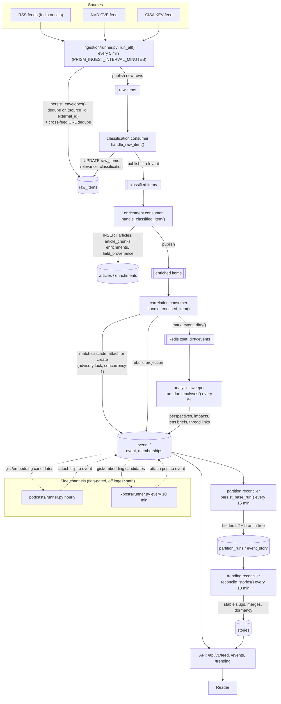
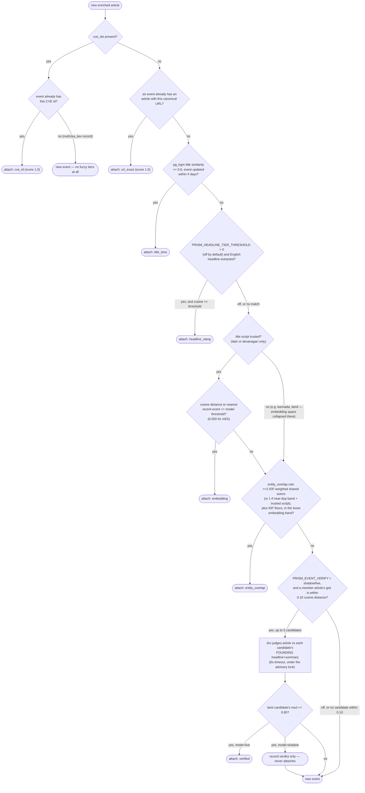
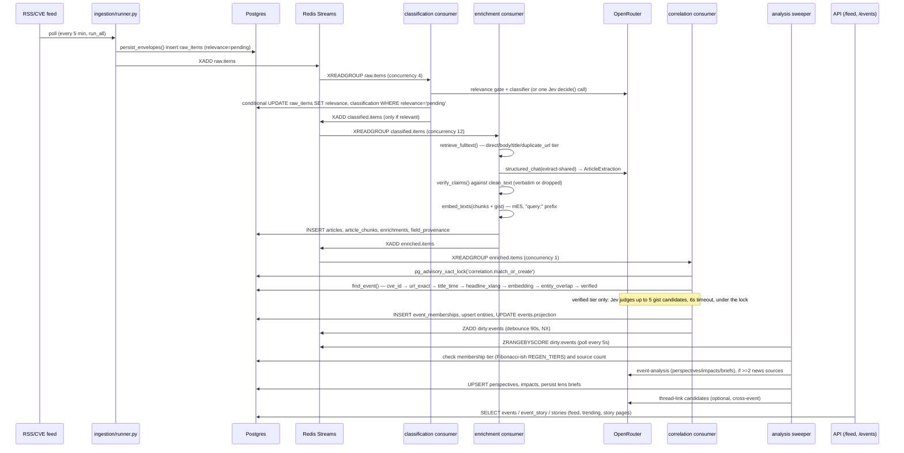

# Prism backend data pipeline

Audience: a full-stack dev, an AI engineer and an ML engineer joining the project. Scope: the
backend only (`worker/`, `ingestion/`, `classification/`, `enrichment/`, `correlation/`,
`podcasts/`, `xposts/`, `personalization/`, `agent/`, `common/`) — from a feed poll to a story
served by the API. The web app (`web/`) is out of scope except as the terminal consumer of the
API routes named below.

**How this was written.** Every claim below is anchored to a `path:line` in the current
checkout, or to a code comment quoted verbatim (with its date, where the comment has one). Where
a design doc (`docs/STORY-GRAPH.md`, `docs/STORYLINE-DESIGN.md`, `docs/ENRICHMENT-SCHEMA.md`,
`docs/INGESTION-CLASSIFICATION.md`) disagrees with the code, that is called out explicitly —
several of these docs describe an earlier or aspirational design (some ported from a prior
project, "EduThreat") that the shipped pipeline has since diverged from. Numbers are never
invented: if a number in this document has no citation next to it, that is a bug in this
document, not a fact about Prism.

**Reading the code yourself.** `graphify-out/graph.json` exists in this repo. Prefer
`graphify query "<question>"` / `graphify explain "<concept>"` / `graphify path "<A>" "<B>"`
before grepping — it returns a scoped subgraph that is usually far smaller than reading whole
files.

---

## Contents

1. [End-to-end flow](#1-end-to-end-flow)
2. [Worker process and scheduling](#2-worker-process-and-scheduling)
3. [Ingestion](#3-ingestion)
4. [Classification](#4-classification)
5. [Enrichment](#5-enrichment)
6. [Correlation — the event match cascade](#6-correlation--the-event-match-cascade)
7. [Story layer](#7-story-layer)
8. [Side channels](#8-side-channels)
9. [Observability and cost](#9-observability-and-cost)
10. [Sequence: one article's life](#10-sequence-one-articles-life)
11. [Production configuration](#11-production-configuration-worker-2026-09-25)
12. [Open questions](#12-open-questions)

---

## 1. End-to-end flow

Four ordered stages run as independent, idempotent consumer groups over a Redis Streams spine
(`worker/__main__.py:1-16`); each stage reads one topic and writes the next. A fifth layer
(story partitioning + trending) runs off the ingest path on scheduled reconcilers, not on the
stream at all. Two more layers (side channels, Ask) read the same tables but do not sit on the
ingest critical path.



Stream/topic names live in one place, `common/stream.py:22-34`: `RAW_ITEMS = "raw.items"`,
`CLASSIFIED_ITEMS = "classified.items"`, `ENRICHED_ITEMS = "enriched.items"`, plus
`ADMIN_TRIGGERS = "admin.triggers"` (API → worker: run ingestion now). `TOPIC_GROUPS` at
`common/stream.py:29-33` is the single list `backlog()` reports on and `tools/redrive_dead.py`
re-drives — "one list so a new stage cannot be reported on and forgotten by the other"
(`common/stream.py:27-28`).

---

## 2. Worker process and scheduling

Entry point `worker/__main__.py`. `python -m worker` runs every stage in one process by default;
`--stages ingestion,enrichment` (etc.) runs a subset, for a microservice split or horizontal
scaling with a unique `PRISM_CONSUMER_NAME` per replica (`worker/__main__.py:1-16`,
`parse_stages()` at `worker/__main__.py:43-57`).

### Loops and their intervals

| Loop | Function | Interval (env var, default) | Notes |
|---|---|---|---|
| Ingestion collectors | `run_all()` via APScheduler job `"ingestion"` | `PRISM_INGEST_INTERVAL_MINUTES=5` | `worker/__main__.py:36,196-202`; `max_instances=1, coalesce=True` |
| Stalled-item requeue | `requeue_stalled()`, job `"requeue"` | `PRISM_REQUEUE_INTERVAL_MINUTES=10` | `worker/__main__.py:37,207-213`; deliberately its own job, not inside `run_all` — see below |
| Podcast poll/transcribe/match | `run_podcasts()`, job `"podcasts"` | fixed 60 min, first run 90s after boot | `worker/__main__.py:216-224`; no-op unless `PRISM_PODCASTS_ENABLED` |
| X post poll/match | `run_xposts()`, job `"xposts"` | `PRISM_X_POLL_MINUTES=10`, first run 120s after boot | `worker/__main__.py:228-234`; no-op unless `PRISM_X_ENABLED` + `X_BEARER_TOKEN` |
| Billing reconcile | `_reconcile_billing()`, job `"billing_reconcile"` | fixed 60 min | `worker/__main__.py:241-259` |
| IndexNow ping | `_indexnow()`, job `"indexnow"` | fixed 60 min | `worker/__main__.py:250-263` |
| LLM balance watch | `_budget_watch()` | `PRISM_BUDGET_INTERVAL_S=900` (15 min) | `worker/__main__.py:63,70-79`; only under the `correlation` stage (`worker/__main__.py:354`) |
| Debounced event analysis | `_analysis_sweeper()` → `run_due_analyses()` | `SWEEP_INTERVAL_S=5` (hardcoded) | `worker/__main__.py:60,82-89` |
| Trending reconcile | `_trending_reconciler()` → `reconcile_stories()` | `PRISM_TRENDING_INTERVAL_S=600` (10 min) | `worker/__main__.py:92-108` |
| Partition base run | `_partition_reconciler()` → `persist_base_run()` | `PRISM_PARTITION_INTERVAL_S=900` (15 min) | `worker/__main__.py:110,114-125` |
| Story veto overlay | `_veto_reconciler()` → `persist_veto_overlay()` | `PRISM_VETO_INTERVAL_S=3600` (1 hr) | `worker/__main__.py:111,128-139` |
| Quote/rendering verdicts | `_quote_reconciler()` → `enrichment.renderings.sweep()` | `PRISM_QUOTES_INTERVAL_S=900` (15 min) | `worker/__main__.py:142-161`; only when `PRISM_QUOTE_VERDICTS` is on |
| Stream consumers (classification/enrichment/correlation) | `stream.consume(...)` | continuous (`XREADGROUP`, block 5s) | `worker/__main__.py:289-350` |

**Requeue is deliberately its own scheduled job, not folded into `run_all()`**
(`worker/__main__.py:203-206`): *"Recovery is its own job... it used to ride inside the collector
pass, so turning ingestion off (the cost brake, or a budget floor) also turned off the only thing
that re-drives items stranded mid-pipeline — exactly when there are most of them (audit H9)."*
`requeue_stalled()` (`ingestion/runner.py:63-156`) republishes three kinds of item stuck without a
row saying so, each older than 20 minutes: a `raw_items` row still `pending` (failed
classification), a `relevant` row with no `articles` row (failed enrichment), and an enriched
article with no `event_memberships` row (publish to `enriched.items` failed or dead-lettered) —
`ingestion/runner.py:80-129`.

**Enrichment concurrency.** `ENRICH_CONCURRENCY = int(os.environ.get("PRISM_ENRICH_CONCURRENCY",
"12"))` (`worker/__main__.py:67`). Classification runs at `concurrency=4`
(`worker/__main__.py:294`); correlation is pinned at `concurrency=1`
(`worker/__main__.py:338-350`) because match-or-create takes a Postgres advisory lock
(`correlation/consumer.py:147`) and "two consumers... would otherwise both miss the match and
seed two events for one story" — the lock, not the concurrency setting, is what actually makes
this safe (a unique constraint on `article_id`, migration `a7c3e91d4b28`, makes the bad state
unrepresentable regardless — `common/models.py:194-196`).

**Corpus-model guard.** Before starting `enrichment` or `correlation`, the worker calls
`assert_corpus_model()` (`common/embeddings.py:167-190`), invoked at `worker/__main__.py:278-287`.
Writing vectors with a different embedding model than the one that wrote the corpus is not an
error, just a silently corrupted feed — "measured at 25x the false merges with nothing logged"
(`common/embeddings.py:172-173`, cross-referenced by the exact table in
`correlation/clustering.py:36-45`, reproduced in §6). An *unknown* corpus (no `corpus_meta` row
yet) is let through with a warning, not refused (`common/embeddings.py:175-182`).

### Redis Streams spine — `common/stream.py`

- **Consumer groups, at-least-once delivery.** `consume()` (`common/stream.py:130-262`) creates
  the group if missing (`XGROUP CREATE ... MKSTREAM`), then runs a **pool of persistent workers**
  reading off an in-process queue, not a batch-then-`gather()` shape. This distinction mattered in
  production: with the old batch shape, `batch_size == concurrency == 12` for enrichment meant "one
  slow article idled eleven workers until it returned," measured at **~172–546 articles/hour**
  against a relevance gate approving **~6,000/hour** — a 33x mismatch that let 1,023 relevant
  articles queue up, get paid for, and never get enriched (`common/stream.py:163-177`, dated
  investigation with the components measured on 2026-09-04: fulltext 0.42s median, embed 0.107s,
  extract 2.61s ≈ 3.14s/article, i.e. ~13,700/hour at 12 slots once fixed).
- **Stream trimming.** Redis Streams never drop acked entries on their own; `STREAM_MAXLEN` (env
  `PRISM_STREAM_MAXLEN`, default **100,000**, `common/stream.py:64`) caps each topic with
  `XADD ... MAXLEN ~ N`. Measured in production before this existed: **306,509** entries across
  five streams, `raw.items` alone at **141,185** (`common/stream.py:53-57`).
  Approximate trimming (`approximate=True`) trims on radix-node boundaries — cheaper, overshoots by
  at most a node (`common/stream.py:59-63`).
- **Stale-message reclaim.** `STALE_CLAIM_IDLE_MS = 300_000` (5 min) — a message held longer than
  this by any consumer is reclaimed via `XAUTOCLAIM` (`common/stream.py:124-128,201-232`). A
  **60-second heartbeat** (`HEARTBEAT_S`, `common/stream.py:129,273-281`) renews the claim on a
  message actively being processed (via `XCLAIM ... JUSTID`, which does not count as a
  redelivery) so a slow-but-alive handler — an LLM cooldown of up to 120s, a retry — is never
  mistaken for a dead consumer and worked twice: "measured 2026-09-17: six raw items got two
  articles each this way under the 402s" (`common/stream.py:126-128`).
- **Dead-lettering.** A handler exception that is *not* judged transient
  (`_is_transient()`, `common/stream.py:334-346` — connection/timeout errors anywhere in the
  cause/context chain, SQLAlchemy's `connection_invalidated`, or "connect" in the exception type
  name) is logged, copied to `<topic>.dead` (capped `maxlen=1000`), and ACKed off the live stream —
  *"poison messages must not wedge the stream"* (`common/stream.py:141-143`). A transient failure
  is left pending (not acked) so `XAUTOCLAIM` redelivers it, and the handler sleeps 5s
  (`common/stream.py:312-320`) — *"a DB outage once acked-and-dropped 885 messages here"*
  (`common/stream.py:313-315`).
- **Backlog visibility.** `backlog()` (`common/stream.py:67-111`) reports `waiting` (group lag,
  i.e. undelivered), `pending` (PEL — handed out, not yet acked), `oldest_pending_ms`, and
  `dead_lettered` per topic, feeding `/healthz`. Best-effort: a Redis hiccup degrades the report
  (`-1` = unknown) rather than failing the health check.

### Redrive tooling — `tools/redrive_dead.py`

CLI: `--list` / `--list --topic raw.items` (counts by error type), `--show <entry_id>` (full
payload), `--redrive --topic raw.items --limit 50` (dry run by default), `--redrive --match
LlmQuotaError --yes` (actually republish, filtered by error substring) —
`tools/redrive_dead.py:1-20`. `redrive()` (`tools/redrive_dead.py:83-112`) republishes the
**original payload** to the live topic and deletes the dead entry **only after** the publish
returns — "a crash between the two replays an item, which every handler tolerates, where the
reverse order would lose it for good" (`tools/redrive_dead.py:104-108`). Safe because every stage
handler is idempotent (`tools/redrive_dead.py:15-19`). Before this tool existed, nothing had ever
read a dead-lettered payload back — *"audit H10"* (`tools/redrive_dead.py:3-7`).

### Advisory locks and single-flight

Two distinct locking mechanisms, for two distinct problems:

- `pg_advisory_xact_lock(hashtext('correlation.match_or_create'))` — a **Postgres** advisory lock
  held for the duration of one match-or-create transaction (`correlation/consumer.py:147`), so a
  second replica or a reclaimed duplicate delivery of the same article cannot seed two events for
  one story.
- `common/locks.single_flight()` (`common/locks.py:1-66`) — a **Redis**-backed single-flight lock
  for on-demand, cross-replica-shared work (e.g. the digest, on-demand lens briefs): exactly one
  caller for a key becomes the "leader" (`yield True`) and produces the value; others wait
  (`yield False`) and re-read the shared cache; a leader that stalls past `wait_timeout` (default
  25s) lets a waiter fall back to producing itself, favoring correctness over strict
  single-flighting (`common/locks.py:12-17`).

### Table: worker & streams

| | |
|---|---|
| **Inputs** | Redis Streams (`raw.items`, `classified.items`, `enriched.items`, `admin.triggers`); wall-clock schedule |
| **Outputs** | Downstream stream publishes; scheduled side effects (billing reconcile, IndexNow) |
| **Tables written** | None directly — the worker orchestrates; each consumer writes its own tables (see §3–§7) |
| **Models/flags** | `PRISM_STAGES`, `PRISM_CONSUMER_NAME`, `PRISM_INGEST_INTERVAL_MINUTES`, `PRISM_REQUEUE_INTERVAL_MINUTES`, `PRISM_ENRICH_CONCURRENCY`, `PRISM_BUDGET_INTERVAL_S`, `PRISM_TRENDING_INTERVAL_S`, `PRISM_PARTITION_INTERVAL_S`, `PRISM_VETO_INTERVAL_S`, `PRISM_QUOTES_INTERVAL_S`, `PRISM_STREAM_MAXLEN` |
| **Failure behaviour** | Per-handler exceptions: dead-letter (permanent) vs. pending+redeliver (transient) per `_is_transient()`; reconciler loops catch-and-log every exception so one bad tick never kills the loop (`except Exception: logger.exception(...)` pattern throughout `worker/__main__.py`); worker exits with `SystemExit("no stages selected")` if `--stages` resolves to nothing (`worker/__main__.py:360-361`) |

---

## 3. Ingestion

Collectors live in `ingestion/` (`rss.py`, `nvd.py`, `cisa_kev.py`), sharing plumbing in
`ingestion/base.py`. `run_all()` (`ingestion/runner.py:17-60`) is the single entry point called by
both the scheduler and the admin-trigger handler.

### Master switches, checked before any collector runs

`run_all()` checks three things, in order, **before** any network call, so hitting a limit costs
nothing (`ingestion/runner.py:17-41`):

1. `prism_ingestion_enabled` (default **True**, `common/config.py:144`) — the cost brake. Off
   stops collection *and* the stalled-item requeue (the requeue is its own scheduled job, but
   `run_all()` itself is gated here; see §2 for why recovery is scheduled separately anyway).
2. LLM budget floor: `budget.below_floor(await budget.current())` — collection stops under
   `prism_llm_budget_floor_usd` (default **$5.00**, `common/config.py:142`) even though nothing
   downstream has failed yet, because *"the queue must not grow while enrichment cannot follow"*
   (`ingestion/runner.py:26-27`).
3. Corpus cap: `prism_ingest_max_articles` (default **0** = disabled, `common/config.py:138`) — a
   hard ceiling on the *articles* table, not spend directly, because it is *"the one quantity that
   cannot drift"* (`common/config.py:118-126`).

`prism_cve_feeds_enabled` (default **False**, `common/config.py:143`) gates `nvd`/`cisa_kev`
collection; RSS always runs first "so the general feed is never starved by the CVE feeds' volume"
(`ingestion/runner.py:44-46`). Comment context: the CVE feeds dominated the corpus by volume
before this — **19,276 of 27,194** articles and **77%** of all events, none reaching the general
feed — and that corpus was deleted 2026-09-05 (`common/config.py:111-115`).

### `common/budget.py` — the LLM balance as a readable fact

Polls `GET https://openrouter.ai/api/v1/credits` every 15 minutes (`_budget_watch()`,
§2), stores `{credits, usage, balance, at}` in Redis (`budget:openrouter`). *"Enrichment
stopped for eleven hours on 2026-09-16/17 because the OpenRouter balance reached zero and the
only signal was a 402 in the worker log"* (`common/budget.py:1-13`). `below_floor()` only returns
true on **evidence** — an unreachable OpenRouter or no recorded balance never trips the floor
(`common/budget.py:54-70`): *"absence of evidence never acts."*

### URL canonicalization — `common/urls.py`

`canonicalize_url()` (`common/urls.py:26-65`) is a **comparison key**, not a rewrite of the stored
URL: strips known tracking params (`utm_*`, `fbclid`, `gclid`, etc. — `_TRACKING_KEYS`,
`common/urls.py:15-18`), IDNA-normalizes the host, drops default ports, sorts remaining query
params, drops the fragment, forces `https`. Deliberately **not** included: AMP/mobile host
rewriting, generic `ref` stripping, path case-folding, percent-decoding, or per-publisher slug
surgery — *"each can merge two real documents and belongs behind measured, explicit alias rules"*
(`common/urls.py:29-32`). Versioned (`CANONICAL_URL_VERSION = 1`, `common/urls.py:13`) so a future
change to the algorithm doesn't silently reinterpret old rows.

### Dedup at ingest — `ingestion/base.py`

`persist_envelopes()` (`ingestion/base.py:104-206`) does two dedup passes before insert:

1. **Within-source, at the DB constraint level**: `ON CONFLICT (source_id, external_id) DO
   NOTHING` (`ingestion/base.py:191`) — a feed re-poll cannot double-emit.
2. **Cross-feed, same publisher, by canonical URL** (`ingestion/base.py:126-165`): a second feed
   of the same **publisher** (not just the same source slug — The Hindu ships six regional feeds
   that republish each other) carrying a canonical URL already seen is inserted as
   `relevance="duplicate"` and never published to `raw.items`. Motivation, quoted:
   *"432 of 6,717 articles in the week to 2026-09-20"* went through the gate and the extractor
   as their own report before this existed (`ingestion/base.py:126-136`). `external_id` alone was
   not a reliable document key — *"BBC has changed only its URL fragment as an article moves
   through the feed (#0 → #2 → #5)"* (`ingestion/base.py:126-128`).
3. A duplicate that carries a **state-edition** feed's signal still calls `note_edition()`
   (`ingestion/base.py:72-101`, `ingestion/base.py:198`) to stamp the state onto the event the
   article already belongs to — the article is the same, but the state page carrying it is real
   evidence of regional relevance, applied only when
   `classification/consumer.feed_state_applies()` says the event isn't already foreign or placed.

**Language is stamped from the source, not the collector.** `ingestion/base.py:177-185`:
`language=source.language or env.language` — `ingestion/rss.py` used to hardcode `"en"` on every
envelope including the Hindi/Tamil/Kannada feeds, mislabeling **1,385** non-Latin production
articles. Fixed at this single choke point so it holds for every collector, present and future.

**Text cleaning.** `clean_text()` (`ingestion/base.py:47-69`) strips markup *then* unescapes HTML
entities, in that specific order — reversing it would turn an escaped `&lt;b&gt;` into a real tag
for the stripper to eat, silently deleting text the publisher wrote literally. Motivated by a
measured production defect: *"22 occurrences across 4% of feed titles and 5% of storyline
developments"* of literal `&#039;` reaching readers, "and every affected headline was Hindi"
(`ingestion/base.py:54-57`).

### Table: ingestion

| | |
|---|---|
| **Inputs** | RSS feeds (India outlets), NVD CVE feed, CISA KEV feed |
| **Outputs** | New rows on `raw.items` stream |
| **Tables written** | `sources` (watermark), `raw_items` (insert, `relevance='pending'` or `'duplicate'`) |
| **Models/flags** | No LLM. `PRISM_INGESTION_ENABLED` (default true), `PRISM_INGEST_MAX_ARTICLES` (default 0/off), `PRISM_LLM_BUDGET_FLOOR_USD` (default 5.0), `PRISM_CVE_FEEDS_ENABLED` (default false) |
| **Failure behaviour** | Per-collector `try/except`, logs `collector_failed`, continues with the rest (`ingestion/runner.py:52-57`); a failed collector returns `-1` in the result dict rather than aborting the run |

---

## 4. Classification

`classification/consumer.py` — module docstring (`classification/consumer.py:1-10`): *"Phase 2 —
relevance gate + classifier/router. Consumes raw.items... CVE-feed items (NVD, CISA KEV) are
relevant by construction and classified deterministically... News/RSS items go through the binary
LLM gate, then the classifier — or, with `prism_decisions_mode`, through one typed Jev call that
answers both."*

**Note on `docs/INGESTION-CLASSIFICATION.md`**: this doc describes an earlier design ("ported
from EduThreat") with a `route: fast_lane` concept, a `confidence` field, and NER/RAG
preprocessing ahead of extraction. The `fast_lane` route *is* implemented (see below); the rest of
that doc's phase-2 description is broadly accurate for the **LLM-pair** path but does not mention
the Jev Decisions path at all (`classification/decide.py`), which did not exist when it was
written. Treat it as background, not a spec.

### Three classification paths

`handle_raw_item()` (`classification/consumer.py:44-109`) picks one of three paths per item:

1. **Deterministic CVE path** — `source_type == "cve_feed"`: `_classify_cve_feed()`
   (`classification/consumer.py:279-296`), no LLM. `route="fast_lane"` iff
   `source_slug == "cisa_kev"` (actively exploited ⇒ time-critical).
2. **Deterministic single-topic feed path** — the feed declares a fixed `sector` in its
   `FeedSpec` (`ingestion/rss.py`): built with `confidence=0.8`, `role_interests=["markets"]` iff
   sector is finance/business.
3. **LLM-pair-or-Jev path** — everything else, via `_gate_and_classify()`
   (`classification/consumer.py:127-163`).

Writes are a single conditional `UPDATE raw_items SET relevance=..., classification=...,
classified_at=..., rejection_reason=... WHERE id=:id AND relevance='pending'`
(`classification/consumer.py:97-103`) — not a re-`SELECT` then ORM flush — so a replayed message
or a second worker that raced the same item cannot flip an already-settled row; `settled_here =
rowcount == 1` gates whether the item is published onward at all. Pinned by
`tests/test_classification_consumer.py::test_an_item_settled_by_another_worker_mid_call_is_not_overwritten`.

### The Jev Decisions path — `classification/decide.py` + `common/decisions.py`

`prism_decisions_mode` (`common/config.py:195`, default **`"off"`**) has three values:

- **`off`** — the LLM pair only (`_run_gate()` + `_run_classifier()`, unchanged).
- **`shadow`** — Jev answers **beside** the pair; both verdicts are logged
  (`_log_decision_shadow()`, `classification/consumer.py:203-230`) as one structured log line per
  item; behaviour is unchanged (the pair's answer is what's stored).
- **`live`** — Jev's answer is used directly, **unless** its confidence is under
  `prism_decisions_min_confidence` (default **0.0**, "set from the shadow run's agreement table" —
  `common/config.py:196`) or Jev itself fails, in which case it falls back to the LLM pair for
  that one item (and still logs the shadow comparison).

**What Jev is.** `common/decisions.py` — *"TypeSafe Jev through OpenRouter's Decisions API. Jev
is not a chat model. It reads a STATE... and answers a set of QUESTIONS in one parallel pass, each
answer typed with a probability"* (`common/decisions.py:1-9`). Wire contract (measured
2026-09-22): `POST {openrouter}/api/alpha/decisions` with `{model, state, questions}`, back comes
`{answers, usage: {input_tokens, output_tokens, cost}, model, id, provider}`; **$0.042 per million
input tokens, output free**; 64k tokens/call; 1,200 requests/minute
(`common/decisions.py:11-16`). Failure semantics mirror `common/llm.py`: quota codes (401/402/403/
429) → `LlmQuotaError` (account-wide cooldown); 5xx/timeout → retried twice then `ConnectionError`
(transient, redelivered); other 4xx → `ValueError` (dead-letter once, our request was wrong) —
`common/decisions.py:202-221`.

`classification/decide.py` builds ten base questions (`event`, `not_news`, `sector`, `subsector`,
`indian_state`, `country`, `language`, `cyber`, `markets`, `fast_lane`) plus the subject-tree
cascade (root + level-2 questions) in **one** Decisions call. `QUESTIONS_VERSION` is a content
hash of the question set, since the alpha endpoint has no prompt object to version.

### Thresholds — and why none of them is 0.5

The single comment block that justifies every threshold below, quoted in full
(`classification/decide.py:39-49`, dated 2026-09-22, `tools/bakeoff_decide` against 450 production
items the LLM pair had already labelled):

> "Where each noul crosses. Not 0.5 across the board: Jev's probabilities are calibrated to the
> statement, not to our labels, and on 450 prod items the LLM pair had labelled... the `event`
> noul for items the LLM kept sat at 0.52-0.86 and for items it rejected at 0.09-0.77, so the gate
> leans on `not_news` (0.07 vs 0.42 medians); `fast_lane` was 0.79+ on every LLM fast-lane item and
> under 0.63 on 90% of the rest, so 0.7 keeps all of them at a 4% false-positive rate where 0.5
> gave 23%; `cyber` likewise. `markets` stays at 0.5 because where the two disagreed Jev was
> right — the LLM had tagged a school shooting and a co-op's ₹51-lakh profit as market-moving;
> Jev's 0.88+ were a stock down 11%, a ₹4,433-crore fine and a BoJ rate hike."

| Threshold | Value | Defined | Meaning |
|---|---|---|---|
| `EVENT_MIN` | 0.3 | `classification/decide.py:50` | gate needs `event >= EVENT_MIN` |
| `NOT_NEWS_MAX` | 0.4 | `classification/decide.py:51` | gate needs `not_news < NOT_NEWS_MAX` (the load-bearing half of the gate, per the note above) |
| `FAST_LANE_MIN` | 0.7 | `classification/decide.py:52` | 4% false-positive rate at this floor vs. 23% at 0.5 |
| `LENS_MIN["cyber"]` | 0.7 | `classification/decide.py:53` | same reasoning as `fast_lane` |
| `LENS_MIN["markets"]` | 0.5 | `classification/decide.py:53` | deliberately the naive midpoint — Jev outperformed the LLM here even at 0.5 |
| `DESCEND_MIN_CONFIDENCE` | 0.55 | `classification/subject.py:35` | below this, the subject tree stops at the parent level rather than guessing a 3rd-level leaf |

### Taxonomy — two systems, bridged

- **Flat legacy taxonomy** (`common/taxonomy.py:9-29`): 10 sectors × 0–8 subsectors, single
  source of truth for the classifier prompt menu, subsector validation, and `/api/v1/taxonomy`.
- **Subject tree** (`common/subjects.py`): 8 roots (`politics, business, sports, tech, health,
  education, entertainment, civic`), hand-authored at levels 1–2 because clustering mis-grouped
  (sports by tournament, politics by state name — an embedding artifact); a level-3 leaf is only
  added where 30 days of production events showed a real recurring cluster (`common/subjects.py:
  9-38`, ~30 stories/month minimum). Only two branches go three levels deep: `tech.security`
  (→ vulnerabilities/breaches/malware/policy) and `civic.crime` (→ violent/property/sexual/
  policing). `legacy_for(path)` / `path_for_legacy()` bridge the two systems both ways
  (`common/subjects.py:212-239`).

### Failure behaviour

- **Rejected on relevance**: row kept (never deleted) with `relevance="rejected"`,
  `rejection_reason=<gate's reason>`, `classification=None`; nothing published. Audit trail by
  design (`classification/consumer.py:89-93`).
- **Jev failure inside `_gate_and_classify`**: caught explicitly, logged `decision_failed`, falls
  through to the LLM pair — an item is never lost to a Jev outage
  (`classification/consumer.py:150-152`).
- **LLM error** (`LlmQuotaError`/`LlmEmptyResponse`/`LlmContentBlocked`/timeout from
  `common/llm.py`): **not** caught inside classification; propagates to `common/stream.py`'s
  consumer loop, which dead-letters (permanent, e.g. content-blocked with no fallback) or leaves
  pending for redelivery (transient, e.g. quota/timeout) per `_is_transient()`.

### Table: classification

| | |
|---|---|
| **Inputs** | `raw.items` messages (`raw_item_id`) |
| **Outputs** | `classified.items` messages, only for relevant items |
| **Tables written** | `raw_items` (`relevance`, `classification` JSONB, `classified_at`, `rejection_reason`) |
| **Models/flags** | `prism_model_gate`, `prism_model_classify` (both `google/gemini-3.1-flash-lite`); `prism_model_decide` (`typesafe/jev-1.13`); `prism_decisions_mode` (off\|shadow\|live, default off); `prism_decisions_min_confidence` (default 0.0) |
| **Failure behaviour** | Rejected items kept with reason, never deleted; Jev failures fall back to the LLM pair silently; LLM/infra failures propagate to the stream layer for dead-lettering or redelivery |

---

## 5. Enrichment

`enrichment/consumer.py` — *"Phase 3 — enrichment: full text, schema-constrained extraction,
embeddings. Consumes classified.items. CVE-feed records are enriched deterministically from their
structured payload; news articles go through the LLM extractor (shared schema + cyber lens in one
call)"* (`enrichment/consumer.py:1-8`).

**Note on `docs/ENRICHMENT-SCHEMA.md`**: this doc (also "ported from EduThreat") describes
per-source field provenance dicts inside the shared schema itself (`{"src_1": "critical_of_A"}`
stance maps, `provenance: ["src_1"]` on every entity/claim/impact) and a preprocessing pass of
"grounded NER... and retrieval augmentation" ahead of extraction. **Neither is what ships**: the
current design does one LLM call per article (no separate NER pass), stores provenance at the
**field-path** level per enrichment row (`field_provenance` table, one source per enrichment since
extraction is single-source in the prototype — see below), and claims/stance are per-article
fields on `SharedExtraction`, not multi-source maps. Treat that doc as the original design sketch,
not current behavior.

### Full-text retrieval tiers

`retrieve_fulltext()` (`enrichment/fulltext.py:64-109`) — prototype has one live fetch tier plus
three cheaper fallbacks, resolved in `handle_classified_item()`
(`enrichment/consumer.py:70-85`):

| Tier | When | Where |
|---|---|---|
| `duplicate_url` | a prior enrichment exists for the same canonical URL (534 URL groups arrive more than once in production, 533 of them cross-source) | `enrichment/consumer.py:71,76-79`, `_extraction_for_same_url()` at `enrichment/consumer.py:288-324` |
| `body` | source is `nvd`/`cisa_kev` (use the structured payload directly); or the feed's own body is already ≥400 chars (`MIN_USEFUL_CHARS`) | `enrichment/consumer.py:80-81`; `enrichment/fulltext.py:20,70-71` |
| `direct` | fetched via `httpx` + `trafilatura.bare_extraction`, with an SSRF guard (`refuse_non_public`, every hop) | `enrichment/fulltext.py:73-103` |
| `title` | nothing else produced usable text | `enrichment/consumer.py:84-85` |
| `none` | (rare) no body, no URL, or fetch failed and body absent | `enrichment/fulltext.py:107-109` |

A fetched page whose extracted text still contains ≥2 real HTML tags (`_markup_leaked()`,
`enrichment/fulltext.py:35-37`) gets a **second** `trafilatura` pass over the leaked text itself
(`_demarkup()`, `enrichment/fulltext.py:40-61`) — some sites embed the article body as an escaped
HTML string inside a JSON payload, and re-parsing that string as a document (rather than
tag-stripping it) recovers prose instead of boilerplate. Measured: *"854 of prajavani's 880
direct-tier articles arrived like this, while thehindu's 853 on the same path were clean"*
(`enrichment/fulltext.py:96-100`) — a per-site failure, not a general one.

The og-image comes free from the same fetch's metadata — never a separate request
(`enrichment/fulltext.py:66-67`).

### Extraction — `extract-shared` prompt, `ArticleExtraction` schema

For a news article (not CVE, not reused), `handle_classified_item()`
(`enrichment/consumer.py:96-143`) fetches the Langfuse-managed `extract-shared` prompt
(`common/observability.fetch_prompt`), truncates the article to `MAX_EXTRACT_CHARS = 12000`
chars, and calls `structured_chat(model=extract_model, output_model=ArticleExtraction, ...,
reasoning=REASONING_OFF, prune_fields={"impacts"})`. The model is
`prism_model_extract` (`google/gemini-3.1-flash-lite`) except for soft-news sectors
(sports/entertainment/health/science), which use `prism_model_extract_light` (same model
currently, but a separate override point) — `enrichment/consumer.py:103-107`.

**`prune_fields={"impacts"}`**: correlation re-derives impacts in event-analysis and nothing reads
the extracted ones, so asking for them on the highest-volume stage costs output tokens for
nothing (`enrichment/consumer.py:124-127`). **`claims` is deliberately kept** despite the same
"nothing reads it" reasoning once applying to it too — pruning claims *was* the reason the
perspectives layer didn't exist, per the comment (`enrichment/consumer.py:129-132`).

**Model choice, measured 2026-09-04** (`common/config.py:41-64`), on 10 production articles, same
prompt, claims enabled:

| Model | Failed | Claims | Entities |
|---|---|---|---|
| `qwen/qwen3.5-flash-02-23` | 10/10 | 0 | 0 |
| `google/gemini-3.1-flash-lite` (current) | 0/10 | 16 | 77 |
| `google/gemini-3.5-flash` | 0/10 | 15 | 73 |

qwen answered with a bare sentiment number instead of an object on every call — a reversal of an
earlier finding that had chosen qwen specifically because gemini "empties entities"; the comment
is explicit that this reverses a previously recorded finding and to re-measure before trusting
either direction again (`common/config.py:61-64`).

**`ArticleExtraction`** (`enrichment/schemas.py:316-333`) = `shared: SharedExtraction` +
optional `cyber: CyberLens` + optional `finance: FinanceLens`. Key `SharedExtraction`
(`enrichment/schemas.py:109-172`) fields: `event_type`, `headline_summary`, `headline` (English,
≤12 words, present tense — the field `correlation/consumer.english_headline()` reads),
`reader_brief` (3–5 plain sentences — written at extraction time rather than on first view because
*"78% of events are single-source and were skipping the analysis pass"*,
`enrichment/schemas.py:116-118`), `watch_points` (≤3), `occurred_at`, `entities`, `regions`,
`stance`, `claims`, `impacts` (pruned as above), `sentiment`. Validators repair common shape-slips
cloud models produce — flattened nesting, a string where a list belongs, a bare status string
where `Exploitation` belongs — because *"schema in prompt, not enforced server-side"*
(`enrichment/schemas.py:1-9`).

**Occurred-date correction.** `occurred_on()` (`enrichment/consumer.py:264-285`) never returns a
date after the article's own published date (Indian-clock, IST): the extractor sometimes answers
with the date the article is *about* rather than reported ("SBI ATM rules change from October 1"
on a report filed 16 September) — measured **202 of 13,870 events (2026-09-21)** sitting in the
future. When the extracted date is later than publication, the honest answer is "not stated," so
it's dropped to `None`.

### Verbatim claim verification — `enrichment/claims.py`

*"MISATTRIBUTION IS THE WORST FAILURE THIS PRODUCT CAN HAVE"* (`enrichment/claims.py:1-7`,
repeated verbatim in `enrichment/schemas.py:43`). `verify_claims()`
(`enrichment/claims.py:122-160`) keeps a claim **only if its quote is found verbatim** (whitespace
collapsed, nothing else normalized) inside `clean_text`; `quote_start`/`quote_end` offsets are
**recomputed from the found text**, never trusted from the model — *"models are reliable at
copying a sentence and unreliable at counting characters to it"* (`enrichment/claims.py:9-14`). A
quote under `MIN_QUOTE_CHARS = 25` chars is rejected regardless (a bare "Yes" proves nothing about
attribution). Rejection reasons are counted (`no_speaker`, `short_quote`, `not_verbatim`) and
logged, never silently discarded. `faithful_role()` (`enrichment/claims.py:74-119`) similarly cuts
a speaker's stated role back to the longest leading run the article's own words actually support.

### Chunking, embeddings, and the gist

`chunk_text()` (`common/text.py:4-27`): paragraph/sentence/space-boundary-aware split,
`max_chars=1200`, `overlap=150`. Every chunk plus one extra "gist" text are embedded in a
**single** `embed_texts()` call (`enrichment/consumer.py:149-152`).

**The gist** is new as of the verified-matching tier: `gist_text()`
(`correlation/verify.py:69-77`) = the extractor's English `headline` + one-line
`headline_summary`, concatenated — *"None when the extractor wrote neither — a raw title alone is
not a gist."* Stored on `articles.gist_embedding` (`common/models.py:106-108`,
`enrichment/consumer.py:150,177`). It exists because the founding article's first ~1200 raw
characters — what event matching used to compare against — separates same-happening pairs at only
**AUC 0.46** (worse than chance) on hard same-language pairs, since templated local news (a
cooperative society's annual results, a district's Lok Adalat notice) reads alike regardless of
which specific happening it is; the extractor's English headline+summary separates the same pairs
at **0.91–0.99** (migration `db/versions/e5a9c3b7d2f1_...py:7-12`, measured 2026-09-25). This is
what the verified matching tier in §6 retrieves candidates on.

**Embedding model.** `intfloat/multilingual-e5-base`, 768-dim, run in-process via `fastembed`
(ONNX/CPU) — `common/embeddings.py:1-24`, `common/config.py:99-100`. E5 requires an instruction
prefix or its embeddings are silently weaker; the stored **document** prefix is `"query:"` (not
`"passage:"`), chosen deliberately because comparing two articles is a **symmetric** task and E5
wants `query:` on both sides for that, whereas `passage:` is right for asymmetric search
(`common/embeddings.py:26-69`). The cascade genuinely cannot separate the two prefix choices on
the labelled set held out (`Cdet` 0.5837 vs 0.5949, a one-event difference over 242 pairs) — the
`query:` choice rests on a **different, larger** cross-lingual measurement (163 news pairs:
Devanagari P@1 0.531 vs 0.399, Kannada 0.778 vs 0.611) that the small gold set structurally cannot
see (`common/embeddings.py:52-66`). `embed_query()` (`common/embeddings.py:127-130`) — used by
Ask's retrieval (§8) — applies the same `"query:"` prefix, so both sides of every comparison in
the system share one convention.

`assert_corpus_model()` / `check_corpus_model()` (`common/embeddings.py:133-190`) record and
enforce which model+prefix wrote the corpus (`corpus_meta` table), refusing to start
enrichment/correlation on a mismatch (see §2).

### Image dHash — `common/imagehash.py`

`dhash_bytes()` (`common/imagehash.py:63-78`): 9×8 greyscale, 64-bit difference hash comparing
each pixel to its right neighbour. Motivation: BBC's Tamil/Telugu/Bengali editions each upload the
same photo under a new URL, so no URL check can dedupe it — *"a reader saw the same face three
times in a story's rail (2026-09-20)"* (`common/imagehash.py:1-10`). The image is fetched once,
small (`MAX_BYTES = 3 MiB`), and discarded — never stored or served (DESIGN.md § Images). Fetching
goes through the same SSRF guard (`refuse_non_public`, `public_http_url()`,
`common/imagehash.py:30-60`) used by `enrichment/fulltext.py` and `podcasts/feeds.py` — the feed
URL is attacker-controlled and the fetch happens from inside the deployment, so loopback/private/
link-local addresses are refused on the first request **and every redirect hop**.

### Field provenance and lens fields

Every populated top-level field of `shared` and any active lens gets one `field_provenance` row
pointing at the source that produced it (`enrichment/consumer.py:219-240`) — single-source in the
prototype (one enrichment call, one source), so this is currently a 1:1 map, not yet a
disagreement-resolution mechanism (that's what `docs/ENRICHMENT-SCHEMA.md`'s multi-source design
anticipated but isn't built).

**Finance lens ticker validation**: `fin["tickers"] = await validated(session, ...)`
(`enrichment/consumer.py:203`, `common/securities.py`) — *"The one place a ticker enters the
database... a symbol that cannot be traced to a listed security is refused at this line rather
than filtered at each of the places it would later be shown"* (`enrichment/consumer.py:197-202`).

**Cyber lens, deterministic for CVE feeds**: `extract_from_nvd()` / `extract_from_kev()`
(`enrichment/cve_lens.py:26-137`) build `ArticleExtraction` straight from the structured payload —
CVSS from `cvssMetricV31`/`V40`/`V30`/`V2` in that preference order, affected products from
`configurations[].nodes[].cpeMatch[]`, KEV's `known_exploited=True`/`kev_listed=True`. A small
static control-mapping ruleset (`_default_control_mapping()`,
`enrichment/cve_lens.py:188-217`) adds NIST/CIS control references keyed on exploitation/
ransomware status — no LLM.

### Table: enrichment

| | |
|---|---|
| **Inputs** | `classified.items` messages (`raw_item_id`) |
| **Outputs** | `enriched.items` messages (`raw_item_id`, `article_id`, `enrichment_id`) |
| **Tables written** | `articles` (incl. `gist_embedding`), `article_chunks`, `enrichments`, `field_provenance`; may update `raw_items.image_url`/`image_phash` |
| **Models/flags** | `prism_model_extract`/`prism_model_extract_light` (`google/gemini-3.1-flash-lite`); deterministic path for `nvd`/`cisa_kev`; embed model `intfloat/multilingual-e5-base` (`prism_embed_model`), `prism_embed_dim=768` |
| **Failure behaviour** | Reused extraction for a duplicate canonical URL (no re-spend); claims failing verbatim check are dropped and counted, never stored; fulltext fetch failure falls back through tiers to `title`/`none`; image hash failure returns `None` silently ("a photo without a hash is simply shown as before") |

---

## 6. Correlation — the event match cascade

`correlation/consumer.py` — *"Phase 4 — correlation: canonicalize into events, perspectives,
impacts... Assigns each enriched article to an existing event (match cascade in clustering.py,
trail persisted on event_memberships) or creates a new one."* (`correlation/consumer.py:1-7`).

### The cascade, in order — `correlation/clustering.py:1-15,202-282`



Each tier is tried in this fixed order (`find_event()`, `correlation/clustering.py:202-282`);
the first match wins. Identity is **never merged** — matching only links an article to an event;
it never rewrites entities or inflates impact ("EduThreat canonicalization rules",
`correlation/clustering.py:14`).

### Distance thresholds — keyed by embedding model, never a bare constant

Every cosine distance in this stage lives in one table, `_SCALE`
(`correlation/clustering.py:74-91`), keyed by `prism_embed_model` — *"these MOVE WITH THE
MODEL... Swapping the model while keeping these numbers was measured through the full cascade
against gold_pairs"* (`correlation/clustering.py:33-45`):

| model | embedding | entity_near | entity_loose | embed_far | story_max | story_edge_max | gist_candidate |
|---|---|---|---|---|---|---|---|
| `paraphrase-multilingual-mpnet-base-v2` | 0.12 | 0.25 | 0.45 | 0.45 | 0.55 | 0.656 | *off* |
| `intfloat/multilingual-e5-base` (current) | 0.050 | 0.079 | 0.106 | 0.106 | 0.127 | 0.145 | 0.10 |

The consequence of a mismatch was measured directly: applying mpnet's thresholds to mE5's much
more compressed distance space gave **tp 47 / fp 76** (P 0.38) against mE5's own thresholds' **tp
31 / fp 8** (P 0.79) — **"25x the false merges"** on the same gold set
(`correlation/clustering.py:36-45`). An unrecognized model logs a loud warning and falls back to
the incumbent's numbers rather than guessing (`correlation/clustering.py:94-108`).

### Script-trusted embedding tier

`EMBEDDING_TRUSTED_SCRIPTS = {"latin", "devanagari"}` (`correlation/clustering.py:137`) — an
**allow-list**, not a deny-list. Measured 2026-07-28 against production: the (then-current)
embedding model's subspace for Kannada is collapsed to the point of an AUC ~0.5 ROC against
distance — *"one event absorbed 139 unrelated articles this way"* — while Devanagari is healthy
(69% recall at zero false positives) (`correlation/clustering.py:113-136`). The comment is
explicit that this is *not* a "non-Latin is bad" rule; an unmeasured script gets routed straight
to the entity path rather than a distance cutoff that would silently fail the same way.

### Entity-overlap tier — IDF-weighted, not a document-frequency cutoff

`_match_by_entities()` (`correlation/clustering.py:528-634`) requires **≥2** shared canonical
actors (`ENTITY_MATCH_MIN_SHARED`) inside the *loose* embedding band, or just **1** if the
embedding distance is already in the *near-dup* band **and** the script is trusted
(`ENTITY_MATCH_NEAR_DISTANCE`, `allow_single_actor`). Actors are weighted `1/df` (document
frequency within the in-window graph) rather than excluded past a df cutoff — a prior cutoff
*deleted a trending story's own core actors* (CJP, Pradhan, Wangchuk, all df 50–82 at the time)
and shattered that story into dozens of single-source events
(`correlation/clustering.py:143-153`). Guards on top of the IDF sum: `ENTITY_MATCH_MIN_TOP_IDF =
0.1` (at least one moderately specific actor, df ≤ 10) **unless** the shared-cast is broad enough
on its own (`ENTITY_MATCH_BROAD_SHARED = 4` — eight shared actors including Amit Shah and Rahul
Gandhi was previously and wrongly rejected for lacking one *individually* rare actor); and
`ENTITY_MATCH_MIN_ARTICLES = 2` — an event's "own cast" only counts actors named by **≥2 of its
current articles**, not every actor it has ever absorbed, specifically to stop a single bad merge
from permanently widening what the event can match (one event reached 978 actors this way).

**A confirming title-agreement gate on this path was tried three times and lost all three times**,
each on cascade replay rather than a pairwise score (`correlation/clustering.py:437-469`) — most
starkly: perfect precision (P 1.0, zero false merges) still *lost* against no gate, because
rejecting a merge doesn't just fail to merge — it creates a smaller, wronger candidate event for
the next article, compounding. `TITLE_COSINE_GATE = None` (off) as a result.

### Verified matching tier — `correlation/verify.py`

The last tier, for an article every other tier refused. **Why a judge and not a threshold**:
templated local news (two cooperative societies' annual results, two districts' Lok Adalats, "rain
in Karnataka" vs. "rain in Kerala") sits at cosine **0.93–0.97** on every embedding signal
regardless of similarity metric — *"no cut clears those without discarding most true
duplicates"* (`correlation/verify.py:1-10`). Measured same-happening AUC across three labelled
sets (hard same-language / cross-language / a July production sample):

| Signal | hard same-language | cross-language | July gold |
|---|---|---|---|
| gist embedding alone | 0.913 | 0.992 | 0.940 |
| Jev on headline+summary | 0.993 | 0.985 | 0.964 |
| Jev + brief or + body | no gain (0.990/0.993, 0.985/0.983, 0.964/0.952) | | |

At **noul ≥ 0.85** (`prism_event_verify_min`), Jev held **precision 1.00** on the hard set and
**20/20** on a random sample of a week of production pairs (`correlation/verify.py:14-20`). A
batched call (one article, up to 5 candidates) scores identically to pairwise (AUC 0.988 vs
0.987), so this costs **one call per article: ~$0.00005, ~250ms**.

**Candidates come from member articles' gists, not a per-event average** — an average would drift
toward whatever a wrong merge already brought in and then attract more of it, which is exactly the
feedback loop that grew one Kannada event to 139 articles (`correlation/clustering.py:666-676`).
Up to `GIST_CANDIDATES = 5` events, each within gist cosine distance **≤ 0.10**
(`gist_candidate`, mE5 only — off for mpnet).

**What Jev is asked**: whether the article and each candidate's *founding* headline+summary
(frozen at event creation, `canonical_title()`) report the same real-world happening — explicitly
including "different figures, later, in another language" as *still the same happening*, and
explicitly excluding a follow-up/reaction, an earlier/later stage of the same story, a different
person's statement on the same issue, or another instance of a recurring kind
(`correlation/verify.py:53-60`). Judging against the **founder**, not transitively against
whatever an event has since absorbed, is deliberate — linking transitively once chained a week of
Trump–Xi coverage into one 46-event group (`correlation/verify.py:22-26`).

**Flag**: `prism_event_verify` (`common/config.py:136`, default **`"off"`**) — `off` | `shadow`
(asks and records to `event_match_verdicts`, never attaches) | `live` (attaches). Runs under
`VERIFY_TIMEOUT_S = 6.0` (`correlation/verify.py:51`), inside the same
`pg_advisory_xact_lock('correlation.match_or_create')` the whole match-or-create holds
(`correlation/consumer.py:147`) — a timeout is treated as "no," so a slow Jev call founds a new
event rather than blocking ingest. Every verdict, matched or not, is persisted to
`event_match_verdicts` (`article_id, event_id, noul, gist_distance, model, mode`, migration
`db/versions/e5a9c3b7d2f1_article_gist_and_match_verdicts.py:41-50`) as an audit trail and replay
cache.

### After a match — attach, project, defer

- **Canonical title** (`correlation/consumer.canonical_title()`, `correlation/consumer.py:58-66`):
  a new event's `title` is the extractor's English `headline` (`headline_by='prism'`) when one
  was written in English, else the first report's own headline (`headline_by=NULL`) — *"the
  outlet's words are never lost: they stay on the raw item and print under Sources"* (founder
  decision 1b, 2026-09-17).
- **Entity upsert + fold** (`_upsert_entities()`, `correlation/consumer.py:305-377`): entities are
  filtered against known outlet names before insertion (an outlet reaching the entity graph
  becomes a cast member — *"`tv9kannada` led a live trending story"*), then linked at both
  `article_entities` (this article named it) and `event_entities` (the event has ever touched it)
  granularity — the distinction that makes `ENTITY_MATCH_MIN_ARTICLES` above meaningful.
  `_follow_merge()`/`_resolve_entity()` (`correlation/consumer.py:816-877`) walk `merged_into`
  pointers to the row that actually holds the mentions, bounded at
  `_MAX_ENTITY_MERGE_HOPS = 8` against a cycle; production carries a real two-hop chain (CJP →
  "Cockroach Janta Party" → "Cockroach Janata Party").
- **Projection rebuild** (`_rebuild_projection()`, `correlation/consumer.py:379-604`): merges
  member enrichments into `events.projection` (served fields) via a single `COALESCE(projection,
  '{}') || :patch` update, never a read-modify-write of the whole object — a brief committed
  between an earlier read and a naive whole-object write used to be silently lost (audit H11). The
  event's `summary` is always the **founder's** (earliest member's) summary, never the newest's,
  even though `latest_published_at` tracks the newest — deliberately, because the headline (fixed
  at creation) and a *freshest* summary can describe two different articles once a later member
  wrongly merges in (measured: **830 of 1,054** multi-member events, 79%, had a
  headline/summary mismatch before this fix).
- **Debounced analysis** (`mark_event_dirty()` → `run_due_analyses()`,
  `correlation/consumer.py:234-276`): real-time attach is cheap (DB-only); the LLM analysis pass
  (perspectives, impacts, briefs, thread links) is deferred `ANALYSIS_DEBOUNCE_S = 90` seconds
  (leading debounce, `ZADD ... NX`) so a burst of coverage for one story buys **one** analysis
  pass, off the ingest hot path. Re-run only at Fibonacci-ish membership tiers
  (`REGEN_TIERS = {2,3,5,8,13,21,34}`) — early members change the story most. Single-source news
  (`MIN_SOURCES_FOR_ANALYSIS = 2`) skips the LLM analysis entirely; its brief is the one the
  extractor already wrote (`extracted_reader_brief()`), applied at attach time, not on first view.
  A failed analysis is re-queued with `ANALYSIS_RETRY_BACKOFF_S = 300`, unbounded — explicitly
  marked `ponytail: unbounded retry every 300s; add a cap only if a poison event ever loops`
  (`correlation/consumer.py:269-270`).
- **Thread linking** (`correlation/threads.py`): after an event's projection is rebuilt and its
  LLM analysis has run, `link_event_threads()` looks for cross-event causal/related links (war →
  shipping halt → oil-price coverage) via cheap SQL candidates (shared entities, then a
  mid-embedding band `EMBED_NEAR`/`EMBED_FAR` — reused from `correlation/clustering._scale()`) then
  one batched LLM call; **every** verdict, including rejections, is persisted to `event_links` so
  a pair is never re-asked (`correlation/threads.py:1-8,27-36`).
- **Market digest** (`correlation/digest.py`): a separate, on-demand feature — an LLM synthesis
  across the day's top market-moving events, cached in Redis for `CACHE_TTL = 3` hours behind
  `single_flight()` so a burst of viewers costs one call; no dedicated table, since it's cheap to
  regenerate (`correlation/digest.py:1-27`).

### Table: correlation

| | |
|---|---|
| **Inputs** | `enriched.items` messages (`article_id`, `enrichment_id`) |
| **Outputs** | Updated `events`/`event_memberships`/`event_entities`/`event_links`/`perspectives`/`impacts`; Redis `dirty:events` zset for the sweeper |
| **Tables written** | `events`, `event_memberships`, `entities`, `article_entities`, `event_entities`, `perspectives`, `impacts`, `event_links`, `event_match_verdicts` |
| **Models/flags** | `prism_model_correlate` (`z-ai/glm-5.3-flash`, event-analysis + thread-link); `prism_event_verify` (off\|shadow\|live, default off), `prism_event_verify_min` (0.85); `prism_headline_tier_threshold` (0.0 = off) |
| **Failure behaviour** | Verify timeout/exception ⇒ treated as "no match," article founds its own event; thread-linking failure logged and swallowed (additive, never fails the analysis pass); brief-persist failure logged and swallowed |

---

## 7. Story layer

Above individual events sits a **story** layer: a persistent, slug-stable grouping of related
events (an unfolding political controversy, a disaster and its aftermath). This is computed by
two loosely-coupled, scheduled passes — **not** by the stream at all.

### `correlation/partition.py` — the global Leiden partitioner (L2) and branch tree (L3)

Module docstring: *"Global storyline partitioner: events → stories (Leiden) → branch tree
(coherence). Computed GLOBALLY and ONCE (not per-read)"* (`correlation/partition.py:4-8`).

- **Graph construction**: mutual-kNN embedding edges (`STORY_EMBED_KNN = 4`,
  `correlation/partition.py:88`) computed in numpy (not a pgvector lateral join — the HNSW index
  lives on `article_chunks.embedding`, not `events.embedding`), **plus** IDF-weighted shared-actor
  edges (roundup-excluded, embedding-gated). The two edge sets are **unioned**, not intersected —
  entity edges *add* weight on top of embedding edges as secondary evidence, never gate them
  (`merge_edges()`, `correlation/partition.py:900-920`); an earlier version made the entity rule a
  gate and it rejected 96.5% of real pairs.
- **Community detection**: `leidenalg` + `igraph`, `CPMVertexPartition` (not modularity — CPM has
  no resolution limit; modularity's does), `resolution=0.05` (`LEIDEN_RESOLUTION_V2`,
  `correlation/partition.py:91`), fixed `seed=42`. Nodes and edges are explicitly sorted before
  building the graph, because Leiden's local optimum depends on vertex feed order even with a fixed
  seed — measured **32 of 3,655 gold pairs** landed in different groups between an offline run and
  production on the identical 19,337-event graph before this fix (`correlation/partition.py:
  395-406`).
- **Branch tree (L3)**: a max-coherence arborescence rooted at the most-corroborated event,
  normalizing each candidate parent's "pull" by its mean affinity to all its potential children so
  a hub event doesn't collect everyone (measured: the root's fan-out dropped from 19 to 4,
  depth grew from 2 to 5, once normalized).
- **Story veto (grounded LLM pass)**: over Leiden communities of size ≥ `VETO_MIN_STORY_SIZE = 4`,
  a grounded LLM (or Jev, per `prism_judge_backend`) pass separates entangled-but-distinct
  developments Leiden's modularity-free objective still over-merges (a protest blob absorbing an
  unrelated NEET-protest or SIR/electoral thread because they share national-magnet actors). It
  **fails open** on any LLM exception (`# noqa: BLE001 — a failed veto keeps the member (fail-
  open)`, `correlation/partition.py:824-826`) and caches verdicts keyed on a **label-independent**
  story signature (`story_signature()`) so re-running Leiden doesn't re-ask a question already
  answered for the same member set.
- **`persist_base_run()`** (`correlation/partition.py:1095-1139`) is the frequent (15-min), cheap,
  no-LLM path — a fresh Leiden partition published as a new immutable `partition_runs` row
  (`veto_state='pending'`). It explicitly refuses to publish an **empty** partition, because
  production once silently promoted an empty `event_story` to `current` for 9 runs straight and
  logged success the whole time (`correlation/partition.py:1101-1111`).
- **`persist_veto_overlay()`** (`correlation/partition.py:1142-1195`) is the slower (hourly)
  refinement: runs the LLM veto outside the advisory lock, then re-acquires the lock and
  compare-and-swaps a new overlay run in **only if the base it refined is still `current`**;
  otherwise the base moved on and the overlay is discarded.

**Why the veto is effectively invisible in production today** — two independent reasons, both
confirmed in code, not just asserted:

1. **The race.** `common/config.py:169-184` states the veto was *"Turned OFF in production
   2026-07-30 because the pass pays for itself roughly never"*: with a 15-minute base cadence and
   a multi-minute veto wall-clock run, the overlay's compare-and-swap loses the race about half
   the time, and even when it wins, the *next* base tick unconditionally republishes with
   `veto_state='pending'` — discarding the refinement within 15 minutes. Measured: of 10 retained
   runs, exactly one carried an applied veto, and it survived **4m33s**. — **One nuance worth
   stating precisely, since the comment's "15-minute... ~13-minute" phrasing can be misread as the
   scheduler intervals**: the actual scheduler constants are `PARTITION_INTERVAL_S = 900` (15
   min) and `VETO_INTERVAL_S = 3600` (1 hour) (`worker/__main__.py:110-111`) — the "~13-minute
   veto" in the config comment is describing the LLM pass's own **wall-clock runtime**, not its
   trigger interval.
2. **A second, separate gate, not mentioned in the config comment at all**: `api/routes/
   trending.py`'s `STORY_BOUNDARY_STATUS = "provisional"` is a hardcoded module constant, not
   wired to `partition_runs.veto_state` — *"Promotion is a deliberate code/config change after
   the time-held-out, two-labeller story evaluation passes. Until then, do not even serve a route
   tree that a client could mistake for verified chronology."* Even if a veto overlay *did*
   survive, the API still serves the branch tree as unpromoted and `branches: None`
   (confirmed by `tests/test_trending_contract.py::test_a_served_story_carries_every_declared_key`,
   which asserts exactly `boundary_status == "provisional"` and `branches is None` on a live served
   story). `prism_veto_enabled` defaults to `True` in `common/config.py:184` and `.env.example`,
   but production runs with **`PRISM_VETO_ENABLED=false`** on the worker (Railway, checked
   2026-09-25) — the comment's "off since 2026-07-30" holds.

### `correlation/trending.py` — story reconciliation (separate from the Leiden pass)

*"No LLM. Labels are extractive — the hero event's own headline."* (`correlation/trending.py:21`).
Runs every 10 minutes (`PRISM_TRENDING_INTERVAL_S`), consuming the **current** Leiden partition's
member sets where available (falling back to an older BFS-based grouping only for an event not
yet partitioned).

State machine, verbatim from the module docstring (`correlation/trending.py:9-19`):

```
community C (member event-ids)                       existing stories (member sets)
    │  overlap = |C ∩ S| / min(|C|,|S|)
    ▼
┌── 0 matches ≥0.6 ──▶ CREATE  (new id + FROZEN slug from cast; status=active)
├── 1 match   ≥0.6 ──▶ UPDATE  (merge members, refresh label/velocity; id + slug PERSIST)
└── ≥2 matches≥0.6 ──▶ MERGE   (keep the OLDEST story; others → merged_into + dormant → URL 301s)

A story not refreshed by any community this pass, older than DORMANT_AFTER → status='dormant'
(never deleted, so shared links keep resolving).
```

Matching combines member-set overlap (`OVERLAP_THRESHOLD = 0.6`), cast Jaccard
(`CAST_SAME_STORY = 0.5`), and IDF-weighted cast overlap (`SPECIFIC_CAST_MIN = 0.12` — re-merges a
Leiden-over-split story sharing *specific* protagonists while refusing to re-merge veto-separated
stories sharing only national magnets), plus a **hero-anchor short-circuit**: two stories anchored
on the same event are the same story unconditionally, regardless of what the other three signals
say — added after two active stories anchored on one event ("Karnataka cabinet expansion: DKS
inducts 19") scored member overlap 0.33, cast Jaccard 0.20, and IDF cast overlap 0.003, all under
their floors, sharing only Dharmendra Pradhan (df 339) as an actor. A separate self-healing pass
(`_converge_existing()`) union-finds the **existing active stories** against each other, since the
main reconcile loop only ever compares a fresh community to existing stories, never two existing
stories to each other — without it, two stories created in separate passes never collapse and
linger as near-duplicate cards until the 24-hour dormant timer.

### Docs vs. code — explicitly flagged as current vs. historical

- **`docs/STORY-GRAPH.md`** describes the **pre-partitioner, on-read** story graph
  (`correlation/threads.py`'s BFS + connected-components + greedy-modularity approach) as if it
  were still the primary path. It is now the **fallback** path only, used when an event hasn't
  been placed by the global Leiden partition yet — the doc was not updated when
  `correlation/partition.py` shipped. Its trending section (§4) still matches current
  `correlation/trending.py` closely, with one drifted number: the doc's third dedup signal is "≥3
  cast members shared outright" where the current code is an IDF-weighted sum
  (`SPECIFIC_CAST_MIN = 0.12`) — the doc predates the IDF-weighting fix.
- **`docs/STORYLINE-DESIGN.md`** is explicitly headed *"Status: proposal. Supersedes the on-read
  story graph in STORY-GRAPH.md once staged in"* (2026-07-24) and **is** what
  `correlation/partition.py` implements — but with real deviations from what actually shipped:
  its illustrative code sample uses `RBConfigurationVertexPartition`, while shipped code uses
  `CPMVertexPartition` (a deliberate choice, explained in `partition.py`'s own comments); its
  proposed L3 "causal confirmation" step via `event_links` (`leads_to`/`related`) is **not** the
  mechanism that shipped — the actual L3 semantic-separation tool is the grounded LLM veto
  (`StoryVeto`/Jev), a different kind of judgment (same-story binary, not causal linking); its
  proposed data model (`events.story_id`, `events.branch_parent_id`) was **not** built — instead a
  separate per-run join table `event_story` was, specifically because Leiden's `story_label` is
  **ephemeral per run**, never a stable cross-run id (contradicting the doc's claim that "story_id
  is stable across runs"); and its proposed stages 5–6 (HDBSCAN/MinHash-LSH for L1, LLM causal
  confirmation) show no evidence of having been implemented in the files read for this doc.

### Tables

| Table | Written by | Notes |
|---|---|---|
| `partition_runs` | `persist_base_run()` / `persist_veto_overlay()` | `base_run_id` NULL = base, set = overlay; `status` building\|current\|superseded; `veto_state` pending\|applied; exactly one `current` row enforced by a partial unique index |
| `event_story` | same | per-run event→story-label membership; `story_label` is **ephemeral**, never a cross-run identity; carries `branch_parent_id`/`off_spine` for the L3 tree |
| `story_veto` | `_vet_with_reuse()` | cached verdicts keyed on `(signature, candidate_event_id)`, `signature` label-independent |
| `stories` | `correlation/trending.py::reconcile_stories()` | the durable, slug-stable, reader-facing story; `merged_into` + `status` (`active`\|`dormant`) |

### Table: story layer

| | |
|---|---|
| **Inputs** | current `events`/`event_entities`/embeddings; the current `partition_runs` run |
| **Outputs** | `partition_runs`/`event_story` (Leiden pass); `stories` rows (trending reconcile) |
| **Tables written** | `partition_runs`, `event_story`, `story_veto`, `stories` |
| **Models/flags** | `prism_veto_enabled` (default true in repo; **false in production**, checked 2026-09-25); `prism_judge_backend` (llm\|decide) for the veto's model choice; `PRISM_PARTITION_INTERVAL_S=900`, `PRISM_VETO_INTERVAL_S=3600`, `PRISM_TRENDING_INTERVAL_S=600` |
| **Failure behaviour** | Empty-partition publish refused outright; veto LLM failure fails open (member kept, not dropped); veto overlay discarded on a stale-base race, logged `veto_overlay_discarded_stale_base` |

---

## 8. Side channels

Each of these reads the same `events`/embeddings tables but is flag-gated and off the ingest hot
path.

### Podcasts — `podcasts/`

Hourly (`worker/__main__.py:216-224`, first run 90s after boot — a fresh deploy otherwise waits a
full hour under an hourly-aligned trigger). `run_podcasts()` (`podcasts/runner.py:11-13`) is a
no-op unless `prism_podcasts_enabled` (default **False**). Three steps: `poll_all()` → 5 English
daily shows (`podcasts/shows.py:33-39`: The Hindu's "In Focus", Indian Express's "3 Things" —
catalogued but never transcribed, `dai=True` ad-stitching defeats byte-identical caching across
clients — ET's "The Morning Brief", Finshots Daily, Moneycontrol Podcast); `transcribe_pending()`
→ OpenRouter routed to Groq's `whisper-large-v3` (the *full* model, not `turbo`, after turbo
dropped a whole phrase mid-sentence on a real clip — ≈$0.11/hour, ≈$0.06/day at this cadence,
`common/config.py:147`); `match_recent()` → candidate retrieval (embedding-nearness **and**
rare-cast/headline-word overlap) → pairwise LLM judge (`podcasts/judge.py`, **0.83** precision
measured on 23 clips 2026-09-20, beating a comparative "pick the best on the menu" form at 0.56)
→ tie-break for a window that survives against ≥2 stories → structural guards (one event per
story, headline-list/preview filters, a per-story clip cap). Ships only once
`tools/gold_clips.py` reads **≥0.9**. Candidate floor `prism_clip_min_cos = 0.84`.

### X posts — `xposts/`

Every `PRISM_X_POLL_MINUTES` (default 10). No-op unless `prism_x_enabled` (default **False**)
**and** `X_BEARER_TOKEN` is set. Polls 25 official Indian government/regulator/defence accounts by
`since_id` (a request returning nothing costs nothing; pay-per-use, $0.005/post read). Two attach
paths: `url` (exact canonical-URL join, no model) and `judge` (same embedding+heuristic+LLM-judge
shape as podcasts, sharing constants/imports from `podcasts/match.py`). Rematches the full 72-hour
hold on every run, not just new posts, because an official post often precedes news coverage of it
and the event it belongs to may not exist yet at post time. Gated on `tools/gold_xposts.py`
reading ≥0.9, per project convention — per code, this is fully wired end-to-end (polling, matching,
judging, a compliance sweep that deletes/purges per X's developer policy) and simply flag-off, not
missing pieces. Candidate floor `prism_x_min_cos = 0.84`, explicitly flagged in its own comment as
carried over from the podcast tuning (100–150-word windows) and unverified for a 30–60-word post.

### Personalization — `personalization/`

**Minimal today.** The package README describes an aspirational architecture — a consumer of
`event.updates`, per-user `user_event_scores`, assembled `feed_items`, an emitted `feed.updates`
stream. **None of that is built.** The only file with logic is `personalization/ranking.py`
(59 lines): a pure `score_event()` function combining recency decay (linear over 168h from
`occurred_at`, not ingest time), lens-specific boosts (cyber from CVSS/KEV, finance from
price-impact magnitude), corroboration (`min(source_count-1, 4)`), and a language nudge that only
ever *ranks* preferred-language coverage up, never filters other languages out ("a news app can't
hide the news"). This is a placeholder scoring function ahead of the real per-user model the
README describes, not evidence that the described pipeline exists.

### Ask — `agent/`

*"The per-story question-answering agent. Retrieval-augmented over a single event's clustered
sources and structured fields (pgvector), answers with citations (`cited_source_ids`), and refuses
when the answer is not in the grounding set."* (`agent/README.md`). `answer_stream()`
(`agent/rag.py:116`) streams SSE-shaped events (`token`/`citations`/`structure`/`done`/`error`).

- **Moderation pre-check** runs before retrieval or any LLM call: `guard_question()`
  (`common/moderation.py:54-79`), gated by `prism_ask_guard_enabled` (default **True**), fails
  **open** on error (the retrieval grounding is the backstop) but escalates its own log severity
  after 5 consecutive guard failures.
- **Retrieval**: `retrieve_grounding()` (`agent/rag.py:52-113`) embeds the question via
  `common/embeddings.embed_query()` (the same `"query:"` E5 prefix used elsewhere — see §5) and
  does a plain pgvector nearest-neighbour scan over `article_chunks`, scoped to one event
  (`TOP_K = 8`) or, for Plus subscribers asking "story-wide," every event sharing the current
  partition run's story label (`TOP_K_STORY = 16`).
- **Model**: `prism_model_agent` (`qwen/qwen3.7-plus`) for paying/Plus users,
  `prism_model_agent_free` (`z-ai/glm-5.3-flash`, "~1/6 the cost") for free/anonymous readers —
  same prompt either way. Reasoning is off/minimal per model, since a reasoning burn was observed
  to spend the whole token ceiling and return **empty answers on 7 of 50** eval questions
  (2026-09-20) before this was fixed. Routed only to non-retaining OpenRouter providers
  (`PRIVATE_PROVIDERS = {"data_collection": "deny"}`) since this is the one call site that carries
  a reader's own words.
- **Structured tail**: the streamed prose is followed by a `===`-delimited JSON blob
  (`agent/structure.py`) parsed once the stream ends into a `Structure` (timeline/who_said/
  compare/numbers, ≤12 rows) — never streamed token-by-token.
- **Cost guardrail, independent of the LLM provider's own accounting**: `common/quota.py` tracks
  an *estimated* daily Ask spend (`ASK_COST_USD = {"free": 0.0005, "plus": 0.003}` per answer)
  against `ASK_DAILY_CEILING_USD = 25.0`, closing anonymous Ask at 80% of the ceiling and free Ask
  at 100% (Plus continues). Explicitly documented as an **under-counting** meter — a failed or
  aborted generation spends money but leaves nothing to count, so "bounding actual spend needs the
  provider's own accounting, not ours."

### Shared judge machinery — `common/pair_judge.py`

Both podcasts and X posts (and no other call site) share one judge implementation,
`judge_pairs()`, branching on `prism_judge_backend` (default **`"llm"`**): `"llm"` calls
`structured_chat` with `prism_model_judge` (`google/gemini-3.5-flash`); `"decide"` calls the same
Jev Decisions client used by classification and event verification
(`prism_model_decide`, `typesafe/jev-1.13`). This flag does **not** touch Ask's own model
selection — Ask and the pair-judge are two separate call sites.

### Table: side channels

| | |
|---|---|
| **Inputs** | Podcast RSS feeds; X API v2 timelines; Ask questions from readers |
| **Outputs** | Clip/post attachments to events; SSE token stream + structured answer |
| **Tables written** | podcast episode/window/clip tables (not enumerated here — out of scope of files read), `clip_verdicts`, `x_post_verdicts`, `agent_sessions`/`agent_messages` |
| **Models/flags** | `prism_podcasts_enabled` (false), `prism_clip_min_cos` (0.84); `prism_x_enabled` (false), `x_bearer_token`, `prism_x_min_cos` (0.84); `prism_ask_guard_enabled` (true), `prism_model_agent`/`prism_model_agent_free`, `prism_judge_backend` (llm) |
| **Failure behaviour** | Podcasts: one dead feed doesn't stop the rest of the poll; X: a 429 logs and returns empty, no retry loop; Ask: guard fails open, retrieval empty ⇒ the model is expected to refuse rather than hallucinate (backstop, not a hard filter) |

---

## 9. Observability and cost

### Langfuse tracing — `common/observability.py`

Self-hosted, **off by default, deliberately**: the stack (web + worker + Postgres + Redis +
ClickHouse + MinIO) cost **$70 in its first two weeks** — more than the LLM spend it was there to
observe — and is configured to scale to zero after 10 idle minutes, meaning *any* background trace
wakes the whole stack and restarts billing (`common/config.py:206-216`). `langfuse_enabled` is a
**computed property** requiring both the flag (`prism_langfuse_enabled`) and both keys — *"Setting
the keys is NOT enough to enable it... that made 'cost' a side effect of 'credentials are
present'"* (`common/config.py:281-286`). The `observe()` decorator checks this flag **before**
touching the SDK at all, not merely dropping the span after — with tracing off, no Langfuse client
is ever constructed and no exporter thread starts (`common/observability.py:41-47`).
`fetch_prompt()` always has a local JSON fallback (`common/prompts/fallbacks/*.json`) so a prompt
lookup never depends on Langfuse being reachable, tracing on or off.

### LLM client — `common/llm.py`

- **Timeout**: `LLM_TIMEOUT_SECONDS = 90.0` (explicit — the SDK default is 600s), whole-call
  deadline `LLM_DEADLINE_SECONDS = 180.0` wrapping retries + fallback swap in one
  `asyncio.timeout`. Motivation: *"2 SDK retries × 3 attempts × a fallback could hold an enrichment
  slot for 13 minutes while the docstring promised 90s"*.
- **Reasoning off**: `REASONING_OFF = {"enabled": False}`. Measured 2026-09-17 on one gate call:
  `qwen3.7-plus` went from 758 output tokens (690 of them reasoning, 13.3s) to 64 tokens/2.0s.
  Some OpenRouter endpoints reject `{"enabled": false}` outright
  (`_MANDATORY_REASONING_MODELS = {"google/gemini-3.5-flash", "z-ai/glm-5.3-flash"}`); those get
  `{"effort": "minimal"}` proactively, with a **reactive** fallback in the retry loop for any other
  model that turns out to reject "off" at call time.
- **Cooldowns**: `QUOTA_STATUS = {401, 402, 403, 429}`. `_COOLDOWN_SECONDS = 120`
  (`_WEEKLY_COOLDOWN_SECONDS = 900` if the 429's message mentions "weekly"). A 401/402/403 pauses
  the **whole account** (`_cooldown_until` global — "the credits are one account"); a 429 **with a
  model name** pauses only that model (`_model_cooldown_until[model]`), so one model's weekly cap
  no longer stalls every other call.
- **Content-policy fallback**: on a detected block (`native_finish_reason` in
  `{SAFETY, PROHIBITED_CONTENT, RECITATION, BLOCKLIST, SPII}`, or an explicit `error` object),
  swaps once to `prism_model_fallback` (`z-ai/glm-5.3-flash`); with no fallback configured, raises
  `LlmContentBlocked` (dead-lettered once, not redelivered).
- **Defensive parsing**: tolerates a model echoing its own JSON Schema instead of an instance, a
  bare scalar instead of an object (observed live: `-8.039215789473683` with no object at all),
  markdown-fenced JSON, and embedded NUL characters that previously dead-lettered whole
  enrichments on insert.

### Where spend goes

Four independent, **not mutually aggregated**, cost-visibility mechanisms — there is no single
per-stage spend dashboard in the code read for this document:

1. **`common/budget.py`** — account-level OpenRouter balance (not per-call), polled every 15 min,
   surfaced at `GET /api/v1/admin/status` (`llm_balance_usd`, `llm_budget_floor_usd`,
   `collecting`).
2. **Langfuse**, when explicitly enabled — full per-call model/tokens/latency/cost, but off by
   default for the reason above, so this is usually not the source of truth in practice.
3. **`common/quota.py`** — an *estimated*, self-admittedly under-counting Ask-specific daily
   spend ceiling (§8), independent of what OpenRouter would actually bill.
4. **Scattered per-call log lines** — `podcasts/transcribe.py` logs `cost_usd` per episode,
   `common/decisions.py` logs `cost` per Decisions call — each real but local to its own log line,
   never summed into a report.

By comment-stated volume (not independently re-measured in this pass): extraction dominates spend
because it runs at the highest volume and Ask's paid model costs materially more per call than its
free-tier counterpart; podcasts (~$0.06/day) and X reads (~$2/day at 25 accounts) are both small
next to the gate/extract volume implied by the throughput numbers in `worker/__main__.py:306-313`
(a steady-state figure of ~$1.55 per 1,000 items is cited there but not independently re-derived
here).

### Table: observability & cost

| | |
|---|---|
| **Inputs** | Every `structured_chat`/`plain_chat`/`decide()` call site across the pipeline |
| **Outputs** | Langfuse traces (if enabled); structured log lines; Redis-cached OpenRouter balance |
| **Tables written** | None dedicated to cost; `event_match_verdicts`/`clip_verdicts`/`x_post_verdicts` incidentally carry per-verdict model+cost-adjacent fields |
| **Models/flags** | `prism_langfuse_enabled` (false), `langfuse_public_key`/`secret_key`, `prism_llm_budget_floor_usd` (5.0), `prism_model_fallback` (`z-ai/glm-5.3-flash`) |
| **Failure behaviour** | `get_langfuse()` returns `None` rather than raising — an observability outage never takes down the stage it was watching; budget-unreachable leaves the last known balance in place rather than assuming zero |

---

## 10. Sequence: one article's life



---

## 11. Production configuration (worker, 2026-09-25)

What production actually runs, read from the Railway worker's environment — the code
defaults above are not the whole story:

| Setting | Production | Code default |
|---|---|---|
| `PRISM_INGESTION_ENABLED` | `true` | `true` |
| `PRISM_DECISIONS_MODE` (Jev gate + classifier) | `live` | `off` |
| `PRISM_DECISIONS_MIN_CONFIDENCE` | `0` | — |
| `PRISM_JUDGE_BACKEND` (clip, X-post and veto judges) | `decide` (Jev) | `llm` |
| `PRISM_VETO_ENABLED` | `false` | `true` |
| `PRISM_PODCASTS_ENABLED` | `true` | — |
| `PRISM_X_ENABLED` | `true` | — |
| `PRISM_QUOTE_VERDICTS` | `true` | — |
| `PRISM_EVENT_VERIFY` (verified matching tier) | `off` until shadowed — see `docs/CANONICALIZATION.md` | `off` |
| `PRISM_MODEL_EXTRACT` / `_EXTRACT_LIGHT` / `_GATE` / `_CLASSIFY` | `google/gemini-3.1-flash-lite` | — |
| `PRISM_MODEL_CORRELATE` | `z-ai/glm-5.3-flash` | — |
| `PRISM_MODEL_JUDGE` | `google/gemini-3.5-flash` | — |

## 12. Open questions

1. **`docs/ENRICHMENT-SCHEMA.md` and `docs/INGESTION-CLASSIFICATION.md`** describe a design
   ported from an earlier project ("EduThreat") with per-source field provenance maps, a
   `route: fast_lane` + `confidence` classifier output shape, and a NER/RAG preprocessing pass
   ahead of extraction. Some of this shipped (`fast_lane` routing is real, in both the LLM-pair and
   Jev paths), but the multi-source provenance and preprocessing-pass parts were not built as
   described. Treat both as historical background; this document and the code are current.
2. **No single per-stage LLM cost dashboard exists.** §9 lists four independent,
   non-aggregated cost-visibility mechanisms; "how much did enrichment cost this week" is
   answered by Langfuse when it is on for the period, and nowhere directly otherwise.
3. **`personalization/`'s README describes a `feed.updates` stream and `user_event_scores`/
   `feed_items` tables that do not exist in code today** — confirmed absent.

`correlation/threads.py::link_event_threads` is current: it runs after every analysis pass
(`correlation/consumer.py:283`) and writes `event_links`, which `/trending/{slug}` reads for
causal related stories.
